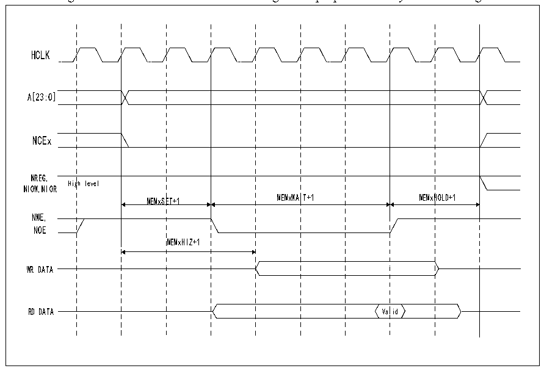

<!-- source-page: 373 -->

[← p.372](0372.md) · [index](../README.md) · [PDF p.373](https://ch32-riscv-ug.github.io/CH32V205/datasheet_en/CH32V205RM.PDF#page=373) · [p.374 →](0374.md)

<!-- header: CH32V205 Reference Manual https://wch-ic.com -->
register contains 4 parameters. The 3 parameters MEMHOLD, MEMWAIT and ATTSET correspond to the  
number of HCLK cycles in the 3 stages of operating the NAND FLASH, and the MEMHIZ parameter  
corresponds to the timing when the FSMC starts to drive the data bus. NAND FLASH controller general memory  
space access timing, see Figure 24-15.  

Figure 24-15 NAND FLASH controller general purpose memory access timing  
 <!-- rendered from the PDF; verify at https://ch32-riscv-ug.github.io/CH32V205/datasheet_en/CH32V205RM.PDF#page=373 -->

🖼 Text parsed from the figure above

HCLK  
gh level  MEMxSE  ET+1  MEMxWAI  IT+1  MEMxH  HOLD+1  MEMxSE  ET+1  MEMxHIZ+1  
A[23:0]  
NCEx  
NREG,  
NIOW,NIOR  
MEMxSET+1 MEMxWAIT+1 MEMxHOLD+1  
NWE,  
NOE  
WR DATA  
Val  lid  
RD DATA Valid  

#### 24.2.4.4 NAND FLASH Operating Procedure

The command latch enables signal (CLE) and address latch enable signal (ALE) of NAND FLASH are driven by  
FSMC address lines A16 and A17 respectively. Therefore, when sending commands or addresses to NAND  
FLASH operations, it is necessary to perform a write operation on the specified address of the storage space. The  
read operation process of NAND FLASH is as follows:  
1） Configure the PWID, PTYP, PWAITEN and PBKEN of the FSMC_PCR2, FSMC_PMEM2 and  
FSMC_PATT2 registers according to the NAND FLASH characteristics to be operated.  
2） Write a command byte in the general storage space. During the period when NWE is low, CLE outputs a high  
level. At this time, the command byte is recognized as a command by NAND FLASH, and the command is  
latched. The subsequent page read operation does not need to send the command repeatedly.  
3） Then, by writing 4 bytes to the memory space, it is used as the starting address of the read operation. During  
the period when NWE is low, ALE outputs high level, and 4 bytes are recognized by NAND FLASH as the  
starting address of the read operation at this time. When operating the attribute storage space, the FSMC can  
be made to generate different timings and realize some NAND FLASH pre-wait functions.  
4） Before the FSMC controller starts a new operation, it needs to wait for the R/NB signal of the NAND  
FLASH to become a high level. During the wait period, the FSMC controller needs to keep the NCE signal at  
a low level.  
5） The FSMC controller can read the memory page byte by byte from the NAND FLASH by operating the  
<!-- image: p373-draw-image-00001 bbox=[515.88, 783.6, 534.96, 793.8] -->
<!-- footer: V1.2 349 -->
