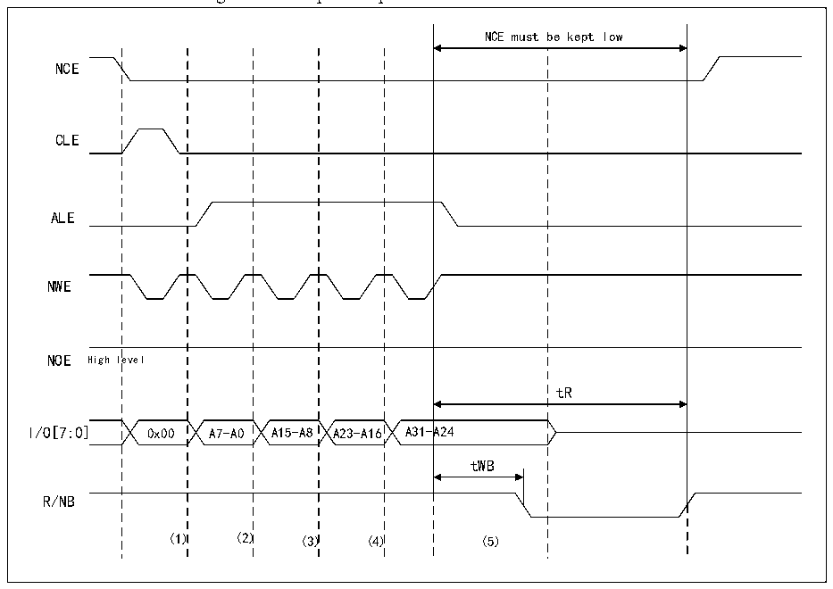

<!-- source-page: 374 -->

[← p.373](0373.md) · [index](../README.md) · [PDF p.374](https://ch32-riscv-ug.github.io/CH32V205/datasheet_en/CH32V205RM.PDF#page=374) · [p.375 →](0375.md)

<!-- header: CH32V205 Reference Manual https://wch-ic.com -->
general memory space.  

#### 24.2.4.5 NAND FLASH Pre-wait Function

For some special NAND FLASHs, after the last address byte is input, the R/NB signal changes to a low level, see  
Figure 24-16.  
In the figure (1) the CPU writes byte command 0x00 to 0x70010000;  
In the figure (2) the CPU writes the NAND FLASH address A7-A0 to 0x70020000;  
In the figure (3) the CPU writes the NAND FLASH address A15-A8 to 0x70020000;  
In the figure (4) the CPU writes the NAND FLASH address A23-A16 to 0x70020000;  
In the figure (5) the CPU writes the NAND FLASH address A31-A24 to 0x70020000;  

Figure 24-16 Special operation on NAND FLASH  
 <!-- rendered from the PDF; verify at https://ch32-riscv-ug.github.io/CH32V205/datasheet_en/CH32V205RM.PDF#page=374 -->

🖼 Text parsed from the figure above

NCE must be kept low  
NCE  
CLE  
ALE  
NWE  
NOE High level  
tR  
I/O[7:0] 0x00 A7-A0 A15-A8 A23-A16 A31-A24  
tWB  
R/NB  
(1) (2) (3) (4) (5)  

When using this function, the timing of tWB is guaranteed by configuring the MEMHOLD bit in the  
FSMC_PMEM2 register. After reading and writing operations to NAND FLASH, the FSMC controller will insert  
(MEMHOLD+1) HCLK between the rising edge of the NEW signal and the next operation. Keep the delay. In  
order to solve this problem, the attribute space is used to configure the ATTHOLD value so that it conforms to the  
timing of tWB, and at the same time, it is necessary to keep MEMHOLD at a minimum value. At this time, only  
when writing the last byte of the NAND FLASH address, the FSMC controller needs to write the attribute storage  
space, and the rest of the NAND FLASH read and write operations use the general storage space.  

#### 24.2.4.6 NAND FLASH ECC Features

FSMC&#x27;s NAND FLASH controller includes an error correction code calculation hardware module, which can  
effectively reduce the software workload of the CPU when processing error correction codes. When the ECC  
<!-- image: p374-draw-image-00001 bbox=[515.88, 783.6, 534.96, 793.8] -->
<!-- footer: V1.2 350 -->
