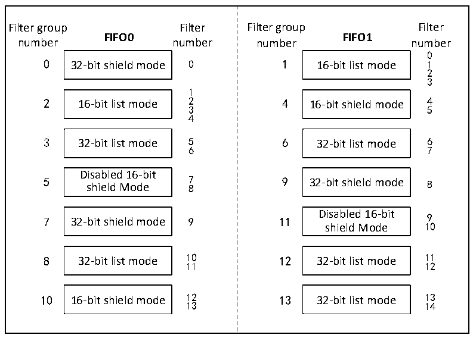
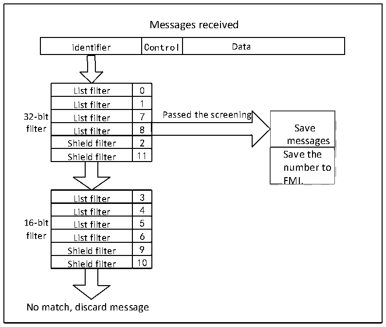

<!-- source-page: 390 -->

[← p.389](0389.md) · [index](../README.md) · [PDF p.390](https://ch32-riscv-ug.github.io/CH32V205/datasheet_en/CH32V205RM.PDF#page=390) · [p.391 →](0391.md)

<!-- header: CH32V205 Reference Manual https://wch-ic.com -->

Figure 25-4 Example of Filter Number  
 <!-- rendered from the PDF; verify at https://ch32-riscv-ug.github.io/CH32V205/datasheet_en/CH32V205RM.PDF#page=390 -->

🖼 Text parsed from the figure above

Filter group Filter FIFO0 number number 0 32-bit shield mode 01 2 16-bit list mode 234 3 32-bit list mode 56 Disabled 16-bit 5 7 shield Mode 8 7 32-bit shield mode 9 8 32-bit list mode 1011 10 16-bit shield mode 1213  Filter group Filter FIFO1 number number 0 1 16-bit list mode 123 4 16-bit shield mode 45 6 32-bit list mode 67 9 32-bit shield mode 8 11 Disabled 16-bit 9 shield Mode 10 12 32-bit list mode 1112 13 32-bit list mode 1314  

Figure 25-5 Filter filtering example  
 <!-- rendered from the PDF; verify at https://ch32-riscv-ug.github.io/CH32V205/datasheet_en/CH32V205RM.PDF#page=390 -->

🖼 Text parsed from the figure above

Messages received  
identifier  Control  Data  
List filter  0  List filter List filter  1  List filter List filter  7  List filter List filter  8  List filter Shield filter  2  Shield filter Shield filter  11  
Save messages  Save the number to FMI.  
<!-- image: p390-draw-image-00002 inside the figure -->
filter List filter 8 Save  
Shield filter 2 messages  
<!-- image: p390-draw-image-00003 inside the figure -->
Shield filter 11 Save the  
List filter  3  List filter List filter  4  List filter List filter  5  List filter List filter  6  List filter Shield filter  9  Shield filter Shield filter  10  
No match, discard message  

<!-- image: p390-draw-image-00001 bbox=[515.88, 783.6, 534.96, 793.8] -->
<!-- footer: V1.2 366 -->
