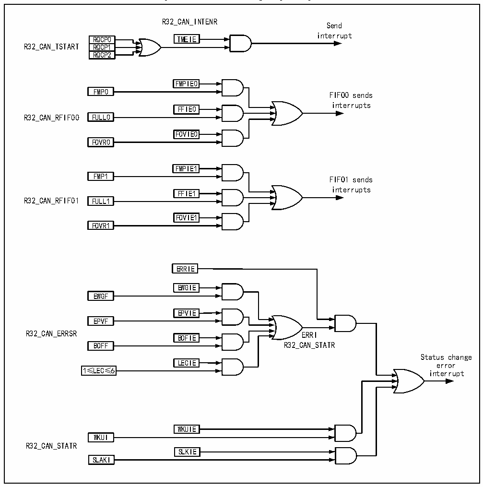

<!-- source-page: 394 -->

[← p.393](0393.md) · [index](../README.md) · [PDF p.394](https://ch32-riscv-ug.github.io/CH32V205/datasheet_en/CH32V205RM.PDF#page=394) · [p.395 →](0395.md)

<!-- header: CH32V205 Reference Manual https://wch-ic.com -->

Figure 25-9 CAN interrupt logic diagram  
 <!-- rendered from the PDF; verify at https://ch32-riscv-ug.github.io/CH32V205/datasheet_en/CH32V205RM.PDF#page=394 -->

🖼 Text parsed from the figure above

R32_CAN_INTENR  
Send  
interrupt  
RQCP0 TMEIE  
RQCP0RQCP1  RQCP1RQCP2  
R32_CAN_TSTART RQCP1  
FMPIE0  
FMP0 FIFO0 sends  
interrupts  
FFIE0  
R32_CAN_RFIF00 FULL0  
FOVIE0  
FOVR0  
FMPIE1  
FMP1 FIFO1 sends  
interrupts  
FFIE1  
R32_CAN_RFIF01 FULL1  
FOVIE1  
FOVR1  
ERRIE  
EWGIE  
EWGF  
<!-- image: p394-draw-image-00003 inside the figure -->
EPVIE  
EPVF  
<!-- image: p394-draw-image-00002 inside the figure -->
R32_CAN_ERRSR ERRI  
<!-- image: p394-draw-image-00004 inside the figure -->
BOFIE  
<!-- image: p394-draw-image-00005 inside the figure -->
BOFF R32_CAN_STATR  
Status change  
LECIE error  
1≤LEC≤6 interrupt  
WKUIE  
WKUI  
R32_CAN_STATR  
SLKIE  
SLAKI  

## 25.7 Register Description

The registers related to the CAN controller must be manipulated in 32-bit words. In order to avoid the influence of  
the current node on the entire CAN bus, the application software can only modify the bit timing register  
CAN_BTIMR in the initialization mode.  

<!-- p394-table-002 (table-25-5@1) pages 394-395 -->
<table><caption>Table 25-5 CAN1-related registers</caption><tr><th>Name</th><th>Access address</th><th>Description</th><th>Reset value</th></tr><tr><td>R32_CAN1_CTLR</td><td>0x40006400</td><td>CAN1 main control register</td><td>0x00010002</td></tr><tr><td>R32_CAN1_STATR</td><td>0x40006404</td><td>CAN1 main status register</td><td>0x00000C02</td></tr><tr><td>R32_CAN1_TSTATR</td><td>0x40006408</td><td>CAN1 transmit status register</td><td>0x1C000000</td></tr><tr><td>R32_CAN1_RFIFO0</td><td>0x4000640C</td><td style="text-align:left">CAN1 receive FIFO0 control and status registers</td><td>0x00000000</td></tr><tr><td>R32_CAN1_INTENR</td><td>0x40006414</td><td>CAN1 interrupt enable register</td><td>0x00000000</td></tr><tr><td>R32_CAN1_ERRSR</td><td>0x40006418</td><td>CAN1 error status register</td><td>0x00000000</td></tr><tr><td>R32_CAN1_BTIMR</td><td>0x4000641C</td><td>CAN1 bit timing register</td><td>0x01230000</td></tr><tr><td>R32_CAN1_TTCTLR</td><td>0x40006420</td><td>CAN1 time trigger control register</td><td>0x0000FFFF</td></tr><tr><td>R32_CAN1_TTCNT</td><td>0x40006424</td><td>CAN1 time trigger count value register</td><td>0x00000000</td></tr><tr><td>R32_CAN1_TERR_CNT</td><td>0x40006428</td><td>CAN1 offline recovery error counter</td><td>0x00000000</td></tr></table>

<!-- image: p394-draw-image-00001 bbox=[515.88, 783.6, 534.96, 793.8] -->
<!-- footer: V1.2 370 -->
