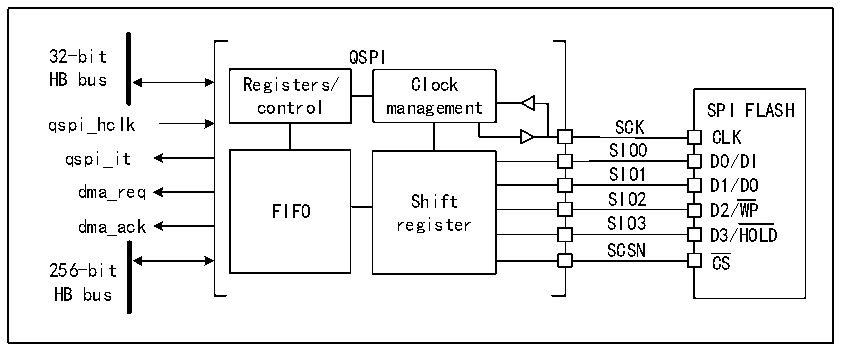

<!-- source-page: 415 -->

[← p.414](0414.md) · [index](../README.md) · [PDF p.415](https://ch32-riscv-ug.github.io/CH32V205/datasheet_en/CH32V205RM.PDF#page=415) · [p.416 →](0416.md)

<!-- header: CH32V205 Reference Manual https://wch-ic.com -->

# Chapter 26 QSPI Interface (QuadSPI)

QuadSPI is a serial interface dedicated to single, double or quad (data lines) SPIFLASH communication. The  
interface primarily supports the following operating modes:  
● Indirect mode: In this mode, the QSPI interface performs all operations through the QSPI register. This mode  
is suitable for applications requiring frequent read/write operations.  
● Status polling mode: In this mode, the system periodically reads the external FLASH status register. When  
the flag is set to 1 (e.g., erase or program complete), the system generates an interrupt. This mode is suitable  
for applications requiring real-time monitoring of the external Flash status.  
● Memory-mapped mode: In this mode, the external Flash is mapped into the microcontroller&#x27;s address space,  
allowing the system to access it as internal memory. The memory-mapped addresses are exclusively for data  
access.  
When dual flash mode is adopted, the system can access 2 Quad-SPIFLASH at the same time, and the throughput  
and capacity can be increased by 2 times. This mode is suitable for application scenarios that require a lot of data  
processing.  

## 26.1 Main Features

● 3 functional modes: Indirect mode, Status polling mode, and Memory-mapped mode  
● Dual flash mode via parallel access to 2 FLASH devices  
● Integrated FIFOs for transmission and reception  
● Supports SDR mode  
● Fully programmable frame format for indirect and memory-mapped modes  
● Fully programmable opcode for indirect and memory-mapped modes  
● Generates DMA trigger signals upon reaching FIFO threshold and transmission completion  
● Generates interrupts upon reaching FIFO threshold, timeout, operation completion, and access errors  

## 26.2 Overview

Figure 26-1 Structure block diagram of QSPI (Dual flash mode disabled)  
 <!-- rendered from the PDF; verify at https://ch32-riscv-ug.github.io/CH32V205/datasheet_en/CH32V205RM.PDF#page=415 -->

🖼 Text parsed from the figure above

32-bit QSPI  
HB bus Registers/ Clock  
control management SPI FLASH  
SPI FLASHCLKD0/DI  
qspi_hclk SCK  
SIO0  
Shift register  SIO2SIO3SCSN  
SIO1  
dma_req D1/DO  
dma_ack register SIO3  
D3/HOLD  
CS  
256-bit  
HB bus  

<!-- image: p415-draw-image-00001 bbox=[515.88, 783.6, 534.96, 793.8] -->
<!-- footer: V1.2 391 -->
