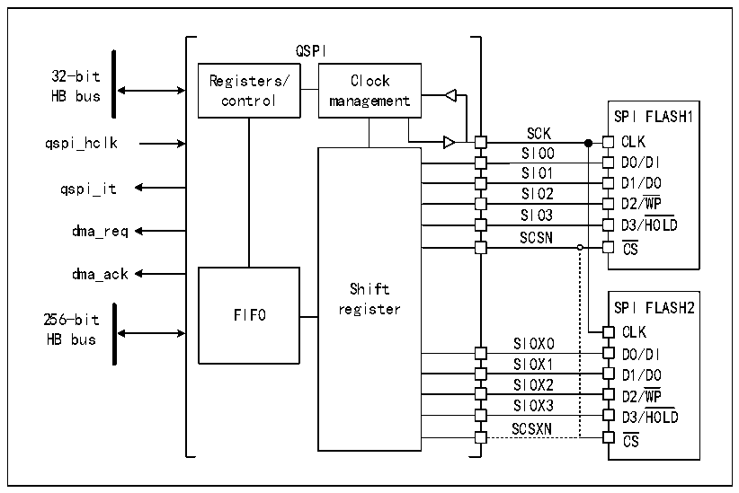
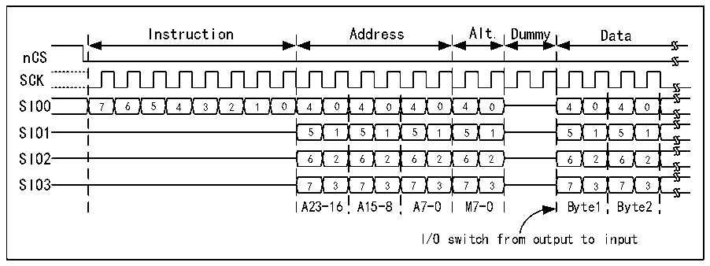

<!-- source-page: 416 -->

[← p.415](0415.md) · [index](../README.md) · [PDF p.416](https://ch32-riscv-ug.github.io/CH32V205/datasheet_en/CH32V205RM.PDF#page=416) · [p.417 →](0417.md)

<!-- header: CH32V205 Reference Manual https://wch-ic.com -->

Figure 26-2 Structure block diagram of QSPI (Dual flash mode enabled)  
 <!-- rendered from the PDF; verify at https://ch32-riscv-ug.github.io/CH32V205/datasheet_en/CH32V205RM.PDF#page=416 -->

🖼 Text parsed from the figure above

QSPI  
32-bit Registers/ Clock  
HB bus control management  
SPI FLASH1  
SCK  
qspi_hclk CLK  
SIO0  
D0/DI  
SIO1  
D1/DO  
qspi_it SIO2  
SIO2SIO3  SIO3SCSN  SCSN  SIOX1SI0X2  SIOX3  
D2/WP  
dma_req D3/HOLD  
CS  
dma_ack  
Shift  
256-bit FIFO  
CLK  
HB bus SIOX0  
D0/DI  
D1/DO  
D2/WP  
D3/HOLD  
SCSXN  
CS  

## 26.3 Function Description

### 26.3.1 QSPI Command Sequence

QSPI communicates with FLASH through commands, and each command includes five stages: instruction,  
address, alternate byte, null instruction and data. Any phase can be skipped, but at least one of instruction, address,  
alternate byte or data phase should be reserved. nCS drops before each instruction starts and rises again after each  
instruction is completed.  

Figure 26-3 Example of read command in 4-wire mode  
 <!-- rendered from the PDF; verify at https://ch32-riscv-ug.github.io/CH32V205/datasheet_en/CH32V205RM.PDF#page=416 -->

🖼 Text parsed from the figure above

Instruction Address Alt. Dummy Data  
nCS  
SCK  
7  6  5  4  3  2  1  0  4  0  4  0  4  0  4  0  5  1  5  1  5  1  5  1  6  2  6  2  6  2  6  2  7  3  7  3  7  3  7  3  
4  0  4  0  5  1  5  1  6  2  6  2  7  3  7  3  
A23-16 A15-8 A7-0 M7-0 Byte1 Byte2  
I/O switch from output to input  

<strong>Instruction Phase</strong>  
During the instruction phase, an 8-bit instruction configured in the INSTRUCTION[7:0] field of the  
R32_QSPIx_CCR register is sent to the FLASH to specify the type of operation to be executed. Most FLASH  
devices can only receive instructions one bit at a time via the SIO0 signal (single-wire SPI mode). However, by  
<!-- image: p416-draw-image-00001 bbox=[515.88, 783.6, 534.96, 793.8] -->
<!-- footer: V1.2 392 -->
