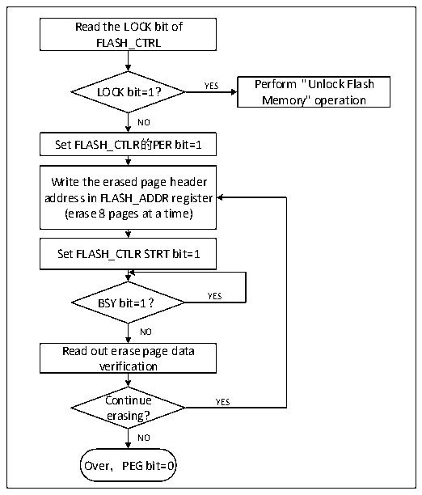

<!-- source-page: 447 -->

[← p.446](0446.md) · [index](../README.md) · [PDF p.447](https://ch32-riscv-ug.github.io/CH32V205/datasheet_en/CH32V205RM.PDF#page=447) · [p.448 →](0448.md)

<!-- header: CH32V205 Reference Manual https://wch-ic.com -->

Figure 27-1 FLASH Page Erase  
 <!-- rendered from the PDF; verify at https://ch32-riscv-ug.github.io/CH32V205/datasheet_en/CH32V205RM.PDF#page=447 -->

🖼 Text parsed from the figure above

Read the LOCK bit of  
FLASH_CTRL  
LOCK bit=1? YES Perform &quot;Unlock Flash  
Memory&quot; operation  
NO  
Set FLASH_CTLR的PER bit=1  
Write the erased page header  
address in FLASH_ADDR register  
(erase 8 pages at a time)  
Set FLASH_CTLR STRT bit=1  
BSY bit=1？ YES  
NO  
Read out erase page data  
verification  
Continue YES  
erasing?  
NO  
Over，PEG bit=0  

1) Check the FLASH_CTLR register LOCK bit, if it is 1, you need to perform the &quot;unlock flash&quot; operation.  
2) Set the per bit of the FLASH_CTLR register to &#x27;1percent, and turn on the standard page erase mode.  
3) Write the header address of the selected erasure to the FLASH_ADDR register.  
4) Set the STRT bit of the FLASH_CTLR register to &#x27;1percent, and start an erase operation.  
5) Waiting for the BSY bit to change to&#x27;0&#x27; or the EOP bit of the FLASH_STATR register to be&#x27;1&#x27; means the  
erasure is over, and the EOP bit is cleared to 0.  
6) Read the data of the erasure page for verification.  
7) Continue the standard page erasure by repeating the 3-5 steps to end the erase to clear the PEG bit 0.  
<em>Note: After erasing successfully, read the word-0xFF.</em>  
<!-- image: p447-draw-image-00001 bbox=[515.88, 783.6, 534.96, 793.8] -->
<!-- footer: V1.2 423 -->
