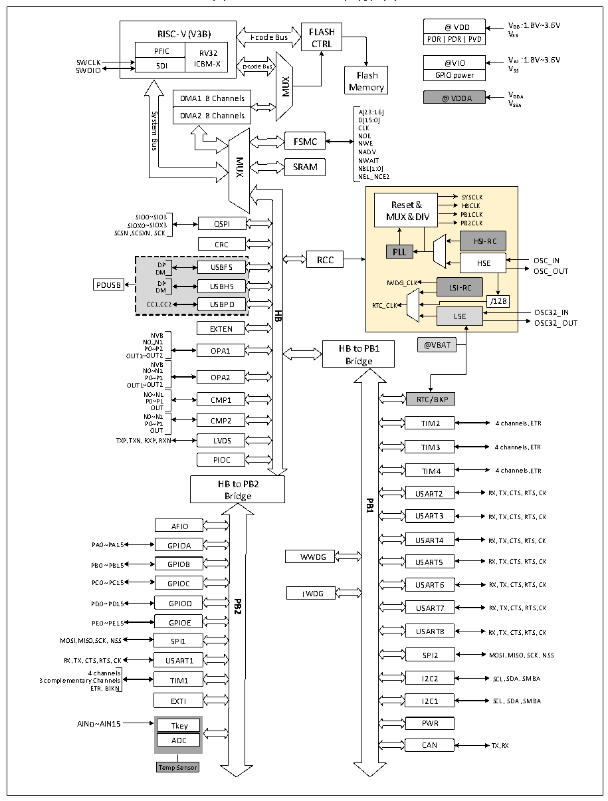

<!-- source-page: 3 -->

[← p.2](0002.md) · [index](../README.md) · [PDF p.3](https://ch32-riscv-ug.github.io/CH32V205/datasheet_zh/CH32V205RM.PDF#page=3) · [p.4 →](0004.md)

<!-- header: CH32V205应用手册 https://wch.cn -->

# 第 1 章 存储器和总线架构

## 1.1 总线架构

该系列芯片是基于青稞RISC-V3B内核设计的工业级通用微控制器，其架构中的内核、仲裁单元、  
DMA模块、SRAM存储等部分通过多组总线实现交互。其系统框图见图1-1-1和图1-1-2。  

图1-1-1 CH32V205系统框图  
 <!-- rendered from the PDF; verify at https://ch32-riscv-ug.github.io/CH32V205/datasheet_zh/CH32V205RM.PDF#page=3 -->

🖼 Text parsed from the figure above

@VDD VDD: 1.8V~3.6V VSS  
RISC-V ( V3B)  RISC-VPFICSDI  V ( V3B) RV32ICBM-X  
<!-- image: p3-draw-image-00002 inside the figure -->
RISC-V ( V3B) FLASH  
I-code Bus  
<!-- image: p3-draw-image-00003 inside the figure -->
CTRL  
SWCLK @VIO VIO: 1.8V~3.6V SWDIO VSS  
SDI ICBM-XD-codeBus Flash  
MUX  
Memory  
DMA1 8 Channels @VDDA VDDA  
DMA1 8 Channels  DMA2 8 Channels  
VSSA  
DMA2 8 ChannelsD[15:0] A[23:16]  
System  
CLK  
NOE  
FSMC NWE  
Bus  
NADV  
MUX  
NWAIT  
SRAM  
NBL[1:0]  
NE1_NCE2  
SYSCLK  
Reset &amp; HBCLK  
SIO0~SIO3 MUX &amp; DIV PB1CLK  
SIOX0~SIOX3 QSPI PB2CLK  
, ,  
SCSNSCSXNSCK  
HSI-RC  
CRC  
PLL  
RCC USBFS  
DP HSE OSC_IN DM OSC_OUT  
D D M P IWDG_CLK LSI-RC  
PDUSB  
USBHS  
CC1CC2 USBPD RTC_CLK /128  
,  
LSE OSC32_IN  
<strong>HB</strong>  
OSC32_OUT  
EXTEN  
NVB  
N P 0 0~ ~ N P2 1 OPA1 @VBAT  
OPA1OPA2  OPA2CMP1  CMP1CMP2  
HB to PB1  
OUT1~OUT2  
Bridge  
NVB  
N0~N1  
OUT1~OUT2  
N P 0 0 ~ ~ N P1 1 CMP1 RTC/BKP  
OUT  
N P 0 0 ~ ~ N P 1 1 CMP2 4 channels,ETR  
TIM2  
OUT  
TXPTXNRXPRXN LVDS  
, , ,  
TIM3  
4 channels,ETR  
PIOC  
4 channels,ETR  
TIM4  
HB to PB2  
Bridge USART2 RX, TX, CTS, RTS, CK  
<strong>PB1</strong>  
USART3 RX, TX, CTS, RTS, CK  
AFIO  
PA0 ~ PA15 GPIOA USART4 RX, TX, CTS, RTS, CK  
WWDG  
PB0 ~ PB15 GPIOB USART5 RX, TX, CTS, RTS, CK  
PC0 ~ PC15 GPIOC USART6  
RX, TX, CTS, RTS, CK  
IWDG  
PD0 ~ PD15 GPIODPB2 USART7  
RX, TX, CTS, RTS, CK  
PE0 ~ PE15 GPIOE  
USART8 RX, TX, CTS, RTS, CK  
MOSI,MISO,SCK, NSS SPI1  
SPI2 MOSI,MISO,SCK, NSS  
RX, TX, CTS, RTS, CK USART1  
4 channels  
I2C2 SCL, SDA,SMBA  
3 complementary Channels TIM1  
ETR, BIKN  
EXTI  
I2C1 SCL, SDA,SMBA  
PWR  
AIN0 ~ AIN15 Tkey  
ADC  
CAN TX,RX  
Temp Sensor  

<!-- image: p3-draw-image-00001 bbox=[507.84, 786.36, 527.28, 796.68] -->
<!-- footer: V1.2 1 -->
