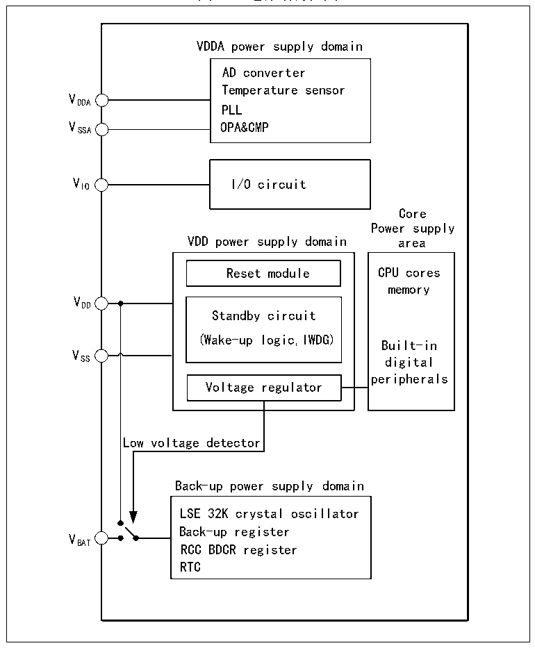

<!-- source-page: 7 -->

[← p.6](0006.md) · [index](../README.md) · [PDF p.7](https://ch32-riscv-ug.github.io/CH32V205/datasheet_zh/CH32V205RM.PDF#page=7) · [p.8 →](0008.md)

<!-- header: CH32V205应用手册 https://wch.cn -->

# 第 2 章 电源控制（PWR）

## 2.1 概述

系统工作电压 VDD 范围为 1.8～3.6V，内置电压调节器提供内核所需的低压电源。当主电源 VDD  
掉电后，电池等后备电源可通过VBAT 引脚为实时时钟(RTC)和后备寄存器提供电源，如果无需后备电  
源，建议将VDD 直接连接到VBAT 引脚上。  
VDDA 和VSSA 引脚专门为系统中模拟相关电路供电，包括ADC、温度传感器等。  

图2-1 电源结构框图  
 <!-- rendered from the PDF; verify at https://ch32-riscv-ug.github.io/CH32V205/datasheet_zh/CH32V205RM.PDF#page=7 -->

🖼 Text parsed from the figure above

VDDA power supply domain  
AD converter  
Temperature sensor  
VDDA  
PLL  
VSSA OPA&amp;CMP  
VIO I/O circuit  
Core  
Power supply  
VDD power supply domain area  
Reset module CPU cores  
memory  
VDD  
Standby circuit  
(Wake-up logic,IWDG)  
Built-in  
V  
SS digital  
peripherals  
Voltage regulator  
Low voltage detector  
Back-up power supply domain  
LSE 32K crystal oscillat or  
Back-up register  
VBAT  
RCC BDCR register  
RTC  

在主电源VDD 掉电后，模拟开关切换至VBAT，后备区域由VBAT 引脚供电，此时PC13～PC15无法作  
为GPIO，仅可使用如下功能：  
● PC13可以作为TAMPER引脚、RTC闹钟或秒输出。  
● PC14和PC15只能用作LSE引脚。  
当主电源VDD 上电稳定后，系统自动切换后备区域由VDD 供电，PC13～PC15可以用作GPIO功能。  
当PC13～PC15引脚作为GPIO输出时，速度必须限制在2MHz以下，最大负载电容为30pF，并  
且禁止用在持续输出和吸入电流的场合，比如LED驱动。  
注：在主电源VDD 恢复供电过程中，内部VBAT 电源仍然通过对应的VBAT 引脚连在外部备用电源上，若  
<!-- image: p7-draw-image-00001 bbox=[507.84, 786.36, 527.28, 796.68] -->
<!-- footer: V1.2 2 -->
