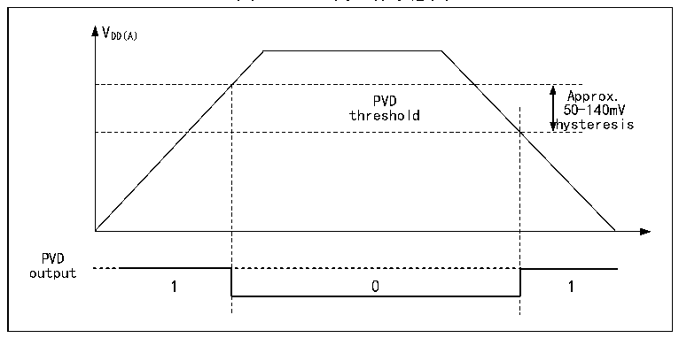

<!-- source-page: 9 -->

[← p.8](0008.md) · [index](../README.md) · [PDF p.9](https://ch32-riscv-ug.github.io/CH32V205/datasheet_zh/CH32V205RM.PDF#page=9) · [p.10 →](0010.md)

<!-- header: CH32V205应用手册 https://wch.cn -->

图2-3 PVD的工作示意图  
 <!-- rendered from the PDF; verify at https://ch32-riscv-ug.github.io/CH32V205/datasheet_zh/CH32V205RM.PDF#page=9 -->

🖼 Text parsed from the figure above

VDD(A)  
PVD threshold  0  
hysteresis  
PVD  
output  

## 2.3 低功耗模式

在系统复位后，微控制器处于正常工作状态（运行模式），此时可以通过降低系统主频或者关  
闭不用外设时钟或者降低工作外设时钟来节省系统功耗。如果系统不需要工作，可设置系统进入低  
功耗模式，并通过特定事件让系统跳出此状态。  
微控制器目前提供了3种低功耗模式，从处理器、外设、电压调节器等的工作差异上分为：  
● 睡眠模式：内核停止运行，所有外设（包含内核私有外设）仍在运行。  
● 停止模式：停止所有时钟，唤醒后系统继续运行。停止模式分为四档，分别为：停止模式1、  
停止模式2、停止模式3，停止模式4，相应的配置方法如表2-1所示，停止模式四个档位配置后的  
电流参考CH32V205DS0手册。  
● 待机模式：停止所有时钟，唤醒后微控制器复位（电源复位）。  

<!-- p9-table-002 (table-2-1@1) -->
<table><caption>表2-1 低功耗模式一览</caption><tr><th>模式</th><th>进入</th><th>唤醒源</th><th>对时钟的影响</th><th>电压调节器</th></tr><tr><td rowspan="2" style="text-align:left">睡眠 （SLEEP）</td><td>WFI</td><td>任意中断唤醒</td><td rowspan="2" style="text-align:left">内核时钟关闭， 其他时钟无影响</td><td rowspan="2">正常</td></tr><tr><td>WFE</td><td>唤醒事件唤醒</td></tr><tr><td rowspan="4" style="text-align:left">停止 (STOP)</td><td rowspan="4" style="text-align:left">SLEEPDEEP置1PDDS清0WFI或WFE</td><td rowspan="4" style="text-align:left">任一外部中断/事件，NRST引脚上外部复位，PVD的输出， IWDG复位，RTC闹钟，USB的 唤醒信号，USB PD唤醒信号， CMP唤醒信号等</td><td rowspan="4" style="text-align:left">关闭HSE、HSI、 PLL和外设时钟</td><td style="text-align:left">停 止 模 式 1 ： LPDS=0，PDDS=0</td></tr><tr><td style="text-align:left">停止模式 2（LDO 节 能 模 式 ） ： LPDS=0，PDDS=0， AUTO_LDO_EC=1 或LPDS=0，PDDS=0， LDO_EC=1</td></tr><tr><td style="text-align:left">停 止 模 式 3 ： RAMLV=0，PDDS=0， LPDS=1</td></tr><tr><td style="text-align:left">停 止 模 式 4 ： RAMLV=1，PDDS=0， LPDS=1</td></tr><tr><td style="text-align:left">待机 (STANDBY)</td><td style="text-align:left">SLEEPDEEP置1PDDS置1WFI或WFE</td><td style="text-align:left">EXTI0~EXTI17 任一外部事件 （不包括中断）、WKUP 引脚上升沿、RTC闹钟事件、NRST引脚复位、IWDG复位等</td><td style="text-align:left">关闭HSE、HSI、 PLL和外设时钟</td><td>关闭</td></tr></table>

注：SLEEPDEEP位属于内核私有外设控制位，参考PFIC_SCTLR寄存器。  
<!-- image: p9-draw-image-00001 bbox=[507.84, 786.36, 527.28, 796.68] -->
<!-- footer: V1.2 4 -->
