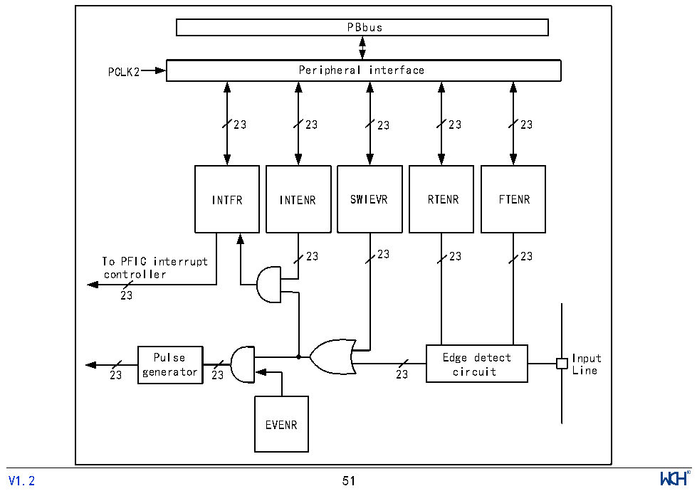

<!-- source-page: 56 -->

[← p.55](0055.md) · [index](../README.md) · [PDF p.56](https://ch32-riscv-ug.github.io/CH32V205/datasheet_zh/CH32V205RM.PDF#page=56) · [p.57 →](0057.md)

<!-- header: CH32V205应用手册 https://wch.cn -->

> ⬆ **Table continued** — rendered in full at [page 54](0054.md). <!-- p56-table-001 -->

注：1、NMI、EXC、ECALL-M、ECALL-U、BREAKPOINT默认使能；  
2、ECALL-M、ECALL-U、BREAKPOINT为EXC的一种情况；  
3、NMI、EXC、ECALL-M、ECALL-U、BREAKPOINT 支持中断挂起清除和设置操作，不支持中断使能清  
除和设置操作。  

## 9.4 外部中断和事件控制器（EXTI）

### 9.4.1 概述

图9-1 外部中断(EXTI)接口框图  
 <!-- rendered from the PDF; verify at https://ch32-riscv-ug.github.io/CH32V205/datasheet_zh/CH32V205RM.PDF#page=56 -->

🖼 Text parsed from the figure above

PBbus  
PCLK2 Peripheral interface  
23 23 23 23 23  
INTFR INTENR SWIEVR RTENR FTENR  
23 23 23 23  
To PFIC interrupt  
controller  
23  
Pulse Edge detect Input  
23 generator 23 23 circuit Line  
EVENR  
<!-- image: p56-draw-image-00001 inside the figure -->
<!-- footer: V1.2 51 -->

