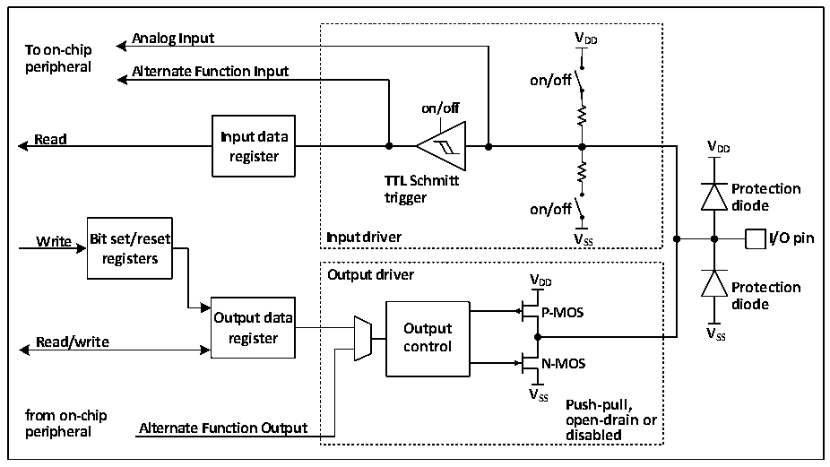

<!-- source-page: 78 -->

[← p.77](0077.md) · [index](../README.md) · [PDF p.78](https://ch32-riscv-ug.github.io/CH32V205/datasheet_zh/CH32V205RM.PDF#page=78) · [p.79 →](0079.md)

<!-- header: CH32V205应用手册 https://wch.cn -->

# 第 10 章 GPIO 及其复用功能（GPIO/AFIO）

GPIO口可以配置成多种输入或输出模式，内置可关闭的上拉或下拉电阻，可以配置成推挽或开  
漏功能。GPIO口还可以复用成其他功能。  
PA11/PA12可以复用作为USB的I/O引脚，有两套互斥的上拉和下拉电阻。当RB_UC_RST_SIE=1  
时作为普通 GPIO，上拉和下拉电阻的控制方法和特性与其他 GPIO相同。当 RB_UC_RST_SIE=0时作  
为USB专用引脚UDM/UDP，USB上拉电阻约1.5K，参考表20-2实现控制，USB下拉电阻约15K，由  
R8_USB_CTRL中的RB_UH_PD_DIS控制，均不受GPIO控制。  
PA0/PA1可以复用作为USB PD的I/O引脚，有两套相互独立的上拉和下拉电阻。其中，与其他  
GPIO特性相同的上拉和下拉电阻的控制方法与其他GPIO相同。另有一套上拉电流和下拉电阻R（d 部  
分封装形式的芯片未内置）用于Type-C引脚，由R16_PORT_CC1/R16_PORT_CC2控制。另外，AFIO_CR  
中的USBPD_IN_HVT位，可为PA0/PA1选择高阈值输入模式。  

## 10.1 主要特征

端口的每个引脚可以配置成以下的多种模式之一：  
浮空输入； 开漏输出；  
上拉输入； 推挽输出；  
下拉输入； 模拟输入；  
复用功能的输入和输出。  
许多引脚拥有复用功能，很多其他的外设把自己的输出和输入通道映射到这些引脚上，这些复  
用引脚具体用法需要参照各个外设，而对这些引脚是否复用和是否重映射的内容由本章说明。  

## 10.2 功能描述

### 10.2.1 概述

图10-1 GPIO模块基本结构框图  
 <!-- rendered from the PDF; verify at https://ch32-riscv-ug.github.io/CH32V205/datasheet_zh/CH32V205RM.PDF#page=78 -->

🖼 Text parsed from the figure above

<strong>Analog Input V DD</strong>  
<strong>To on-chip</strong>  
<strong>peripheral Alternate Function Input</strong>  
<strong>on/off</strong>  
<strong>on/off</strong>  
<strong>Read Input data</strong>  
<strong>V</strong>  
<strong>register DD</strong>  
<strong>TTL Schmitt</strong>  
<strong>Protection</strong>  
<strong>trigger</strong>  
<strong>on/off diode</strong>  
<strong>Write Bit set/reset Input driver V SS I/O pin</strong>  
<strong>registers</strong>  
<strong>Output driver V</strong>  
<strong>DD Protection</strong>  
<strong>diode</strong>  
<strong>Output data P-MOS</strong>  
<strong>Read/write register O co u n t t p r u o t l V SS</strong>  
<strong>N-MOS</strong>  
<strong>V</strong>  
<strong>SS Push-pull,</strong>  
<strong>from on-chip open-drain or</strong>  
<strong>peripheral Alternate Function Output disabled</strong>  

如图10-1所示IO口结构，每个引脚在芯片内部都有两只保护二极管，IO口内部可分为输入和  
输出驱动模块。其中输入驱动有弱上下拉电阻可选，可连接到AD等模拟输入的外设；如果输入到数  
字外设，就需要经过一个TTL施密特触发器，再连接到GPIO输入寄存器或其他复用外设。而输出驱  
<!-- image: p78-draw-image-00001 bbox=[507.84, 786.36, 527.28, 796.68] -->
<!-- footer: V1.2 73 -->
