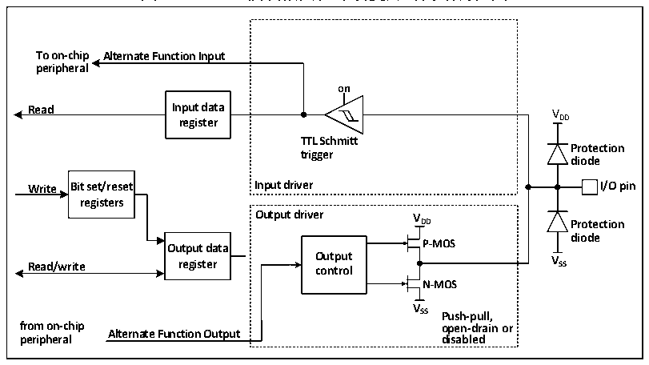
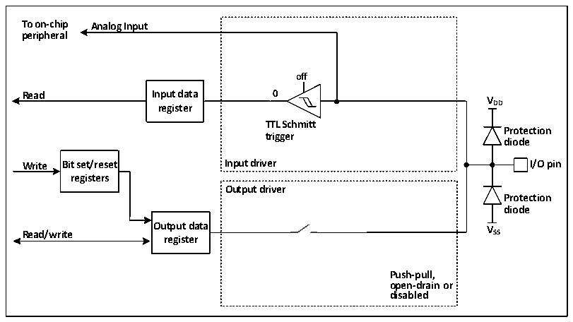

<!-- source-page: 81 -->

[← p.80](0080.md) · [index](../README.md) · [PDF p.81](https://ch32-riscv-ug.github.io/CH32V205/datasheet_zh/CH32V205RM.PDF#page=81) · [p.82 →](0082.md)

<!-- header: CH32V205应用手册 https://wch.cn -->

### 10.2.8 复用功能配置

图10-4 GPIO模块被其他外设复用时的结构框图  
 <!-- rendered from the PDF; verify at https://ch32-riscv-ug.github.io/CH32V205/datasheet_zh/CH32V205RM.PDF#page=81 -->

🖼 Text parsed from the figure above

<strong>To on-chip Alternate Function Input</strong>  
<strong>peripheral</strong>  
<strong>on</strong>  
<strong>Read Input data V</strong>  
<strong>register DD</strong>  
<strong>TTL Schmitt</strong>  
<strong>Protection</strong>  
<strong>trigger</strong>  
<strong>diode</strong>  
<strong>Write Bit set/reset Input driver I/O pin</strong>  
<strong>registers</strong>  
<strong>Output driver V</strong>  
<strong>DD Protection</strong>  
<strong>diode</strong>  
<strong>Output data P-MOS</strong>  
<strong>Read/write register O co u n t t p r u o t l V SS</strong>  
<strong>N-MOS</strong>  
<strong>V</strong>  
<strong>SS Push-pull,</strong>  
<strong>from on-chip open-drain or</strong>  
<strong>Alternate Function Output</strong>  
<strong>peripheral disabled</strong>  

在启用复用功能时，输出驱动器被使能，可以按需要被配置成开漏或推挽模式，施密特触发器  
也被打开，复用功能的输入和输出线都被连接，但是输出数据寄存器被断开，出现在IO引脚上的电  
平将会在每个PB2时钟被采样到输入数据寄存器，在开漏模式下，读取输入数据寄存器将会得到IO  
口当前状态；在推挽模式下，读取输出数据寄存器将会得到最后一次写入的值。  

### 10.2.9 模拟输入配置

图10-5 GPIO模块作为模拟输入时的配置结构框图  
 <!-- rendered from the PDF; verify at https://ch32-riscv-ug.github.io/CH32V205/datasheet_zh/CH32V205RM.PDF#page=81 -->

🖼 Text parsed from the figure above

<strong>To on-chip Analog Input</strong>  
<strong>peripheral</strong>  
<strong>off</strong>  
<strong>Read Input data 0</strong>  
<strong>V</strong>  
<strong>register DD</strong>  
<strong>TTL Schmitt</strong>  
<strong>Protection</strong>  
<strong>trigger</strong>  
<strong>diode</strong>  
<strong>Write Bit set/reset Input driver I/O pin</strong>  
<strong>registers</strong>  
<strong>Output driver</strong>  
<strong>Protection</strong>  
<strong>diode</strong>  
<strong>Output data V</strong>  
<strong>Read/write SS</strong>  
<strong>register</strong>  
<strong>Push-pull,</strong>  
<strong>open-drain or</strong>  
<strong>disabled</strong>  

# 在启用模拟输入时，输出缓冲器被断开，输入驱动中施密特触发器的输入被禁止以防止产生IO

口上的消耗，上下拉电阻被禁止，读取输入数据寄存器将一直为0。  

### 10.2.10 外设的 GPIO设置

下列表格推荐了各个外设的引脚相应的GPIO口配置。  

<!-- p81-table-001 (table-10-1@1) pages 81-82 -->
<table><caption>表10-1 高级定时器（TIM1）</caption><tr><th>TIM1</th><th>配置</th><th>GPIO配置</th></tr><tr><td rowspan="2">TIM1_CHx</td><td>输入捕获通道x</td><td>浮空输入</td></tr><tr><td>输出比较通道x</td><td>推挽复用输出</td></tr><tr><td>TIM1_CHxN</td><td>互补输出通道x</td><td>推挽复用输出</td></tr><tr><td>TIM1_BK</td><td>刹车输入</td><td>浮空输入</td></tr><tr><td>TIM1_ETR</td><td>外部触发时钟输入</td><td>浮空输入</td></tr></table>

<!-- image: p81-draw-image-00001 bbox=[507.84, 786.36, 527.28, 796.68] -->
<!-- footer: V1.2 76 -->
