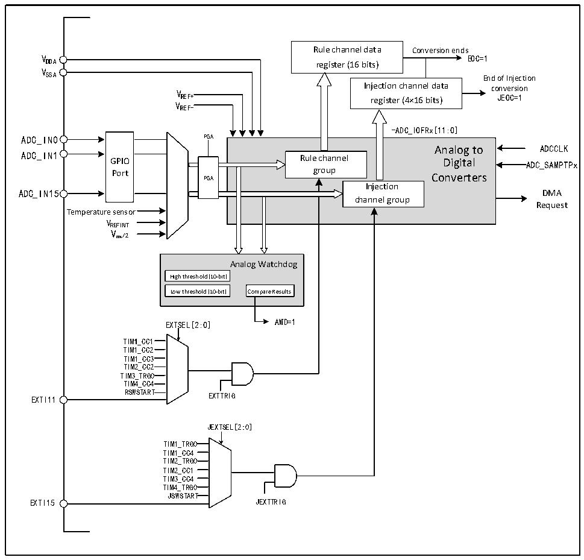

<!-- source-page: 108 -->

[← p.107](0107.md) · [index](../README.md) · [PDF p.108](https://ch32-riscv-ug.github.io/CH32V205/datasheet_zh/CH32V205RM.PDF#page=108) · [p.109 →](0109.md)

<!-- header: CH32V205应用手册 https://wch.cn -->

## 12.2 功能描述

### 12.2.1 模块结构

图12-1 ADC模块框图  
 <!-- rendered from the PDF; verify at https://ch32-riscv-ug.github.io/CH32V205/datasheet_zh/CH32V205RM.PDF#page=108 -->

🖼 Text parsed from the figure above

Rule channel data Conversion ends  
V EOC=1  
DDA register (16 bits)  
V  
SSA End of Injection  
V Injection channel data conversion  
REF+ register (4×16 bits) JEOC=1  
VREF-  
-ADC_IOFRx[11:0]  
GPIOPort  
-ADC_IOFRx[11:0] Analog to Rule channel Digital group Converters Injection channel group  PGA  
Analog to ADCCLK  
ADC_IN15 DMA  
Request  
Temperature sensor  
VREFINT  
VDDA/2  
Analog Watchdog  
High threshold (10-bit)  Low threshold (10-bit)  
Low threshold (10-bit) Compare Results  
EXTSEL[2:0] AWD=1  
TIM11_CC11  
TIM1_CC2  
TIM1_CC3  
TIM2_CC2  
TIM3_TRG0  
TIM4_CC4  
EXTI11 RSWSTART EXTTRIG  
JEXTSEL[2:0]  
TIM1_TRG0  
TIM1_CC4  
TIM2_TRG0  
TIM2_CC1  
TIM3_CC4  
TIM4_TRG0  
JSWSTART  
EXTI15 JEXTTRIG  

### 12.2.2 ADC配置

1）模块上电  
ADC_CTLR2寄存器的ADON位为1表示ADC模块上电。当ADC模块从断电模式（ADON=0）下进入  
上电状态（ADON=1）后，需要延迟一段时间tSTAB 用于模块稳定时间。之后再次写入ADON位为1，用  
于作为软件启动ADC转换的启动信号。通过清除ADON位为0，可以终止当前转换并将ADC模块置于  
断电模式，这个状态下，ADC几乎不耗电。  
2）采样时钟  
模块的寄存器操作基于PCLK2（PB2总线）时钟，其转换单元的时钟基准ADCCLK与PCLK2同步，  
由RCC_CFGR0寄存器的ADCPRE[1:0]域配置分频，最大不能超过64MHz。  
3）通道配置  
ADC模块提供了19个通道采样源，包括16个外部通道和3个内部通道。它们可以配置到两种  
<!-- image: p108-draw-image-00001 bbox=[507.84, 786.36, 527.28, 796.68] -->
<!-- footer: V1.2 103 -->
