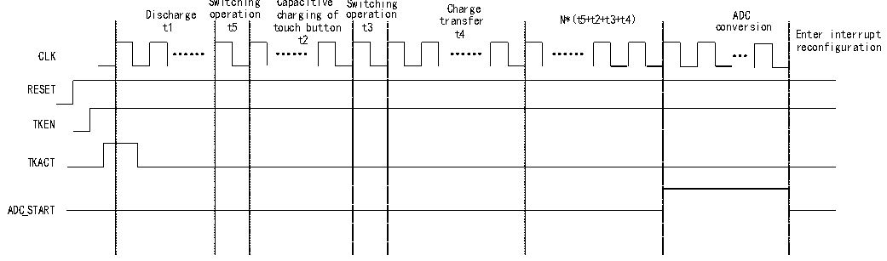

<!-- source-page: 124 -->

[← p.123](0123.md) · [index](../README.md) · [PDF p.124](https://ch32-riscv-ug.github.io/CH32V205/datasheet_zh/CH32V205RM.PDF#page=124) · [p.125 →](0125.md)

<!-- header: CH32V205应用手册 https://wch.cn -->

# 第 13 章 触摸按键检测（TKEY）

触摸检测控制（TKEY）单元，借助ADC模块的电压转换功能，通过将电容量转换为电压量进行  
采样，实现触摸按键检测功能。检测通道复用ADC的16个外部通道，通过ADC模块的单次转换模式  
实现触摸按键检测。  

## 13.1 TKEY 操作步骤

说明：ADCIN0-ADCIN15通道里，任意一个端口接CX（外部参考电容），其余一个端口接CS（触  
摸按键电容）  

### 13.1.1 TKEY 单通道电荷搬移模式

图13-1 TKEY单通道电荷搬移模式时序图  
 <!-- rendered from the PDF; verify at https://ch32-riscv-ug.github.io/CH32V205/datasheet_zh/CH32V205RM.PDF#page=124 -->

🖼 Text parsed from the figure above

Switching Capacitive Switching Charge  
arge oper  
a  
tion  
ope  
r  
ation transfer N*（t5+t2+t3+t4）  
Disc  
h  
c  
h  
a  
r  
g i  
n  
g  
o  
f  
A  
D  
C  
conv  
e  
r  
s ion  
t  
3  
t  
5  
t  
1  
t  
o  
u  
c  
h  
b  
u  
t t  
o  
n  
t4 Enter interrupt  
t2  
reconfiguration  
CLK  
RESET  
TKEN  
TKACT  
ADC_START  

操作流程：  
（1）通过R32_CAP_CFG寄存器的SELCX字段配置CX通道（一个通道），SELCS字段配置CS通  
道（选择一个通道）。  
（2）通过 R32_DRV_CFG寄存器的 DRVEN字段（DRVEN=1）开启驱动屏蔽功能，DRVOUTSEL 字段  
配置需要屏蔽的通道（DRVOUTSEL[15:0]=0xFFFF）。  
（3）通过R32_TKEY_CTRL寄存器的CHSEL字段配置通道源选择位（CHSEL=1），MODE字段配置  
电荷搬移模式（MODE=0）。  
（4）通过R32_TRANS_CFG寄存器的TKSW字段配置开关切换时间（t5和t3），TRANSN字段配  
置电荷搬移次数（N），TRANSCC字段配置触摸按键电容充电时间（t2）和电荷搬移时间（t4）。  
（5）通过ADC_CTLR2寄存器的EXTTRIG字段（EXTTRIG=1）开启规则通道外部触发转换使能，  
EXTSEL 字段配置规则通道转换的外部触发事件（EXTSEL=110），REGUSEL 字段配置触发源  
（REGUSEL=1），ADON 字段（ADON=1）开启 ADC（规则通道为例，注入通道配置为：JEXTTRIG=1，  
JEXTSEL=110，INJESEL=1，）。  
（6）通过R32_TKEY_CTRL寄存器的TKEN字段（TKEN=1）开启TKEY，TKACT字段（TKACT=1）控  
制位，触发TKEY开始工作。  
（7）等待ADC状态寄存器的EOC转换结束标志位置1，读取ADC数据寄存器，得到此次转换值，  
若使能ADC中断，将进入ADC中断，获取转换结果。  
<!-- image: p124-draw-image-00001 bbox=[507.84, 786.36, 527.28, 796.68] -->
<!-- footer: V1.2 119 -->
