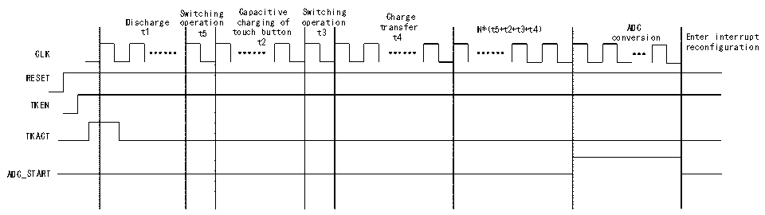
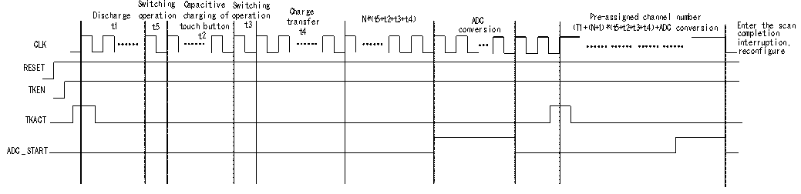

<!-- source-page: 125 -->

[← p.124](0124.md) · [index](../README.md) · [PDF p.125](https://ch32-riscv-ug.github.io/CH32V205/datasheet_zh/CH32V205RM.PDF#page=125) · [p.126 →](0126.md)

<!-- header: CH32V205应用手册 https://wch.cn -->

### 13.1.2 TKEY 多通道电荷搬移模式

图13-2 TKEY多通道电荷搬移时序图  
 <!-- rendered from the PDF; verify at https://ch32-riscv-ug.github.io/CH32V205/datasheet_zh/CH32V205RM.PDF#page=125 -->

🖼 Text parsed from the figure above

Disc t h 1 arge S o w p i e t r t c a 5 h t i i n o g n t c o C h u a a c p r h a g t c 2 i b i n u t g t i t v o o e f n o S p w e i r t t a 3 c t h i i o n n g tr C a h t n a 4 s r f g e e r N*（t5+t2+t3+t4） conv A e D r C sion r E e nt co e n r f i i g nt ur e a r t r i u o pt n  
CLK  
RESET  
TKEN  
TKACT  
ADC_START  

操作流程：  
（1）通过R32_CAP_CFG寄存器的SELCX字段配置CX通道（一个通道），SELCS字段配置CS通  
道（选择多个通道）。  
（2）通过 R32_DRV_CFG寄存器的 DRVEN字段（DRVEN=1）开启驱动屏蔽功能，DRVOUTSEL 字段  
配置需要屏蔽的通道（DRVOUTSEL[15:0]=0xFFFF）。  
（3）通过R32_TKEY_CTRL寄存器的CHSEL字段配置通道选择位（CHSEL=1），MODE字段配置电  
荷搬移模式（MODE=0）。  
（4）通过R32_TRANS_CFG寄存器的TKSW字段配置开关切换时间（t5和t3），TRANSN字段配  
置电荷搬移次数（N），TRANSCC字段配置触摸按键电容充电时间（t2）和电荷搬移时间（t4）。  
（5）通过ADC_CTLR2寄存器的EXTTRIG字段（EXTTRIG=1）开启规则通道外部触发转换使能，  
EXTSEL 字段配置规则通道转换的外部触发事件（EXTSEL=110），REGUSEL 字段配置触发源  
（REGUSEL=1），ADON 字段（ADON=1）开启 ADC（规则通道为例，注入通道配置为：JEXTTRIG=1，  
JEXTSEL=110，INJESEL=1）。  
（6）通过R32_TKEY_CTRL寄存器的TKEN字段（TKEN=1）开启TKEY，TKACT字段（TKACT=1）控  
制位，触发TKEY开始工作。  
（7）等待ADC状态寄存器的EOC转换结束标志位置1，读取ADC数据寄存器，得到此次转换值，  
若使能ADC中断，将进入中断，获取转换结果。  

### 13.1.3 TKEY 电荷搬移自动扫描模式

图13-3 TKEY电荷搬移自动扫描模式时序图  
 <!-- rendered from the PDF; verify at https://ch32-riscv-ug.github.io/CH32V205/datasheet_zh/CH32V205RM.PDF#page=125 -->

🖼 Text parsed from the figure above

Switching Capacitive Switching  
Disch t a 1 rge oper t a 5 tion t c o h u a c r h t g 2 i b n u g t t o o f n ope t r 3 ation t C r h a a n t r 4 s g f e e r N*（t5+t2+t3+t4） conv A e D r C s ion （T1+（ P N r +1 e ） - * a （ s t s 5 i + g t n 2+ e t d 3 + c t4 h ） a + n A ne DC l c n o u n m v b e e r r sion E c n o t m e p r l e t t h i e o n s can  
n,  
CLK i  
n  
t  
e  
r  
r  
u  
p  
t  
i  
o  
r  
e  
c  
o  
n  
f  
i  
g  
u  
r  
e  
RESET  
TKEN  
TK ACT  
ADC_ST ART  

操作流程：  
（1）通过寄存器ADC_SQR1/2/3配置预设通道数目及通道编号，R32_TKEY_CTRL寄存器的SCANEN  
字段配置开启TKEY通道扫描功能，SCANNUM字段配置扫描通道数目（和配置的预设通道数目一致），  
SCANIE字段寄存器配置扫描完成中断使能。  
（2）通过R32_CAP_CFG寄存器的SELCX字段配置CX通道（一个通道），SELCS字段配置CS通  
道（选择一个通道）。  
<!-- image: p125-draw-image-00001 bbox=[507.84, 786.36, 527.28, 796.68] -->
<!-- footer: V1.2 120 -->
