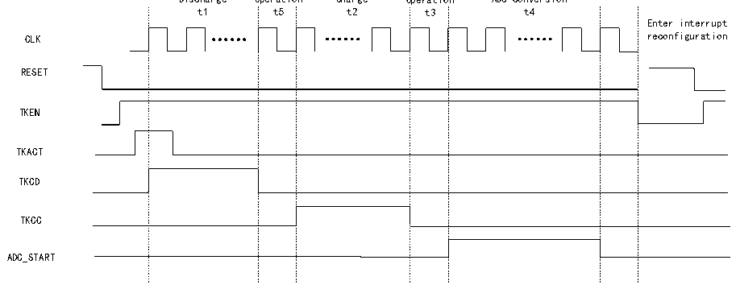

<!-- source-page: 126 -->

[← p.125](0125.md) · [index](../README.md) · [PDF p.126](https://ch32-riscv-ug.github.io/CH32V205/datasheet_zh/CH32V205RM.PDF#page=126) · [p.127 →](0127.md)

<!-- header: CH32V205应用手册 https://wch.cn -->
（3）通过 R32_DRV_CFG寄存器的 DRVEN字段（DRVEN=1）开启驱动屏蔽功能，DRVOUTSEL 字段  
配置需要屏蔽的通道（DRVOUTSEL[15:0]=0xFFFF）。  
（4）通过R32_TKEY_CTRL寄存器的CHSEL字段配置通道选择位（CHSEL=1），MODE字段配置电  
荷搬移模式（MODE=0）。  
（5）通过R32_TRANS_CFG寄存器的TKSW字段配置开关切换时间（t5和t3），TRANSN字段配  
置电荷搬移次数（N），TRANSCC字段配置触摸按键电容充电时间（t2）和电荷搬移时间（t4）。  
（6）通过ADC_CTLR2寄存器的DMA字段（DMA=1）开启DMA，EXTTRIG字段（EXTTRIG=1）开启  
规则通道外部触发转换使能，EXTSEL字段配置规则通道转换的外部触发事件（EXTSEL=110），REGUSEL  
字段配置触发源（REGUSEL=1），ADON字段（ADON=1）开启ADC（规则通道为例，注入通道配置为：  
JEXTTRIG=1，JEXTSEL=110，INJESEL=1）。  
（7）通过R32_TKEY_CTRL寄存器的TKEN字段（TKEN=1）开启TKEY，TKACT字段（TKACT=1）控  
制位，触发TKEY开始工作。  
（8）等待ADC状态寄存器的EOC转换结束标志位置1，读取ADC数据寄存器得到此次转换值。  
（9）当上一个ADC转换结束之后，会自动触发TKACT控制位重新开始新通道的电荷搬移（t1+  
（N+1）*（t5+t2+t3+t4）+ADC转换），此时CX通道不变，CS通道会自动更新，直至预设扫描通道  
中的最后一个通道转换完成，此时TKEY扫描结束，产生扫描结束标志，可以产生扫描结束中断。  

### 13.1.4 电流源充电模式

图13-4 电流源充电模式时序图  
 <!-- rendered from the PDF; verify at https://ch32-riscv-ug.github.io/CH32V205/datasheet_zh/CH32V205RM.PDF#page=126 -->

Switching Switching  
Discharge Operation Charge Operation ADC conversion  

🖼 Text parsed from the figure above

t1 t5 t2 t3 t4  
Enter interrupt  
CLK reconfiguration  
RESET  
TKEN  
TKACT  
TKCD  
TKCC  
ADC_START  

注：电流源充电模式只支持单次单通道转换，将待转换的通道配置到ADC模块的规则组序列第一个，  
软件启动转换。  
操作流程：  
（1）通过R32_CAP_CFG寄存器的SELCS字段配置CS通道（选择一个通道）。  
（2）通过 R32_DRV_CFG寄存器的 DRVEN字段（DRVEN=1）开启驱动屏蔽功能，DRVOUTSEL 字段  
配置需要屏蔽的通道（DRVOUTSEL[15:0]=0xFFFF）。  
（3）通过R32_TKEY_CTRL寄存器的CHSEL字段配置通道选择位（CHSEL=1），MODE字段配置电  
流源充电模式（MODE=1）  
（4）通过R32_TRANS_CFG寄存器的TKSW字段配置开关切换时间（t3和t5）。  
（5）通过R32_TKEY_CDCC寄存器的TKCC字段配置充电时间（t2），TKCD字段配置放电时间（t1），  
t4为ADC采样时间，可以通过ADC_SAMPTR1和ADC_SAMPTR2寄存器配置相应通道的ADC采样时间。  
（6）通过ADC_CTLR2寄存器的EXTTRIG字段（EXTTRIG=1）开启规则通道外部触发转换使能，  
EXTSEL 字段配置规则通道转换的外部触发事件（EXTSEL=110），REGUSEL 字段配置触发源  
（REGUSEL=1），ADON 字段（ADON=1）开启 ADC（规则通道为例，注入通道配置为：JEXTTRIG=1，  
<!-- image: p126-draw-image-00001 bbox=[507.84, 786.36, 527.28, 796.68] -->
<!-- footer: V1.2 121 -->
