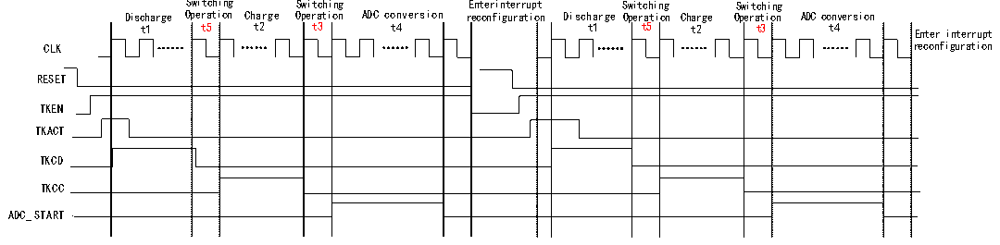

<!-- source-page: 127 -->

[← p.126](0126.md) · [index](../README.md) · [PDF p.127](https://ch32-riscv-ug.github.io/CH32V205/datasheet_zh/CH32V205RM.PDF#page=127) · [p.128 →](0128.md)

<!-- header: CH32V205应用手册 https://wch.cn -->
JEXTSEL=110，INJESEL=1）。  
（7）通过R32_TKEY_CTRL寄存器的TKEN字段（TKEN=1）开启TKEY，TKACT字段（TKACT=1）控  
制位，触发TKEY开始工作。  
（8）等待ADC状态寄存器的EOC转换结束标志位置1，读取ADC的数据寄存器得到此次转换值，  
如果使能ADC中断，将进入中断。  

### 13.1.5 电流源充电模式自动扫描模式

图13-5 电流源充电模式自动扫描模式时序图  
 <!-- rendered from the PDF; verify at https://ch32-riscv-ug.github.io/CH32V205/datasheet_zh/CH32V205RM.PDF#page=127 -->

🖼 Text parsed from the figure above

Switching Switching Enterinterrupt Switching Switching  
Discharge Operation Charge Operation ADC conversion reconfiguration Discharge Operation Charge Operation ADC conversion  
t1 t5 t2 t3 t4 t1 t5 t2 t3 t4 Enter interrupt  
CLK reconfiguration  
RESET  
TKEN  
TKACT  
TKCD  
TKCC  
ADC_START  

操作流程：  
（1）通过寄存器ADC_SQR1/2/3配置预设通道数目及通道编号，R32_TKEY_CTRL寄存器的SCANEN  
字段配置开启TKEY通道扫描功能，SCANNUM字段配置扫描通道数目（和配置的预设通道数目一致），  
SCANIE字段寄存器配置扫描完成中断使能。  
（2）通过 R32_DRV_CFG寄存器的 DRVEN字段（DRVEN=1）开启驱动屏蔽功能，DRVOUTSEL 字段  
配置需要屏蔽的通道（DRVOUTSEL[15:0]=0xFFFF）。  
（3）通过R32_TKEY_CTRL寄存器的CHSEL字段配置通道选择位（CHSEL=1），MODE字段配置电  
流源充电模式（MODE=1）。  
（4）通过R32_TRANS_CFG寄存器的TKSW字段配置开关切换时间（t3和t5）。  
（5）通过R32_TKEY_CDCC寄存器的TKCC字段配置充电时间（t2），TKCD字段配置放电时间（t1），  
t4为ADC采样时间，可以通过ADC_SAMPTR1和ADC_SAMPTR2寄存器配置相应通道的ADC采样时间。  
（6）通过R32_ADC_CTLR2寄存器的DMA字段（DMA=1）开启DMA，EXTTRIG字段（EXTTRIG=1）  
开启规则通道外部触发转换使能，EXTSEL字段配置规则通道转换的外部触发事件（EXTSEL=110），  
REGUSEL字段配置触发源（REGUSEL=1），ADON字段（ADON=1）开启ADC（规则通道为例，注入通道  
配置为：JEXTTRIG =1，JEXTSEL =110，INJESEL=1）。  
（7）通过R32_TKEY_CTRL寄存器的TKEN字段（TKEN=1）开启TKEY，TKACT字段（TKACT=1）控  
制位，触发TKEY开始工作。  
（8）等待ADC状态寄存器的EOC转换结束标志位置1，读取ADC_DR寄存器得到此次转换值。  
（9）当上一个 ADC 转换结束之后，会自动触发 TKACT 控制位重新开始新通道的电流源充电  
（t1+t5+t2+t3+t4）过程，此时CS通道会自动更新，直至预设扫描通道中的最后一个通道转换完成，  
此时TKEY扫描结束，产生扫描结束标志，可以产生扫描结束中断。  

## 13.2 TKEY 寄存器描述

<!-- p127-table-001 (table-13-1@1) pages 127-128 -->
<table><caption>表13-1 TKEY相关寄存器列表</caption><tr><th>名称</th><th>访问地址</th><th>描述</th><th>复位值</th></tr><tr><td>R32_TKEY_CTLR</td><td>0x40012458</td><td>TKEY控制寄存器</td><td>0x00000000</td></tr><tr><td>R32_TKEY_TRANS_CFG</td><td>0x4001245C</td><td>电荷搬移配置寄存器</td><td>0x00000000</td></tr><tr><td>R32_CAP_CFG</td><td>0x40012460</td><td>电容配置寄存器</td><td>0x00000000</td></tr><tr><td>R32_DRV_CFG</td><td>0x40012464</td><td>驱动屏蔽配置寄存器</td><td>0x00000000</td></tr><tr><td>R32_TKEY_CDCC</td><td>0x40012468</td><td>TKEY充电放电配置寄存器</td><td>0x00000000</td></tr><tr><td>R32_TKEY_SR</td><td>0x4001246C</td><td>TKEY状态寄存器</td><td>0x00000000</td></tr><tr><td>R32_TKEY_RSQR1</td><td>0x4001242C</td><td>TKEY通道序列寄存器1</td><td>0x00000000</td></tr><tr><td>R32_TKEY_RSQR2</td><td>0x40012430</td><td>TKEY通道序列寄存器2</td><td>0x00000000</td></tr><tr><td>R32_TKEY_RSQR3</td><td>0x40012434</td><td>TKEY通道序列寄存器3</td><td>0x00000000</td></tr></table>

<!-- image: p127-draw-image-00001 bbox=[507.84, 786.36, 527.28, 796.68] -->
<!-- footer: V1.2 122 -->
