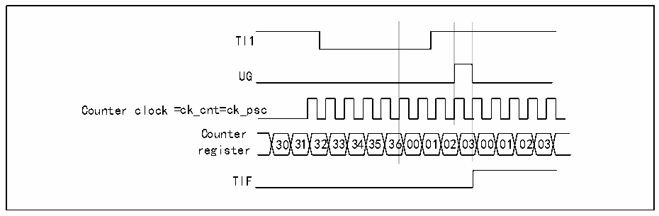

<!-- source-page: 143 -->

[← p.142](0142.md) · [index](../README.md) · [PDF p.143](https://ch32-riscv-ug.github.io/CH32V205/datasheet_zh/CH32V205RM.PDF#page=143) · [p.144 →](0144.md)

<!-- header: CH32V205应用手册 https://wch.cn -->
从模式：复位模式  
计数器及其预分频器可以响应触发输入事件而被重新初始化；如果 R16_TIMx_CTLR1 寄存器的  
URS 位为低，则产生一个更新事件 UEV；然后更新所有的预装载寄存器(R16_TIMx_ATRLR，  
R16_TIMx_CHxCVR)。  
以下示例中，当TI1输入出现上升沿，向上计数器清零：  
1) 配置通道1以检测TI1的上升沿。配置输入滤波器带宽(本例不需要任何滤波器，因此保持  
IC1F=0000)。无需配置捕获分频器，因为其不用于触发操作。CC1S位只选择输入捕获源，  
即CC1S=01（在R16_TIMx_CCMR1中）。将CC1P=0和CC1NP=&#x27;0&#x27;写入R16_TIMx_CCER寄存器  
以验证极性(只检测上升沿)；  
2) 将 SMS=100 写入 R16_TIMx_SMCFGR，配置定时器为复位模式；将 TS=101 写入  
R16_TIMx_SMCFGR，选择TI1作为输入源；  
3) 将CEN=1写入R16_TIMx_CTLR1，启动计数器。  
计数器使用内部时钟计数，然后正常运转，当出现一个TI1上升沿，计数器清零并从0开始重  
新计数。同时，触发标志 TIF 位置 1，使能中断或 DMA 后，可以发送中断或 DMA 请求。（取决于  
R16_TIMx_DMAINTENR寄存器中TIE(中断使能)位和TDE(DMA使能)位）。  
下图显示当自动重装载寄存器 R16_TIMx_ARR=0x36 时的动作。TI1 上升沿与实际计数器复位之  
间的延时是TI1输入端的重新同步电路造成的。  

图14-6 复位模式下的控制电路  
 <!-- rendered from the PDF; verify at https://ch32-riscv-ug.github.io/CH32V205/datasheet_zh/CH32V205RM.PDF#page=143 -->

🖼 Text parsed from the figure above

TI1  
UG  
Counter clock =ck_cnt=ck_psc  
Counter  
30 31 32 33 34 35 36 00 01 02 03 00 01 02 03  
register  
TIF  

从模式：门控模式  
输入信号的电平使能计数器。以下的例子中，仅TI1为低时计数器向上计数：  
1) 配置通道1以检测TI1上的低电平。配置输入滤波器带宽(本例不需要任何滤波器，因此保  
持IC1F=0000)。无需配置捕获分频器，因为其不用于触发操作。CC1S位只选择输入捕获源，  
即CC1S=01（在R16_TIMx_CCMR1中）。将CC1P=1和CC1NP=&#x27;0&#x27;写入R16_TIMx_CCER寄存器  
以验证极性(只检测低电平)。  
2) 将 SMS=101 写入 R16_TIMx_SMCFGR，配置定时器为门控模式；将 TS=101 写入  
R16_TIMx_SMCFGR，选择TI1作为输入源。  
3) 将CEN=1写入R16_TIMx_CTLR1，启动计数器。门控模式下，如果CEN=0，无论触发输入电  
平如何，计数器都不会启动。  
只要 TI1 为低，计数器开始依据内部时钟计数，TI1 变高时停止计数。当计数器开始或停止时  
都将R16_TIMx_INTFR中的TIF位置1。TI1上升沿与实际计数器复位之间的延时是TI1输入端的重  
新同步电路造成的。  
<!-- image: p143-draw-image-00001 bbox=[507.84, 786.36, 527.28, 796.68] -->
<!-- footer: V1.2 138 -->
