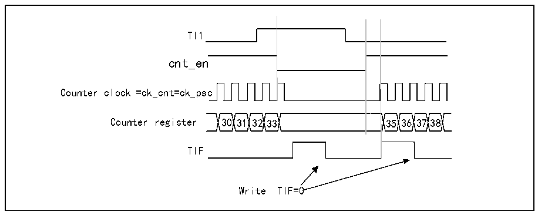
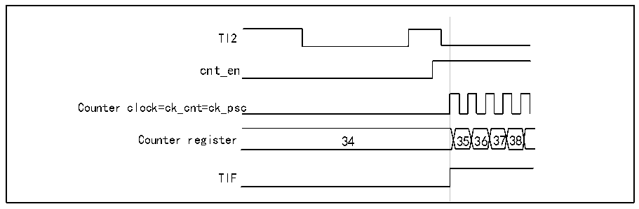

<!-- source-page: 144 -->

[← p.143](0143.md) · [index](../README.md) · [PDF p.144](https://ch32-riscv-ug.github.io/CH32V205/datasheet_zh/CH32V205RM.PDF#page=144) · [p.145 →](0145.md)

<!-- header: CH32V205应用手册 https://wch.cn -->

图14-7 门控模式下的控制电路  
 <!-- rendered from the PDF; verify at https://ch32-riscv-ug.github.io/CH32V205/datasheet_zh/CH32V205RM.PDF#page=144 -->

🖼 Text parsed from the figure above

TI1  
cnt_en  
Counter clock =ck_cnt=ck_psc  
Counter register 30 31 32 33 35 36 3738  
TIF  
Write TIF=0  

从模式：触发模式  
选择的输入端上发生事件时将使能计数器。以下示例中，当TI2输入出现上升沿，向上计数器  
启动：  
1) 配置通道 2 以检测 TI2 的上升沿。配置输入滤波器带宽(本例不需要任何滤波器，因此保持  
IC2F=0000)。无需配置捕获分频器，因为其不用于触发操作。CC2S位只选择输入捕获源，置  
CC2S=01（在R16_TIMx_CCMR1中）。将CC2P=1和CC2NP=‘0’写入R16_TIMx_CCER寄存器以  
验证极性（只检测低电平）；  
2) 将 SMS=110 写入 R16_TIMx_SMCFGR 寄存器，配置定时器为触发模式；将 TS=110 写入  
R16_TIMx_SMCFGR寄存器，选择TI2作为输入源。  
当TI2出现上升沿，计数器开始在内部时钟驱动下计数，同时TIF置1。  
TI2上升沿和实际计数器启动之间的延时，是由TI2输入端的重同步电路造成。  

图14-8 触发模式下的控制电路  
 <!-- rendered from the PDF; verify at https://ch32-riscv-ug.github.io/CH32V205/datasheet_zh/CH32V205RM.PDF#page=144 -->

🖼 Text parsed from the figure above

TI2  
cnt_en  
Counter clock=ck_cnt=ck_psc  
Counter register 34 3536 3738  
TIF  

从模式：外部时钟模式2＋触发模式  
外部时钟模式2可结合除外部时钟模式1和编码器模式以外的另一种从模式一起使用。此时，  
ETR信号用作外部时钟的输入，在复位模式、门控模式或触发模式下，另一个输入可作为触发输入。  
不建议通过R16_TIMx_SMCFGR寄存器的TS位来选择ETR作为TRGI。以下示例中，一旦在TI1上出  
现一个上升沿，向上计数器即在ETR的每一个上升沿递增：  
1) 配置R16_TIMx_SMCFGR寄存器以配置外部触发输入电路：  
─ETF=0000：没有滤波；  
─ETPS=00：不用预分频器；  
─ETP=0：检测ETR的上升沿，置ECE=1使能外部时钟模式2。  
2) 配置通道1以检测TI的上升沿：  
<!-- image: p144-draw-image-00001 bbox=[507.84, 786.36, 527.28, 796.68] -->
<!-- footer: V1.2 139 -->
