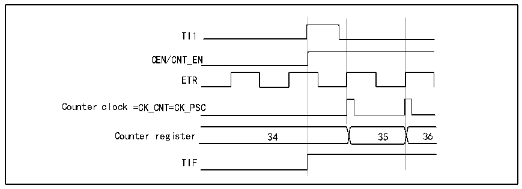
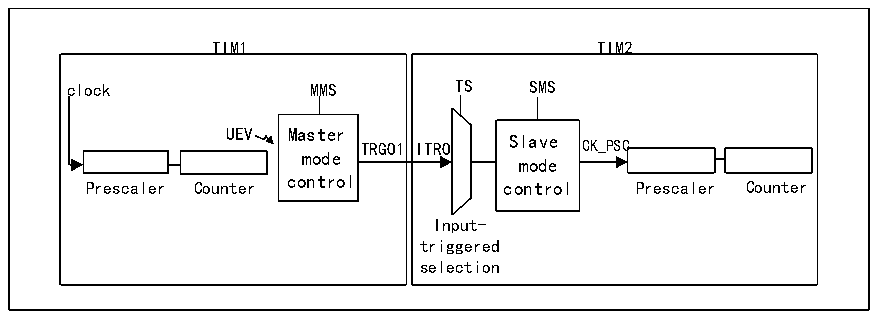

<!-- source-page: 145 -->

[← p.144](0144.md) · [index](../README.md) · [PDF p.145](https://ch32-riscv-ug.github.io/CH32V205/datasheet_zh/CH32V205RM.PDF#page=145) · [p.146 →](0146.md)

<!-- header: CH32V205应用手册 https://wch.cn -->
─IC1F=0000：没有滤波；  
─无需配置捕获分频器，因为其不用于触发操作；  
─置R16_TIMx_CHCTLR1寄存器中CC1S=01，选择输入捕获源；  
─置R16_TIMx_CCER寄存器中CC1P=0以确定极性(只检测上升沿)。  
3) 将 SMS=110 写入 R16_TIMx_SMCFGR 寄存器，配置定时器为触发模式。将 TS=101 写入  
R16_TIMx_SMCFGR寄存器，选择TI1作为输入源。  
当TI1出现上升沿，使能计数器，TIF置1，计数器开始在ETR的上升沿计数。ETR信号的  
上升沿和实际计数器复位间的延时，由ETRP输入端的重同步电路造成。  

图14-9 外部时钟模式2+触发模式下的控制电路  
 <!-- rendered from the PDF; verify at https://ch32-riscv-ug.github.io/CH32V205/datasheet_zh/CH32V205RM.PDF#page=145 -->

🖼 Text parsed from the figure above

TI1  
35  
CEN/CNT_EN  
ETR  
Counter clock =CK_CNT=CK_PSC  
Counter register 34 35 36  
TIF  

### 14.3.12 定时器同步模式

TIMx定时器从内部连接在一起，以实现定时器同步或级联。当某个定时器配置为主模式时，可  
对另一个配置为从模式的定时器的计数器执行复位、启动、停止操作或为其提供时钟。  
将一个定时器用作另一个定时器的预分频器  

图14-10主/从定时器示例  
 <!-- rendered from the PDF; verify at https://ch32-riscv-ug.github.io/CH32V205/datasheet_zh/CH32V205RM.PDF#page=145 -->

🖼 Text parsed from the figure above

TIM1 TIM2  
TIM1 clock MMS UEV Master TRGO1 mode control Prescaler Counter  TIM2 TS SMS ITRO Slave CK_PSC mode control Prescaler Counter Input- triggered selection  

例如，可以将定时器1配置为定时器2的预分频器。为此：  
1) 将定时器1配置为主模式，每次发生更新事件UEV时都输出一个周期性触发信号。如果将  
MMS=010写入R16_TIM1_CTLR2，则每当生成更新事件，TRGO1都会输出一个上升沿。  
2) 要将定时器1的TRGO1输出连接到定时器2，必须将定时器2配置为从模式，使用ITR0作  
为内部触发。通过R16_TIM2_SMCFGR寄存器中的TS位（写入TS=000）可对此进行选择。  
3) 然后将从模式控制器设为外部时钟模式1（在R16_TIM2_SMCFGR寄存器中写入SMS=111）。  
这样一来，定时器2的时钟将由定时器1周期性触发信号的上升沿（与定时器1的计数器  
上溢对应）提供。  
4) 最后必须通过将这两个定时器的相应CEN位（R16_TIMx_CTLR1寄存器）置1同时使能二者。  
<!-- image: p145-draw-image-00001 bbox=[507.84, 786.36, 527.28, 796.68] -->
<!-- footer: V1.2 140 -->
