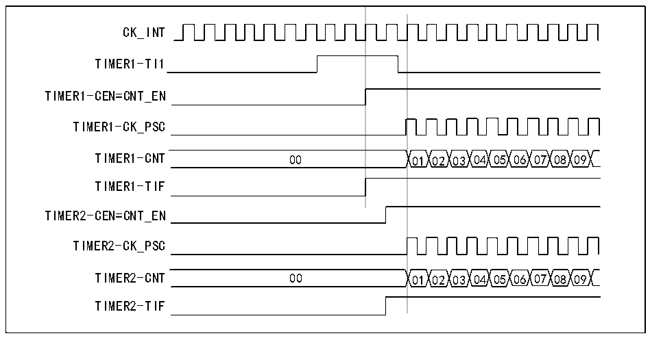

<!-- source-page: 149 -->

[← p.148](0148.md) · [index](../README.md) · [PDF p.149](https://ch32-riscv-ug.github.io/CH32V205/datasheet_zh/CH32V205RM.PDF#page=149) · [p.150 →](0150.md)

<!-- header: CH32V205应用手册 https://wch.cn -->

图14-15 使用定时器1的TI1输入触发定时器1和定时器2  
 <!-- rendered from the PDF; verify at https://ch32-riscv-ug.github.io/CH32V205/datasheet_zh/CH32V205RM.PDF#page=149 -->

🖼 Text parsed from the figure above

CK_INT  
TIMER1-TI1  
TIMER1-CEN=CNT_EN  
TIMER1-CK_PSC  
TIMER1-CNT 00 01 02 03 04 05 06 07 08 09  
TIMER1-TIF  
TIMER2-CEN=CNT_EN  
TIMER2-CK_PSC  
TIMER2-CNT 00 01 02 03 04 05 06 07 08 09  
TIMER2-TIF  

定时器能够输出时钟脉冲（TRGO），也能接收其他定时器的输入（ITRx）。不同的定时器的ITRx  
的来源（别的定时器的TRGO）是不一样的。定时器内部触发连接如表14-2所示。  

<!-- p149-table-002 (table-14-2@1) -->
<table><caption>表14-2 TIMx内部触发连接</caption><tr><th>从定时器</th><th>ITR0(TS=000)</th><th>ITR1(TS=001)</th><th>ITR2(TS=010)</th><th>ITR3(TS=011)</th></tr><tr><td>TIM1</td><td>-</td><td>TIM2</td><td>TIM3</td><td>TIM4</td></tr></table>

### 14.3.13 调试模式

当系统进入调试模式时，定时器根据DBG模块的设置继续运转或停止。  

### 14.3.14 DMA 连续传送功能

在本示例中，定时器DMA连续传送功能用于将TIM1_CHxCVR寄存器（x = 2、3、4）的内容更新  
为通过DMA传输到TIM1_CHxCVR寄存器中的多个半字。  
具体操作步骤如下：  
1.将相应的DMA通道配置如下：  
— DMA通道外设地址为TIM1_DMAADR寄存器地址。  
— DMA通道存储器地址为包含要通过DMA传输到TIM1_CHxCVR寄存器的数据的RAM缓冲区地址。  
— 要传输的数据量等于3（详见注释）。  
— 禁止循环模式。  
2.将TIM1_DMACFGR寄存器的DBL位设置为3次传输，DBA设置为0xE。  
3.将TIM1_DMAINTENR寄存器UDE位置1，使能TIM1更新DMA请求。  
4.使能TIM1。  
5.使能DMA通道。  
注：本例适用于每个TIM1_CHxCVR寄存器只更新一次的情况。  
如果每个TIM1_CHxCVR寄存器要更新两次，则要传输的数据量应为6。下面以包含data1、data2、  
data3、data4、data5和data6的RAM缓冲区为例。数据将按照如下方式传输到TIM1_CHxCVR寄存  
器：在第一个更新DMA请求期间，data1传输到TIM1_CH2CVR，data2传输到TIM1_CH3CVR，data3  
传输到 TIM1_CH4CVR；在第二个更新 DMA 请求期间，data4 传输到 TIM1_CH2CVR，data5 传输到  
TIM1_CH3CVR，data6传输到TIM1_CH4CVR。  
<!-- image: p149-draw-image-00001 bbox=[507.84, 786.36, 527.28, 796.68] -->
<!-- footer: V1.2 144 -->
