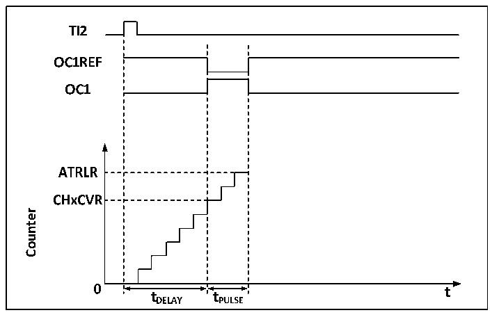

<!-- source-page: 175 -->

[← p.174](0174.md) · [index](../README.md) · [PDF p.175](https://ch32-riscv-ug.github.io/CH32V205/datasheet_zh/CH32V205RM.PDF#page=175) · [p.176 →](0176.md)

<!-- header: CH32V205应用手册 https://wch.cn -->

图15-4 事件产生和脉冲响应  
 <!-- rendered from the PDF; verify at https://ch32-riscv-ug.github.io/CH32V205/datasheet_zh/CH32V205RM.PDF#page=175 -->

🖼 Text parsed from the figure above

<!-- image: p175-draw-image-00003 inside the figure -->
<!-- image: p175-draw-image-00002 inside the figure -->
<!-- image: p175-draw-image-00004 inside the figure -->
<!-- image: p175-draw-image-00005 inside the figure -->
<!-- image: p175-draw-image-00006 inside the figure -->
<!-- image: p175-draw-image-00007 inside the figure -->
<!-- image: p175-draw-image-00008 inside the figure -->
<!-- image: p175-draw-image-00015 inside the figure -->
<!-- image: p175-draw-image-00016 inside the figure -->
<strong>Counter</strong>  
<!-- image: p175-draw-image-00009 inside the figure -->
<!-- image: p175-draw-image-00014 inside the figure -->
<!-- image: p175-draw-image-00010 inside the figure -->
<!-- image: p175-draw-image-00012 inside the figure -->
<!-- image: p175-draw-image-00013 inside the figure -->
<!-- image: p175-draw-image-00011 inside the figure -->

如图15-4所示，需要在TI2输入引脚上检测到一个上升沿开始，延迟Tdelay之后，在OC1上  
产生一个长度为Tpulse的正脉冲：  
1） 设定TI2为触发。置CC2S域为01b，把TI2FP2映射到TI2；置CC2P位为0b，TI2FP2设为上升  
沿检测；置TS域为110b，TI2FP2设为触发源；置SMS域为110b，TI2FP2被用来启动计数器；  
2） Tdelay由比较捕获寄存器定义，Tpulse由自动重装值寄存器的值和比较捕获寄存器的值确定。  

### 15.3.7 编码器模式

编码器模式是定时器的一个典型应用，可以用来接入编码器的双相输出，核心计数器的计数方  
向和编码器的转轴方向同步，编码器每输出一个脉冲就会使核心计数器加一或减一。使用编码器的  
步骤为：将SMS域置为001b（只在TI2边沿计数）、010b（只在TI1边沿计数）或者011b（在TI1  
和TI2双边沿计数），将编码器接到比较捕获通道1、2的输入端，设一个重装值计数器的值，这个  
值可以设的大一点。在编码器模式时，定时器内部的比较捕获寄存器，预分频器，重复计数寄存器  
等都正常工作。下表表明了计数方向和编码器信号的关系。  

<!-- p175-table-002 (table-15-1@1) -->
<table><caption>表15-1定时器编码器模式的计数方向和编码器信号之间的关系</caption><tr><th rowspan="2">计数有效边沿</th><th rowspan="2" style="text-align:left">相对信号的电平</th><th colspan="2">TI1FP1信号边沿</th><th colspan="2">TI2FP2信号</th></tr><tr><td>上升沿</td><td>下降沿</td><td>上升沿</td><td>下降沿</td></tr><tr><td rowspan="2">仅在TI1边沿计数</td><td>高</td><td>向下计数</td><td>向上计数</td><td rowspan="2" colspan="2">不计数</td></tr><tr><td>低</td><td>向上计数</td><td>向下计数</td></tr><tr><td rowspan="2">仅在TI2边沿计数</td><td>高</td><td rowspan="2" colspan="2">不计数</td><td>向上计数</td><td>向下计数</td></tr><tr><td>低</td><td>向下计数</td><td>向上计数</td></tr><tr><td rowspan="2">在TI1和TI2双边沿计数</td><td>高</td><td>向下计数</td><td>向上计数</td><td>向上计数</td><td>向下计数</td></tr><tr><td>低</td><td>向上计数</td><td>向下计数</td><td>向下计数</td><td>向上计数</td></tr></table>

### 15.3.8 定时器同步模式

定时器能够输出时钟脉冲（TRGO），也能接收其他定时器的输入（ITRx）。不同的定时器的ITRx  
的来源（别的定时器的TRGO）是不一样的。定时器内部触发连接如表15-2所示。  

<!-- p175-table-003 (table-15-2@1) pages 175-176 -->
<table><caption>表15-2 GTPM内部触发连接</caption><tr><th>从定时器</th><th>ITR0(TS=000)</th><th>ITR1(TS=001)</th><th>ITR2(TS=010)</th><th>ITR3(TS=011)</th></tr><tr><td>TIM2</td><td>TIM1</td><td>USB</td><td>TIM3</td><td>TIM4</td></tr><tr><td>TIM3</td><td>TIM1</td><td>TIM2</td><td>-</td><td>TIM4</td></tr><tr><td>TIM4</td><td>TIM1</td><td>TIM2</td><td>TIM3</td><td>-</td></tr></table>

<!-- image: p175-draw-image-00001 bbox=[507.84, 786.36, 527.28, 796.68] -->
<!-- footer: V1.2 170 -->
