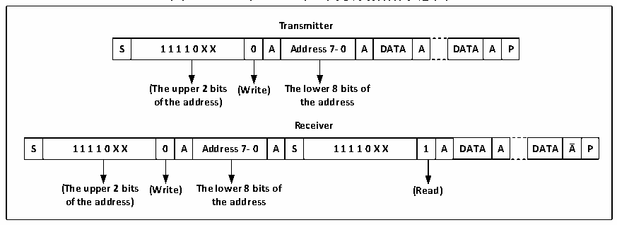

<!-- source-page: 218 -->

[← p.217](0217.md) · [index](../README.md) · [PDF p.218](https://ch32-riscv-ug.github.io/CH32V205/datasheet_zh/CH32V205RM.PDF#page=218) · [p.219 →](0219.md)

<!-- header: CH32V205应用手册 https://wch.cn -->
决定了后续报文的方向，0代表是主设备写入数据到从设备，1代表是主设备向从设备读取信息。  
在10位地址模式下，如图18-3所示，在发送地址阶段，第一个字节为11110xx0，xx为10位  
地址的最高 2 位，第二个字节为 10 位地址的低 8 位。若后续进入主设备发送模式，则继续发送数  
据；若后续准备进入主设备接收模式，则需要重新发送一个起始条件，跟随发送一个字节为  
11110xx1，然后进入主设备接收模式。  

图18-3 10位地址时主机收发数据示意图  
 <!-- rendered from the PDF; verify at https://ch32-riscv-ug.github.io/CH32V205/datasheet_zh/CH32V205RM.PDF#page=218 -->

🖼 Text parsed from the figure above

<strong>Transmitter</strong>  
S  1 1 1 1 0 X X  0  A  Address 7- 0  A  DATA  A  DATA  A  P  
<strong>(The upper 2 bits (Write) The lower 8 bits of</strong>  
<strong>of the address) the address</strong>  
<strong>Receiver</strong>  
S  1 1 1 1 0 X X  0  A  Address 7- 0  A  S  1 1 1 1 0 X X  1  A  DATA  A  DATA  A  P  
<strong>(The upper 2 bits (Write) The lower 8 bits of (Read)</strong>  
<strong>of the address) the address</strong>  

发送模式时，主设备内部的移位寄存器将数据从数据寄存器发送到SDA线上，当主设备接收到  
ACK时，状态寄存器1（R16_I2Cx_STAR1）的TxE被置位，如果ITEVTEN和ITBUFEN被置位，还会产  
生中断。向数据寄存器写入数据将会清除TxE位。如果TxE位被置位且上次发送数据之前没有新的  
数据被写入数据寄存器，那么 BTF 位会被置位,在其被清除之前，SCL 将保持低电平，读  
R16_I2Cx_STAR1后，向数据寄存器写入数据将会清除BTF位。  
在接收模式时，I2C 模块会从 SDA 线接收数据，通过移位寄存器写进数据寄存器。在每个字节  
之后，如果 ACK 位被置位，那么 I2C 模块将会发出一个应答低电平，同时 RxNE 位会被置位，如果  
ITEVTEN和ITBUFEN被置位，还会产生中断。如果RxNE被置位且在新的数据被接收前，原有的数据  
没有被读出，则BTF位将被置位，在清除BTF之前，SCL将保持低电平，读取R16_I2Cx_STAR1后，  
再读取数据寄存器将会清除BTF位。  
主设备在结束发送数据时，会主动发一个结束事件，即置 STOP 位。在接收模式时，主设备需  
要在最后一个数据位的应答位置NAK。注意，产生NAK后，I2C模块将会切换至从模式。  

## 18.4 从模式

从模式时，I2C 模块能识别它自己的地址和广播呼叫地址。软件能控制开启或禁止广播呼叫地  
址的识别。一旦检测到起始事件，I2C 模块将 SDA 的数据通过移位寄存器与自己的地址（位数取决  
于ENDUAL和ADDMODE）或广播地址（ENGC置位时）相比较，如果不匹配将会忽略，直到产生新的起  
始事件。如果与头序列相匹配，则会产生一个ACK信号并等待第二个字节的地址；如果第二字节的  
地址也匹配或7位地址情况下全段地址匹配，那么：  
首先产生一个 ACK 应答；ADDR 位被置位，如果 ITEVTEN 位已经置位，那么还会产生相应的中  
断；  
如果使用的是双地址模式（ENDUAL位被置位），还需要读取DUALF位来判断主机唤起的是哪一  
个地址。  
从模式默认是接收模式，在接收的头序列的最后一位为 1，或 7 位地址最后一位为 1时（取决  
于第一次接收到头序列还是普通的7位地址），I2C模块将进入到发送器模式，TRA位将指示当前是  
接收器还是发送器模式。  
发送模式时，在清除 ADDR 位后，I2C 模块将字节从数据寄存器通过移位寄存器发送到 SDA 线  
上。在收到一个应答 ACK 后，TxE 位将被置位，如果设置了 ITEVTEN 和 ITBUFEN，还会产生一个中  
断。如果 TxE 被置位但在下一个数据发送结束前没有新的数据被写入数据寄存器时，BTF 位将被置  
<!-- image: p218-draw-image-00001 bbox=[507.84, 786.36, 527.28, 796.68] -->
<!-- footer: V1.2 213 -->
