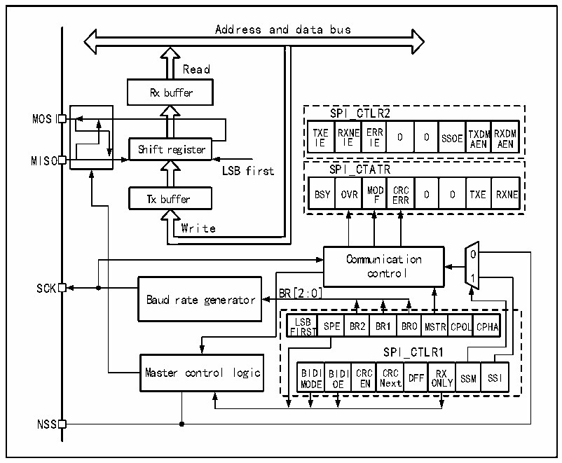

<!-- source-page: 230 -->

[← p.229](0229.md) · [index](../README.md) · [PDF p.230](https://ch32-riscv-ug.github.io/CH32V205/datasheet_zh/CH32V205RM.PDF#page=230) · [p.231 →](0231.md)

<!-- header: CH32V205应用手册 https://wch.cn -->

# 第 19 章 串行外设接口（SPI）

SPI 支持以三线同步串行模式进行数据交互，加上片选线支持硬件切换主从模式，支持以单根  
数据线通讯。  

## 19.1 主要特征

### 19.1.1 SPI特征

● 支持全双工同步串行模式  
● 支持单线半双工模式  
● 支持主模式和从模式，多从模式  
● 支持8位或16位数据结构  
● 最高时钟频率支持到Fpclk的一半  
● 数据顺序支持MSB或LSB在前  
● 支持硬件或软件控制NSS引脚  
● 收发支持硬件CRC校验  
● 收发缓冲器支持DMA传输  
● 支持修改时钟相位和极性  

## 19.2 SPI 功能描述

### 19.2.1 概述

图19-1 SPI结构框图  
 <!-- rendered from the PDF; verify at https://ch32-riscv-ug.github.io/CH32V205/datasheet_zh/CH32V205RM.PDF#page=230 -->

🖼 Text parsed from the figure above

Address and data bus  
Read  
Rx buffer  
SPI_CTLR2  
MOSI  
T I X E E R I X E NE E I R E R 0 0 SSOE T A X E D N MR A X E D N M  
Shift register  
MISO  
LSB first SPI_CTATR  
Tx buffer BSY OVR MO F D E C R R R C 0 0 TXE RXNE  
Write  
Communication 0  
control  
1  
SCK  
BR[2:0]  LSBFIRST  SPE  BR2  BR1  BR0  MSTR  RCPOL  LCPHA  
Baud rate generator  
SPI_CTLR1  
BIDIMODE  BIDIOE  CRCEN  CRCNext  DFF  RXONL  X LY SSM  SSI  
NSS  

由图19-1可以看出，与SPI相关的主要是MISO、MOSI、SCK和NSS四个引脚。其中MISO引脚  
在SPI模块工作在主模式下时，是数据输入引脚；工作在从模式下时，是数据输出引脚。MOSI引脚  
<!-- image: p230-draw-image-00001 bbox=[507.84, 786.36, 527.28, 796.68] -->
<!-- footer: V1.2 225 -->
