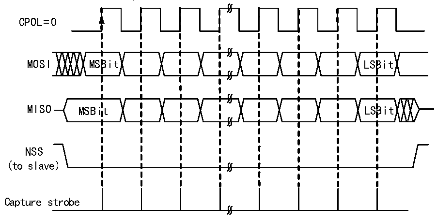
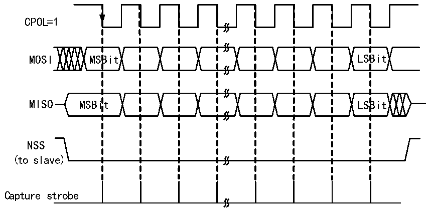

<!-- source-page: 232 -->

[← p.231](0231.md) · [index](../README.md) · [PDF p.232](https://ch32-riscv-ug.github.io/CH32V205/datasheet_zh/CH32V205RM.PDF#page=232) · [p.233 →](0233.md)

<!-- header: CH32V205应用手册 https://wch.cn -->

图19-2 SPI主模式读写模式0  
 <!-- rendered from the PDF; verify at https://ch32-riscv-ug.github.io/CH32V205/datasheet_zh/CH32V205RM.PDF#page=232 -->

MODE 0  
CPHA=0  

🖼 Text parsed from the figure above

CPOL=0  
MOSI MSBit LSBit  
MISO MSBit LSBit  
NSS  
(to slave)  
Capture strobe  

图19-3 SPI主模式读写模式1  
 <!-- rendered from the PDF; verify at https://ch32-riscv-ug.github.io/CH32V205/datasheet_zh/CH32V205RM.PDF#page=232 -->

MODE 1  
CPHA=0  

🖼 Text parsed from the figure above

CPOL=1  
MOSI MSBit LSBit  
MISO MSBit LSBit  
NSS  
(to slave)  
Capture strobe  

<!-- image: p232-draw-image-00001 bbox=[507.84, 786.36, 527.28, 796.68] -->
<!-- footer: V1.2 227 -->
