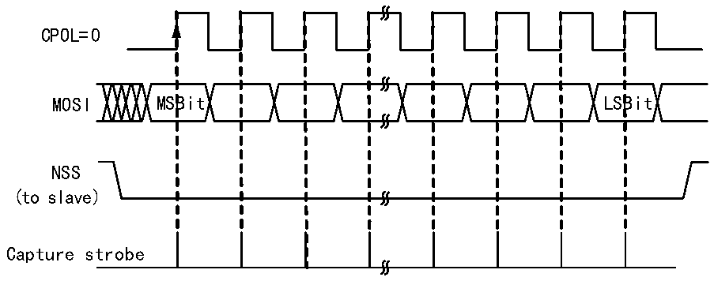
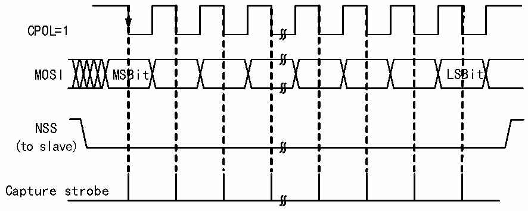

<!-- source-page: 234 -->

[← p.233](0233.md) · [index](../README.md) · [PDF p.234](https://ch32-riscv-ug.github.io/CH32V205/datasheet_zh/CH32V205RM.PDF#page=234) · [p.235 →](0235.md)

<!-- header: CH32V205应用手册 https://wch.cn -->
保持SSI不被置位；  
清除MSTR位，置SPE位，开启SPI模式。  
在发送时，当SCK出现第一个从机接收采样沿时，从机开始发送。发送的过程就是发送缓冲区  
的数据移到发送移位寄存器，当发送缓冲区的数据移到了移位寄存器之后，会置位TXE标志，如果  
之前置位了TXEIE位，那么会产生中断。  
在接收时，最后一个时钟采样沿之后，RXNE位被置位，移位寄存器接收到的字节被转移到接收  
缓冲区，读数据寄存器的读操作可以获得接收缓冲区里的数据。如果在RXNE置位之前RXNEIE已经  
被置位，那么会产生中断。  

图19-6 SPI从模式读模式0  
 <!-- rendered from the PDF; verify at https://ch32-riscv-ug.github.io/CH32V205/datasheet_zh/CH32V205RM.PDF#page=234 -->

MODE 0  
CPHA=0  

🖼 Text parsed from the figure above

CPOL=0  
MOSI MSBit LSBit  
NSS  
(to slave)  
Capture strobe  

图19-7 SPI从模式读模式1  
 <!-- rendered from the PDF; verify at https://ch32-riscv-ug.github.io/CH32V205/datasheet_zh/CH32V205RM.PDF#page=234 -->

MODE 1  
CPHA=0  

🖼 Text parsed from the figure above

CPOL=1  
MOSI MSBit LSBit  
NSS  
(to slave)  
Capture strobe  

<!-- image: p234-draw-image-00001 bbox=[507.84, 786.36, 527.28, 796.68] -->
<!-- footer: V1.2 229 -->
