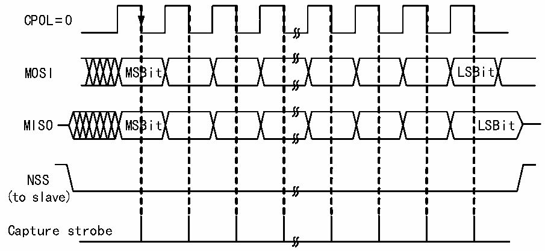
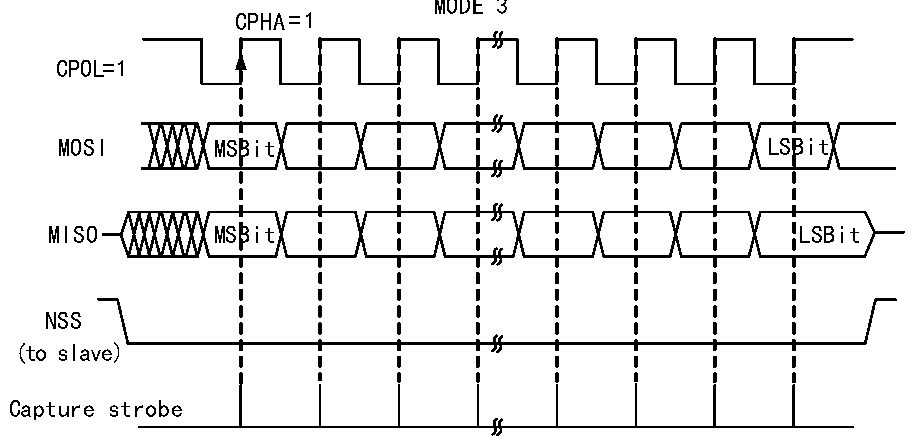

<!-- source-page: 235 -->

[← p.234](0234.md) · [index](../README.md) · [PDF p.235](https://ch32-riscv-ug.github.io/CH32V205/datasheet_zh/CH32V205RM.PDF#page=235) · [p.236 →](0236.md)

<!-- header: CH32V205应用手册 https://wch.cn -->

图19-8 SPI从模式读写模式2  
 <!-- rendered from the PDF; verify at https://ch32-riscv-ug.github.io/CH32V205/datasheet_zh/CH32V205RM.PDF#page=235 -->

MODE 2  
CPHA=1  

🖼 Text parsed from the figure above

CPOL=0  
MOSI MSBit LSBit  
MISO MSBit LSBit  
NSS  
(to slave)  
Capture strobe  

图19-9 SPI从模式读写模式3  
 <!-- rendered from the PDF; verify at https://ch32-riscv-ug.github.io/CH32V205/datasheet_zh/CH32V205RM.PDF#page=235 -->

🖼 Text parsed from the figure above

MODE 3  
CPHA=1  
CPOL=1  
MOSI MSBit LSBit  
MISO MSBit LSBit  
NSS  
(to slave)  
Capture strobe  

### 19.2.4 单工模式

SPI 接口可以工作在半双工模式，即主设备使用 MOSI 引脚，从设备使用 MISO 引脚进行通讯。  
使用半双工通讯时需要把BIDIMODE置位，使用BIDIOE控制传输方向。  
在正常全双工模式下将 RXONLY 位置位可以将SPI 模块设置为仅仅接收的单工模式，在 RXONLY  
置位之后会释放一个数据脚，主模式和从模式释放的引脚并不相同。也可以不理会接收的数据将SPI  
置成只发送的模式。  

### 19.2.5 CRC

SPI 模块使用 CRC 校验保证全双工通信的可靠性，数据收发分别使用单独的 CRC 计算器。CRC  
计算的多项式由多项式寄存器决定，对于8位数据宽度和16位数据宽度，会分别使用不同的计算方  
法。  
设置CRCEN位会启用CRC校验，同时会使CRC计算器复位。在发送完最后一个数据字节后，置  
<!-- image: p235-draw-image-00001 bbox=[507.84, 786.36, 527.28, 796.68] -->
<!-- footer: V1.2 230 -->
