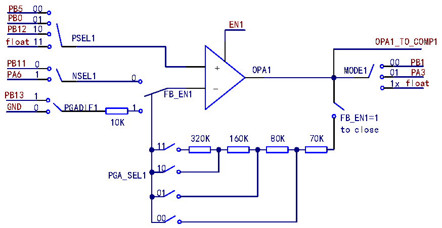

<!-- source-page: 283 -->

[← p.282](0282.md) · [index](../README.md) · [PDF p.283](https://ch32-riscv-ug.github.io/CH32V205/datasheet_zh/CH32V205RM.PDF#page=283) · [p.284 →](0284.md)

<!-- header: CH32V205应用手册 https://wch.cn -->

# 第 23 章 运放（OPA）和比较器（CMP）

该模块包含2个可独立配置的运算放大器（OPA）和2个可独立配置的电压比较器（CMP），其  
中运算放大器（OPA）可配置为可编程增益放大器（PGA），支持增益选择，也可用于电压比较器。  
每个运算放大器的输入和输出通道均连接至I/O口，并可通过配置选择，支持多通道自动轮询，  
内部可关联到ADC和CMP输入通道，支持将外部模拟小信号放大后送入ADC进行转换。  
每个电压比较器的输入通道连接至I/O口，并可通过配置选择，支持两通道自动轮询，可选迟  
滞特性，输出引脚可选择配置到通用I/O口或复用为TIM内部采样通道（不占用I/O引脚）。  

## 23.1 主要特性

● OPA1/OPA2支持自偏置的可编程增益运放（PGA）  
● OPA1/OPA2输出直连到比较器输入端  
● OPA1/OPA2支持单端及差分输入，支持PGA放大倍数选择  
● OPA1支持正端输入轮询功能  
● OPA中断可使系统从睡眠模式中唤醒  
● CMP1/CMP2支持可选数字滤波及迟滞  
● CMP1/CMP2输出引脚可选择通用I/O口或TIM内部采样通道  
● CMP中断可使系统从睡眠和停止模式中唤醒  
● 1个中断向量  

## 23.2 功能描述

### 23.2.1 运放 OPA

在OPA_CTLR1寄存器中：配置EN1位，可使能OPA1；配置PSEL1[1:0]位，可选择OPA1正端输  
入通道；配置NSEL1位，可选择OPA1负端输入通道；配置FB_EN1位，可使能OPA1内部PGA模式；  
配置PGA_SEL1[1:0]位，可选择PGA1的增益大小；配置PGADIF1位，可选择PGA1输出偏置电压外  
供或内接地；配置HS1位，可使能高速模式，在此模式下可提高压摆率；配置MODE1[1:0]位，可选  
择OPA1的输出通道。  

图23-1 OPA1结构图  
 <!-- rendered from the PDF; verify at https://ch32-riscv-ug.github.io/CH32V205/datasheet_zh/CH32V205RM.PDF#page=283 -->

🖼 Text parsed from the figure above

PB5 00  
PB0 01  
EN1  
PB12 10  
PSEL1  
float 11 OPA1_TO_COMP1  
PB11 0 00 PB1  
PA6 1 NSEL1 0 + OPA1 MODE1 01 PA3  
1x float  
-  
PB13 1 FB_EN1  
GND 0 PGADIF1 1  
FB_EN1=1  
10K  
to close  
320K 160K 80K 70K  
11  
10  
PGA_SEL1  
01  
00  

在OPA_CTLR2寄存器中：配置EN2位，可使能OPA2；配置PSEL2位，可选择OPA2正端输入通  
<!-- image: p283-draw-image-00001 bbox=[507.84, 786.36, 527.28, 796.68] -->
<!-- footer: V1.2 278 -->
