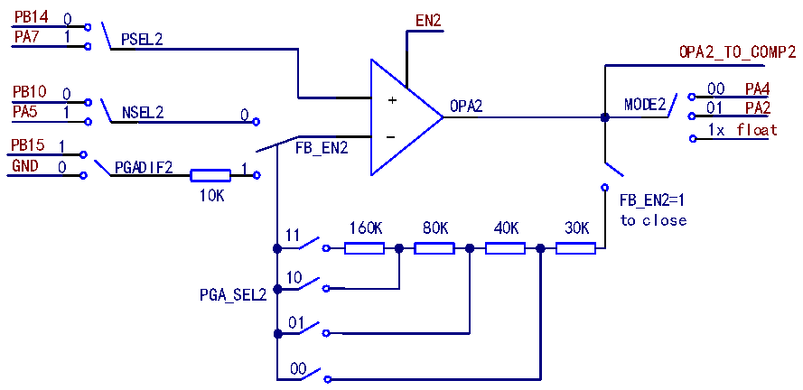
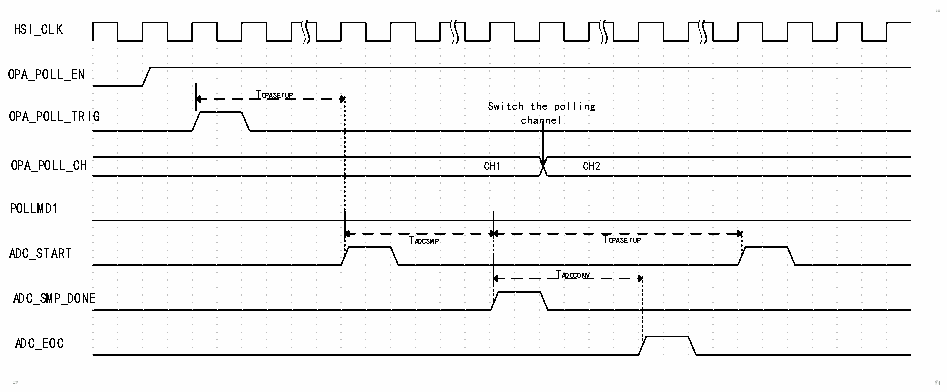

<!-- source-page: 284 -->

[← p.283](0283.md) · [index](../README.md) · [PDF p.284](https://ch32-riscv-ug.github.io/CH32V205/datasheet_zh/CH32V205RM.PDF#page=284) · [p.285 →](0285.md)

<!-- header: CH32V205应用手册 https://wch.cn -->
道；配置NSEL2位，可选择OPA2负端输入通道；配置FB_EN2位，可使能OPA2内部PGA模式；配置  
PGA_SEL2[1:0]位，可选择PGA2的增益大小；配置PGADIF2位，可选择PGA2输出偏置电压外供或内  
接地；配置HS2位，可使能高速模式，在此模式下可提高压摆率；配置MODE2[1:0]位，可选择OPA2  
的输出通道。  

图23-2 OPA2结构图  
 <!-- rendered from the PDF; verify at https://ch32-riscv-ug.github.io/CH32V205/datasheet_zh/CH32V205RM.PDF#page=284 -->

🖼 Text parsed from the figure above

PB14 0 EN2  
PA7 1 PSEL2  
OPA2_TO_COMP2  
PB10 0 00 PA4  
PA5 1 NSEL2 0 + OPA2 MODE2 01 PA2  
1x float  
-  
PB15 1 FB_EN2  
GND 0 PGADIF2 1  
10K FB_EN2=1  
to close  
160K 80K 40K 30K  
11  
10  
PGA_SEL2  
01  
00  

### 23.2.2 运放 OPA1 正输入端轮询

OPA的P端可从OPA_P0/OPA_P1/OPA_P2中选择，可通过OPA_CTLR1寄存器中的POLL1_NUM来配  
置轮询的通道数量，至多可选3个通道；OPA的轮询功能可实现定时依次选择OPA_P0/OPA_P1/OPA_P2，  
轮流选中所有的 P 端；可通过配置 OPA_CTLR1 寄存器中的 POLL_CHx 位来设置 OPA 轮询顺序，配置  
POLL_EN1位可打开OPA1正端轮询。P端轮询功能使用时，须合理配置OPA1的建立时间，确保OPA1  
输出稳定后进行采样，OPA1的建立时间可通过OPA_CFGR1寄存器的STCFG1位配置。  

图23-3 OPA轮询时序图1  
 <!-- rendered from the PDF; verify at https://ch32-riscv-ug.github.io/CH32V205/datasheet_zh/CH32V205RM.PDF#page=284 -->

🖼 Text parsed from the figure above

HSI_CLK  
OPA_POLL_EN  
TOPASETUP  
Switch the polling  
OPA_POLL_TRIG channel  
OPA_POLL_CH CH1 CH2  
POLLMD1  
TADCSMP TOPASETUP  
ADC_START  
TADCCONV  
ADC_SMP_DONE  
ADC_EOC  

TOPASETUP：OPA建立时间。  
TADCSMP：ADC采样时间。  
TADCCONV：ADC转换时间。  
如图23-3，在POLLMD1位配置为0时，配置的轮询触发事件发生后，经过TOPASETUP，ADC开始采  
样，在采样完成后，轮询通道切换，再经过TOPASETUP（注：设置OPA建立时间需大于ADC转换时间），  
进行下一次ADC采样，重复ADC采样后的流程。  
<!-- image: p284-draw-image-00001 bbox=[507.84, 786.36, 527.28, 796.68] -->
<!-- footer: V1.2 279 -->
