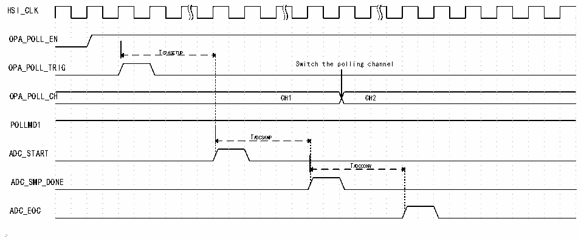

<!-- source-page: 285 -->

[← p.284](0284.md) · [index](../README.md) · [PDF p.285](https://ch32-riscv-ug.github.io/CH32V205/datasheet_zh/CH32V205RM.PDF#page=285) · [p.286 →](0286.md)

<!-- header: CH32V205应用手册 https://wch.cn -->

图23-4 OPA轮询时序图2  
 <!-- rendered from the PDF; verify at https://ch32-riscv-ug.github.io/CH32V205/datasheet_zh/CH32V205RM.PDF#page=285 -->

🖼 Text parsed from the figure above

HSI_CLK  
OPA_POLL_EN  
TOPASETUP  
OPA_POLL_TRIG Switch the polling channel  
OPA_POLL_CH CH1 CH2  
POLLMD1  
TADCSAMP  
ADC_START  
TADCCONV  
ADC_SMP_DONE  
ADC_EOC  

TOPASETUP：OPA建立时间。  
TADCSMP：ADC采样时间。  
TADCCONV：ADC转换时间。  
如图23-4，在POLLMD1位配置为1时，配置的轮询触发事件发生后，经过TOPASETUP，ADC开始采  
样，在采样完成后，轮询通道切换；等待后续轮询触发事件再次发生后重复上述流程。  
使用建议：实际使用时，若ADC转换时间大于OPA建立时间，建议POLLMD1位配置为1同时配  
合ADC扫描模式使用；若ADC转换时间小于OPA建立时间，建议POLLMD1位配置为0同时配合ADC  
单次模式使用。  

### 23.2.3 运放 OPA1 中断

OPA1中断只可唤醒SLEEP睡眠模式，OPA1中断配置：  
1）在内核的PFIC中配置OPA中断，以保证其可以正确响应；  
2）配置POLL_EN1=1，使能OPA1轮询功能；  
3）使能OPA1，使能OPA1中断。  
中断配置：  
（1）OPA1中断  
设置IE_OUT1=1，打开OPA1中断使能，当OPA1输出高电平时进入中断。  
（2）OPA1轮询中断  
设置IE_CNT1=1，打开OPA1轮询间隔结束中断使能，当OPA1的P端轮询一次进入中断。  
（3）OPA1 NMI  
设置NMI_EN1=1，打开OPA1 NMI中断使能，当OPA1输出为高电平，进入NMI中断。  

### 23.2.4 运放 OPA1 复位

使能OPA功能后，设置RST_EN1=1开启OPA1复位功能，OPA1输出为高电平时，系统复位。  

### 23.2.5 运放 OPA刹车

通过设置OPA_CFGR1寄存器中的BKIN_CFG[1:0]位可选择刹车信号源，当BKIN_CFG=00b时，定  
时器的刹车来自IO；当BKIN_CFG=01b时，定时器的刹车来自CMP1/CMP2的输出；当BKIN_CFG=10b  
时，定时器的刹车来自OPA1轮询结果；当BKIN_CFG=11b时，定时器的刹车来自OPA2的输出。  
<!-- image: p285-draw-image-00001 bbox=[507.84, 786.36, 527.28, 796.68] -->
<!-- footer: V1.2 280 -->
