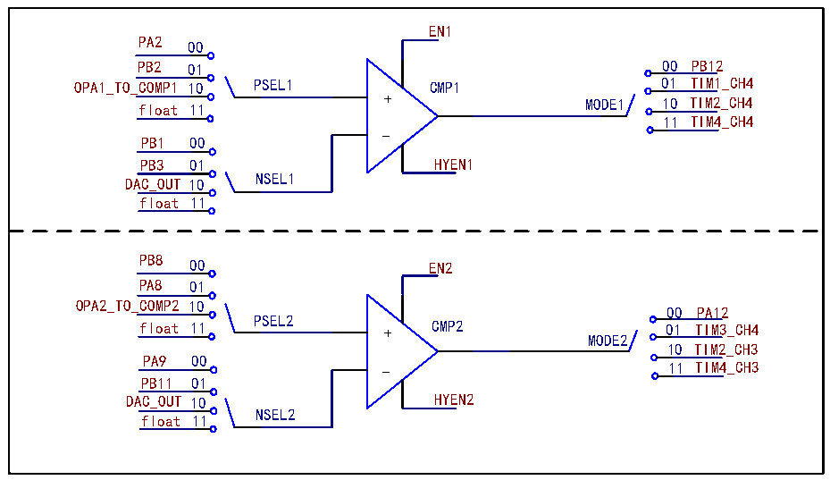

<!-- source-page: 286 -->

[← p.285](0285.md) · [index](../README.md) · [PDF p.286](https://ch32-riscv-ug.github.io/CH32V205/datasheet_zh/CH32V205RM.PDF#page=286) · [p.287 →](0287.md)

<!-- header: CH32V205应用手册 https://wch.cn -->

### 23.2.6 比较器CMP

在CMP_CTLR寄存器中：配置ENx位，可使能对应的CMPx；配置MODEx[1:0]可选择CMPx的输出  
通道为普通 I/O 口或内部定时器通道；配置 PSELx[1:0]，可选择 CMPx 的正端输入引脚；配置  
NSELx[1:0]，可选择CMPx的负端输入引脚；配置HYENx位，可使能CMPx迟滞功能。  

图23-2 CMP结构图  
 <!-- rendered from the PDF; verify at https://ch32-riscv-ug.github.io/CH32V205/datasheet_zh/CH32V205RM.PDF#page=286 -->

🖼 Text parsed from the figure above

EN1  
PA2 00  
PB2 01 00 PB12  
OPA1_TO_COMP1 10 PSEL1 CMP1 01 TIM1_CH4  
+ MODE1 10 TIM2_CH4  
float 11  
11 TIM4_CH4  
-  
PB1 00  
PB3 01 HYEN1  
DAC_OUT 10 NSEL1  
float 11  
PB8 00 EN2  
PA8 01  
OPA2_TO_COMP2 10 00 PA12  
float 11 PSEL2 + CMP2 01 TIM3_CH4  
MODE2  
10 TIM2_CH3  
PA9 00  
11 TIM4_CH3  
PB11 01  
DAC_OUT 10 HYEN2  
NSEL2  
float 11  

注：如果比较器输出使用定时通道，通过定时器捕获用于查看比较器输出状态。  

### 23.2.7 比较器CMP 中断

比较器专属的外部中断（EXTI）线 — EXTI22(COMP唤醒事件)，可产生中断或事件，可用于SLEEP、  
STOP模式1和STOP模式2下唤醒。  
使用外部中断唤醒时，所需条件为：  
1）使能PVD功能；  
2）配置对应的外部中断通道的事件使能位（EXTI_EVENR）；  
3）配置比较器输出触发；  
4）在内核的PFIC中配置EXTI中断，以保证其可以正确响应。  
5）使能CMP。  
注：在STOP模式下需关闭数字滤波功能。  
使用事件时，所需条件为：  
1）配置对应的外部中断通道的事件使能位（EXTI_EVENR）；  
2）配置比较器输出触发；  
3）使能CMP。  
通过配置WKUP_MD[1:0]来选择CMP的唤醒源。  

<!-- p286-table-001 (table-23-1@1) -->
<table><caption>表23-1 CMP唤醒源选择</caption><tr><th>设置WKUP_MD[1:0]</th><th>01</th><th>10</th><th>11</th><th>00</th></tr><tr><td>唤醒CMP的信号</td><td>CMP1的输出</td><td>CMP2的输出</td><td style="text-align:left">CMP1和CMP2的任意变化</td><td>无效</td></tr></table>

注：当CMP将产生一个中断请求，对应的中断线22标志位也会被置位。对标志位写1可以清除该标  
<!-- image: p286-draw-image-00001 bbox=[507.84, 786.36, 527.28, 796.68] -->
<!-- footer: V1.2 281 -->
