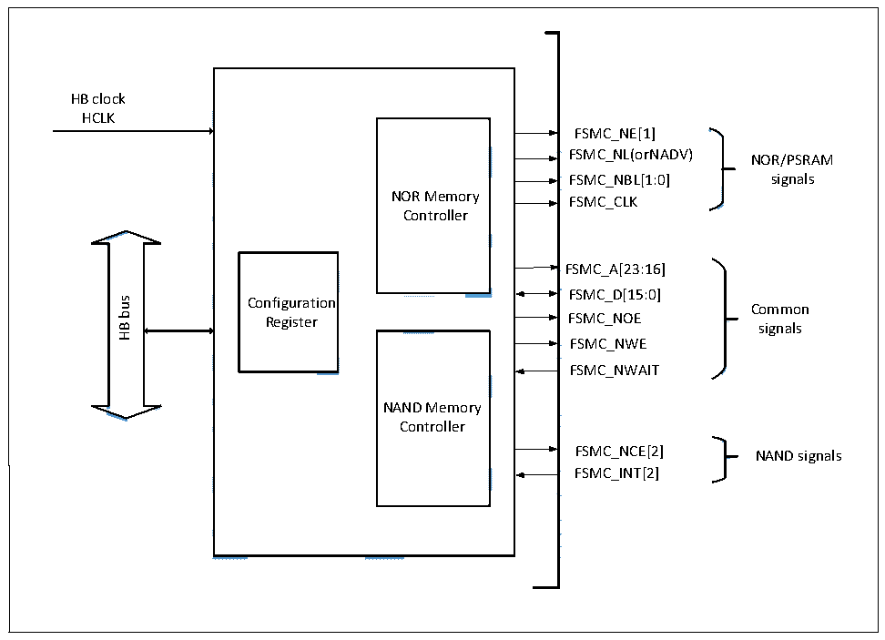

<!-- source-page: 296 -->

[← p.295](0295.md) · [index](../README.md) · [PDF p.296](https://ch32-riscv-ug.github.io/CH32V205/datasheet_zh/CH32V205RM.PDF#page=296) · [p.297 →](0297.md)

<!-- header: CH32V205应用手册 https://wch.cn -->

# 第 24 章 可变静态存储控制器（FSMC）

本章模块描述仅适用于CH32V205微控制器产品。  
可变静态存储控制器（FSMC），支持多种静态存储器类型以及丰富的存储操作方法，可根据系  
统应用需要，对不同类型大容量静态存储器进行扩展。  

## 24.1 主要特性

● 支持操作SRAM、ROM、NOR FLASH和PSRAM  
● 支持操作NAND FLASH，并且内置硬件ECC，最多可检测8KByte数据  
● 支持对同步器件操作，如PSRAM  
● 支持8bit或16bit数据总线宽度  
● 时序信号可软件编程  

## 24.2 功能描述

### 24.2.1 模块结构

FSMC主要包括HB总线接口、NOR存储控制器、NAND存储控制器和外部设备接口。  

图24-1 FSMC模块框图  
 <!-- rendered from the PDF; verify at https://ch32-riscv-ug.github.io/CH32V205/datasheet_zh/CH32V205RM.PDF#page=296 -->

🖼 Text parsed from the figure above

<!-- image: p296-draw-image-00007 inside the figure -->
HB clock  
<!-- image: p296-draw-image-00008 inside the figure -->
HCLK  
<!-- image: p296-draw-image-00004 inside the figure -->
<!-- image: p296-draw-image-00039 inside the figure -->
FSMC_NE[1]  
<!-- image: p296-draw-image-00036 inside the figure -->
FSMC_NL(orNADV) NOR/PSRAM  
<!-- image: p296-draw-image-00009 inside the figure -->
<!-- image: p296-draw-image-00035 inside the figure -->
<!-- image: p296-draw-image-00034 inside the figure -->
FSMC_NBL[1:0] signals  
<!-- image: p296-draw-image-00033 inside the figure -->
NOR Memory FSMC_CLK  
<!-- image: p296-draw-image-00010 inside the figure -->
<!-- image: p296-draw-image-00005 inside the figure -->
Controller  
<!-- image: p296-draw-image-00040 inside the figure -->
<!-- image: p296-draw-image-00011 inside the figure -->
<!-- image: p296-draw-image-00006 inside the figure -->
<!-- image: p296-draw-image-00038 inside the figure -->
FSMC_A[23:16]  
<!-- image: p296-draw-image-00032 inside the figure -->
<!-- image: p296-draw-image-00031 inside the figure -->
FSMC_D[15:0]  
<!-- image: p296-draw-image-00012 inside the figure -->
bus  
Configuration  
Common  
Register FSMC_NOE  
<!-- image: p296-draw-image-00030 inside the figure -->
signals  
HB  
<!-- image: p296-draw-image-00041 inside the figure -->
<!-- image: p296-draw-image-00002 inside the figure -->
FSMC_NWE  
<!-- image: p296-draw-image-00013 inside the figure -->
<!-- image: p296-draw-image-00029 inside the figure -->
<!-- image: p296-draw-image-00028 inside the figure -->
FSMC_NWAIT  
<!-- image: p296-draw-image-00014 inside the figure -->
NAND Memory  
<!-- image: p296-draw-image-00027 inside the figure -->
Controller  
<!-- image: p296-draw-image-00003 inside the figure -->
<!-- image: p296-draw-image-00026 inside the figure -->
<!-- image: p296-draw-image-00015 inside the figure -->
<!-- image: p296-draw-image-00037 inside the figure -->
FSMC_NCE[2] NAND signals  
<!-- image: p296-draw-image-00025 inside the figure -->
FSMC_INT[2]  
<!-- image: p296-draw-image-00016 inside the figure -->
<!-- image: p296-draw-image-00024 inside the figure -->
<!-- image: p296-draw-image-00023 inside the figure -->
<!-- image: p296-draw-image-00022 inside the figure -->
<!-- image: p296-draw-image-00021 inside the figure -->
<!-- image: p296-draw-image-00017 inside the figure -->
<!-- image: p296-draw-image-00020 inside the figure -->
<!-- image: p296-draw-image-00019 inside the figure -->
<!-- image: p296-draw-image-00018 inside the figure -->

### 24.2.2 外部设备地址映射

FSMC根据地址线将存储块分为固定大小16MByte的两个存储块，见图24-2。  
<!-- image: p296-draw-image-00001 bbox=[507.84, 786.36, 527.28, 796.68] -->
<!-- footer: V1.2 291 -->
