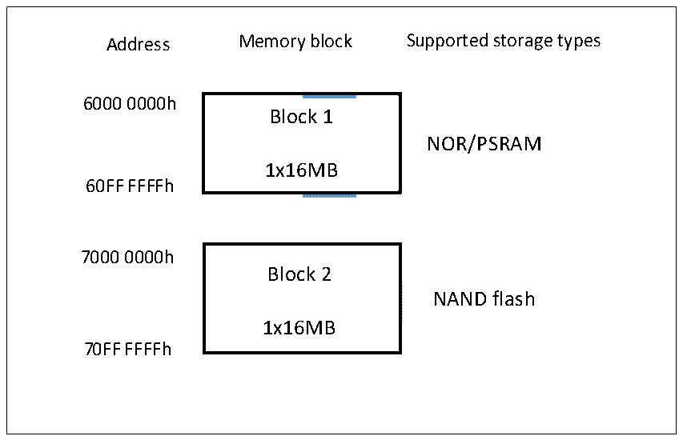

<!-- source-page: 297 -->

[← p.296](0296.md) · [index](../README.md) · [PDF p.297](https://ch32-riscv-ug.github.io/CH32V205/datasheet_zh/CH32V205RM.PDF#page=297) · [p.298 →](0298.md)

<!-- header: CH32V205应用手册 https://wch.cn -->

图24-2 FSMC存储块  
 <!-- rendered from the PDF; verify at https://ch32-riscv-ug.github.io/CH32V205/datasheet_zh/CH32V205RM.PDF#page=297 -->

🖼 Text parsed from the figure above

Address Memory block Supported storage types  
<!-- image: p297-draw-image-00002 inside the figure -->
6000 0000h  
Block 1  
NOR/PSRAM  
1x16MB  
60FF FFFFh  
<!-- image: p297-draw-image-00003 inside the figure -->
7000 0000h  
Block 2  
NAND flash  
1x16MB  
70FF FFFFh  

#### 24.2.2.1 NOR/PSRAM地址映射

<!-- p297-table-001 (table-24-1@1) -->
<table><caption>表24-1 外部存储器地址</caption><tr><th>数据宽度</th><th>配连接到存储器的地址线</th><th>最大访问存储器空间（bit）</th></tr><tr><td>8bit</td><td>HADDR[23:0]与FSMC_A[23:0]对应相连</td><td>16MBx8=128Mbit</td></tr><tr><td>16bit</td><td style="text-align:left">HADDR[23:1]与FSMC_A[22:0]对应相连，HADDR[0]未接</td><td>16MB/2x16=128Mbit</td></tr></table>

注：100脚芯片，支持FSMC，并且仅支持地址和数据线复用模式。  
NOR FLASH 和 PSRAM 支持非对齐访问。对于异步模式，每次操作需要准确的地址；对于同步模  
式，只需发出一次地址信号，之后批量的数据通过 CLK 顺序进行。对于支持非对齐批量访问的 NOR  
FLASH，可以将存储器的非对齐访问模式设置为和HB相同的模式，若不能设置，则禁用非对齐访问  
模式，并把非对齐的访问请求分开成两个连续的访问操作。  

#### 24.2.2.2 NAND地址映射

NAND FLASH映像和时序寄存器，见表24-2。  

<!-- p297-table-002 (table-24-2@1) -->
<table><caption>表24-2 存储器映像和时序寄存器</caption><tr><th>起始地址</th><th>结束地址</th><th>FSMC存储块</th><th>存储空间</th><th>时序寄存器</th></tr><tr><td>0x78000000</td><td>0x78FFFFFF</td><td rowspan="2">块2-NAND FLASH</td><td>属性</td><td>FSMC_PATT2（0x6C）</td></tr><tr><td>0x70000000</td><td>0x70FFFFFF</td><td>通用</td><td>FSMC_PMEM2（0x68）</td></tr></table>

通用和属性空间可以在低 256KB 划分为地址区（第二个 128KB 区域）、命令区（第二个 64KB  
区域）和数据区（前64KB区域），见表24-3。  
软件通过操作这3个区域访问NAND FLASH的具体流程：  
● 向NAND FLASH发送读写等操作命令：软件可以操作命令区任何地址发送命令；  
● 向NAND FLASH发送将要操作的地址：软件可以操作地址区任何地址发送命令；  
● 从NAND FLASH读写数据：软件可以操作数据区任何地址写入或读出数据。  
<!-- image: p297-draw-image-00001 bbox=[507.84, 786.36, 527.28, 796.68] -->
<!-- footer: V1.2 292 -->
