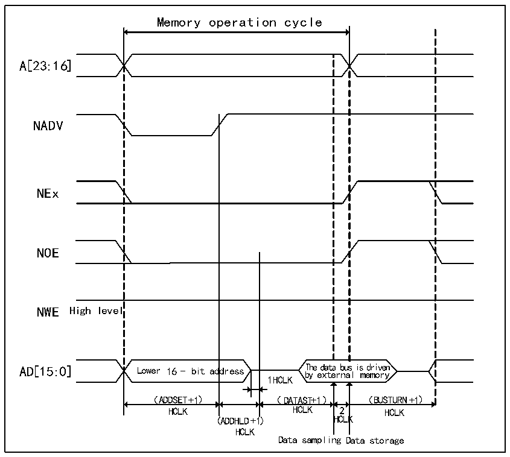

<!-- source-page: 304 -->

[← p.303](0303.md) · [index](../README.md) · [PDF p.304](https://ch32-riscv-ug.github.io/CH32V205/datasheet_zh/CH32V205RM.PDF#page=304) · [p.305 →](0305.md)

<!-- header: CH32V205应用手册 https://wch.cn -->

> ⬆ **Table continued** — rendered in full at [page 303](0303.md). <!-- p304-table-001 -->

图24-7 模式B读操作（复用）  
 <!-- rendered from the PDF; verify at https://ch32-riscv-ug.github.io/CH32V205/datasheet_zh/CH32V205RM.PDF#page=304 -->

🖼 Text parsed from the figure above

Memory operation cycle  
dress  
A[23:16]  
NADV  
NEx  
NOE  
NWE High level  
1HCLK  
（ADDSET+1） （DATAST+1） （BUSTURN+1）  
HCLK HCLK 2 HCLK  
(ADDHLD+1) HCLK  
HCLK  
Data sampling Data storage  

<!-- image: p304-draw-image-00001 bbox=[507.84, 786.36, 527.28, 796.68] -->
<!-- footer: V1.2 299 -->
