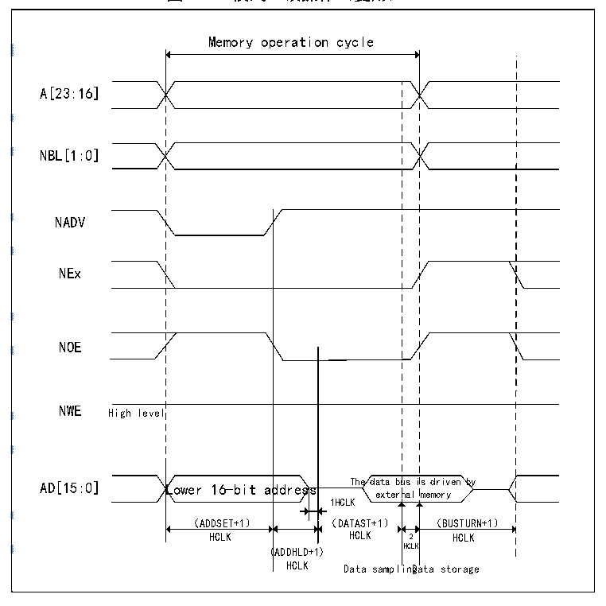
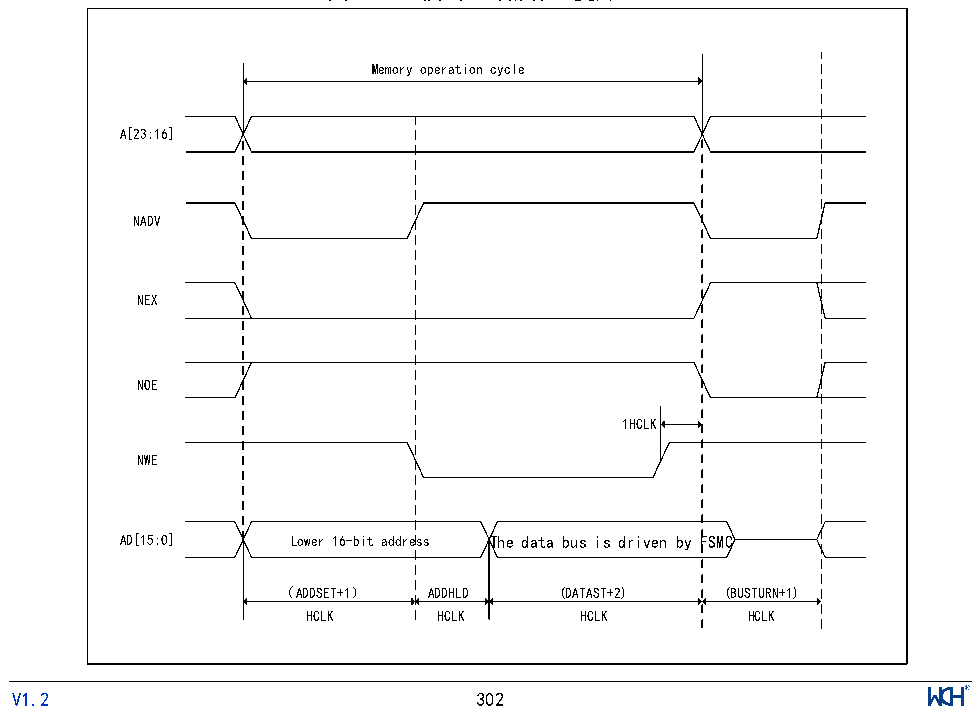

<!-- source-page: 307 -->

[← p.306](0306.md) · [index](../README.md) · [PDF p.307](https://ch32-riscv-ug.github.io/CH32V205/datasheet_zh/CH32V205RM.PDF#page=307) · [p.308 →](0308.md)

<!-- header: CH32V205应用手册 https://wch.cn -->

图24-9 模式C读操作（复用）  
 <!-- rendered from the PDF; verify at https://ch32-riscv-ug.github.io/CH32V205/datasheet_zh/CH32V205RM.PDF#page=307 -->

🖼 Text parsed from the figure above

<!-- image: p307-draw-image-00002 inside the figure -->
Memory operation cycle  
Lower 16-bit ad （ADDSET+1）  ddress  is driven by memory （BUSTURN+1）  ddres  us i nal  ss  
<!-- image: p307-draw-image-00003 inside the figure -->
A[23:16]  
<!-- image: p307-draw-image-00004 inside the figure -->
NBL[1:0]  
<!-- image: p307-draw-image-00005 inside the figure -->
<!-- image: p307-draw-image-00006 inside the figure -->
NADV  
<!-- image: p307-draw-image-00007 inside the figure -->
NEx  
<!-- image: p307-draw-image-00008 inside the figure -->
NOE  
<!-- image: p307-draw-image-00009 inside the figure -->
NWE High level  
<!-- image: p307-draw-image-00010 inside the figure -->
<!-- image: p307-draw-image-00011 inside the figure -->
<!-- image: p307-draw-image-00012 inside the figure -->
HCLK HCLK 2 HCLK  
(ADDHLD+1) HCLK  
<!-- image: p307-draw-image-00013 inside the figure -->
HCLK Data samplinDgata storage  

图24-10 模式C写操作（复用）  
 <!-- rendered from the PDF; verify at https://ch32-riscv-ug.github.io/CH32V205/datasheet_zh/CH32V205RM.PDF#page=307 -->

🖼 Text parsed from the figure above

Memory operation cycle  
A[23:16]  
NADV  
NEX  
Lower 16-bit addre （ADDSET+1）  
NOE  
1HCLK  
NWE  
AD[15:0] Lower 16-bit address The data bus is driven by FSMC  
（ADDSET+1） ADDHLD (DATAST+2) (BUSTURN+1)  
HCLK HCLK HCLK HCLK  
<!-- image: p307-draw-image-00001 inside the figure -->
<!-- footer: V1.2 302 -->

