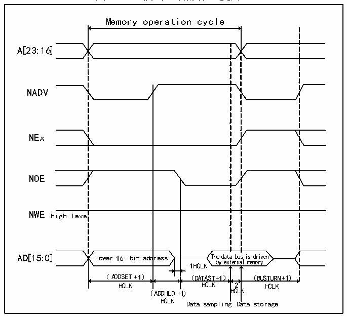
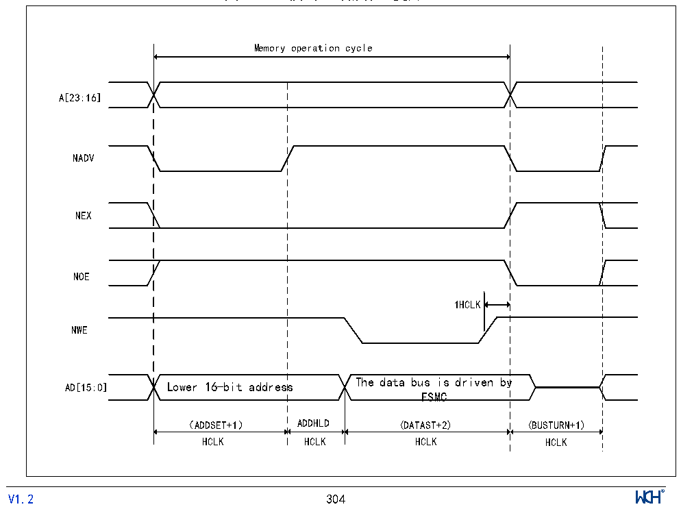

<!-- source-page: 309 -->

[← p.308](0308.md) · [index](../README.md) · [PDF p.309](https://ch32-riscv-ug.github.io/CH32V205/datasheet_zh/CH32V205RM.PDF#page=309) · [p.310 →](0310.md)

<!-- header: CH32V205应用手册 https://wch.cn -->

> ⬆ **Table continued** — rendered in full at [page 308](0308.md). <!-- p309-table-001 -->

图24-11 模式D读操作（复用）  
 <!-- rendered from the PDF; verify at https://ch32-riscv-ug.github.io/CH32V205/datasheet_zh/CH32V205RM.PDF#page=309 -->

🖼 Text parsed from the figure above

Memory operation cycle  
l Lower 16-bit ad （ADDSET+1）  dress  
A[23:16]  
NADV  
NEx  
NOE  
NWE High level  
HCLK HCLK 2 HCLK  
(ADDHLD+1) HCLK  
HCLK Data sampling Data storage  

图24-12 模式D写操作（复用）  
 <!-- rendered from the PDF; verify at https://ch32-riscv-ug.github.io/CH32V205/datasheet_zh/CH32V205RM.PDF#page=309 -->

🖼 Text parsed from the figure above

Memory operation cycle  
A[23:16]  
NADV  
NEX  
NOE  
1HCLK  
NWE  
The data bus is driven by  
AD[15:0] Lower 16-bit address  
FSMC  
（ADDSET+1） ADDHLD (DATAST+2) (BUSTURN+1)  
HCLK HCLK HCLK HCLK  
<!-- image: p309-draw-image-00001 inside the figure -->
<!-- footer: V1.2 304 -->

