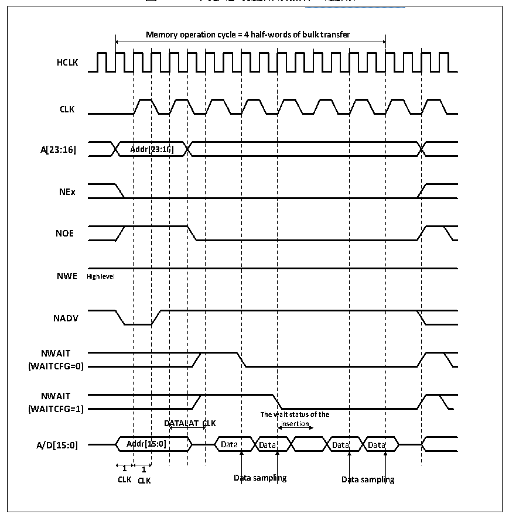

<!-- source-page: 311 -->

[← p.310](0310.md) · [index](../README.md) · [PDF p.311](https://ch32-riscv-ug.github.io/CH32V205/datasheet_zh/CH32V205RM.PDF#page=311) · [p.312 →](0312.md)

<!-- header: CH32V205应用手册 https://wch.cn -->

> ⬆ **Table continued** — rendered in full at [page 310](0310.md). <!-- p311-table-001 -->

#### 24.2.3.4 NOR/PSRAM同步传输地址/数据复用的时序图

数据延迟与 NOR FLASH的延时需注意，DATALAT数值必须与 NOR FLASH 配置寄存器中的定义一  
致。NADV信号为低时的时钟周期不计算在延迟参数中。FSMC的DATLAT参数可以为DATALAT+2或为  
DATALAT+3，对于特别的存储器会在数据保持时间阶段产生NWAIT信号，DATLAT需要设置为最小值，  
对于另外一些存储器不会在数据保持时间阶段产生NWAIT信号，FSMC和存储器的数据保持时间必须  
设置一致。  
对于单次批量传输需注意，存储器配置位同步批量模式，若传输16bit数据，FSMC会执行1次  
长度为1的批量传输，若传输32bit数据，FSMC分为2次16bit传输，执行1次长度为2的批量传  
输。  
NOR FLASH 同步批量模式访问时，在保持时间（DATLAT+1 CLK）之后，若检测 NWAIT 信号为低  
电平时，在NWAIT变成高电平之前FSMC需要插入等待周期，当NWAIT变为高电平时，FSMC认为数  
据有效。在NWAIT信号控制的等待状态插入期间，控制器会持续向存储器发送时钟脉冲、保持片选  
信号和输出有效信号，同时忽略无效的数据信号。在批量传输模式下，NOR FLASH 的 NWAIT 信号通  
过配置WAITCFG位选择两种时序配置。  

图24-13 同步总线复用读操作（复用）  
 <!-- rendered from the PDF; verify at https://ch32-riscv-ug.github.io/CH32V205/datasheet_zh/CH32V205RM.PDF#page=311 -->

🖼 Text parsed from the figure above

<!-- image: p311-draw-image-00002 inside the figure -->
<!-- image: p311-draw-image-00003 inside the figure -->
<!-- image: p311-draw-image-00004 inside the figure -->
<strong>Memory operation cycle = 4 half-words of bulk transfer</strong>  
<!-- image: p311-draw-image-00005 inside the figure -->
Addr[23:16]  A  Addr[2  23:16  wait status o insertion  AT C  Ad 1  D  DATAL  DATAL  ddr[1  5:0]  1  
<!-- image: p311-draw-image-00006 inside the figure -->
<strong>HCLK</strong>  
<!-- image: p311-draw-image-00007 inside the figure -->
<!-- image: p311-draw-image-00008 inside the figure -->
<!-- image: p311-draw-image-00009 inside the figure -->
<!-- image: p311-draw-image-00010 inside the figure -->
<strong>CLK</strong>  
<!-- image: p311-draw-image-00011 inside the figure -->
<!-- image: p311-draw-image-00012 inside the figure -->
<!-- image: p311-draw-image-00013 inside the figure -->
<strong>A[23:16] Addr[23:16]</strong>  
<!-- image: p311-draw-image-00014 inside the figure -->
<!-- image: p311-draw-image-00015 inside the figure -->
<!-- image: p311-draw-image-00016 inside the figure -->
<strong>NEx</strong>  
<!-- image: p311-draw-image-00017 inside the figure -->
<!-- image: p311-draw-image-00018 inside the figure -->
<!-- image: p311-draw-image-00019 inside the figure -->
<!-- image: p311-draw-image-00020 inside the figure -->
<strong>NOE</strong>  
<!-- image: p311-draw-image-00021 inside the figure -->
<!-- image: p311-draw-image-00022 inside the figure -->
<!-- image: p311-draw-image-00023 inside the figure -->
<strong>NWE High level</strong>  
<!-- image: p311-draw-image-00024 inside the figure -->
<!-- image: p311-draw-image-00025 inside the figure -->
<!-- image: p311-draw-image-00026 inside the figure -->
<!-- image: p311-draw-image-00027 inside the figure -->
<strong>NADV</strong>  
<!-- image: p311-draw-image-00028 inside the figure -->
<!-- image: p311-draw-image-00029 inside the figure -->
<strong>NWAIT</strong>  
<!-- image: p311-draw-image-00030 inside the figure -->
<!-- image: p311-draw-image-00031 inside the figure -->
<strong>(WAITCFG=0)</strong>  
<!-- image: p311-draw-image-00032 inside the figure -->
<!-- image: p311-draw-image-00033 inside the figure -->
<strong>NWAIT</strong>  
<!-- image: p311-draw-image-00034 inside the figure -->
<strong>(WAITCFG=1)</strong>  
<!-- image: p311-draw-image-00035 inside the figure -->
<!-- image: p311-draw-image-00036 inside the figure -->
<!-- image: p311-draw-image-00037 inside the figure -->
<!-- image: p311-draw-image-00038 inside the figure -->
<!-- image: p311-draw-image-00039 inside the figure -->
<strong>1 1</strong>  
<!-- image: p311-draw-image-00040 inside the figure -->
<strong>CLK CLK Data sampling Data sampling</strong>  
<!-- image: p311-draw-image-00041 inside the figure -->
<!-- image: p311-draw-image-00042 inside the figure -->
<!-- image: p311-draw-image-00043 inside the figure -->

<!-- image: p311-draw-image-00001 bbox=[507.84, 786.36, 527.28, 796.68] -->
<!-- footer: V1.2 306 -->
