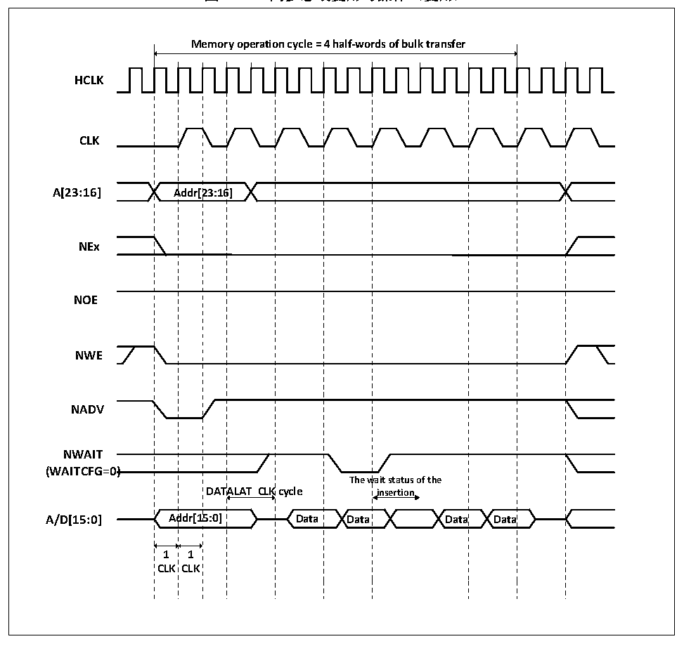

<!-- source-page: 313 -->

[← p.312](0312.md) · [index](../README.md) · [PDF p.313](https://ch32-riscv-ug.github.io/CH32V205/datasheet_zh/CH32V205RM.PDF#page=313) · [p.314 →](0314.md)

<!-- header: CH32V205应用手册 https://wch.cn -->

图24-14 同步总线复用写操作（复用）  
 <!-- rendered from the PDF; verify at https://ch32-riscv-ug.github.io/CH32V205/datasheet_zh/CH32V205RM.PDF#page=313 -->

🖼 Text parsed from the figure above

<!-- image: p313-draw-image-00002 inside the figure -->
<!-- image: p313-draw-image-00003 inside the figure -->
<strong>Memory operation cycle = 4 half-words of bulk transfer</strong>  
<!-- image: p313-draw-image-00004 inside the figure -->
Addr[23:16]  A  Addr[2  23:16  CLK  Ad  DAT  ALAT  ALAT  ddr[1  5:0]  
<strong>HCLK</strong>  
<!-- image: p313-draw-image-00005 inside the figure -->
<!-- image: p313-draw-image-00006 inside the figure -->
<!-- image: p313-draw-image-00007 inside the figure -->
<strong>CLK</strong>  
<!-- image: p313-draw-image-00008 inside the figure -->
<!-- image: p313-draw-image-00009 inside the figure -->
<strong>A[23:16] Addr[23:16]</strong>  
<!-- image: p313-draw-image-00010 inside the figure -->
<!-- image: p313-draw-image-00011 inside the figure -->
<!-- image: p313-draw-image-00012 inside the figure -->
<strong>NEx</strong>  
<!-- image: p313-draw-image-00013 inside the figure -->
<!-- image: p313-draw-image-00014 inside the figure -->
<strong>NOE</strong>  
<!-- image: p313-draw-image-00015 inside the figure -->
<!-- image: p313-draw-image-00016 inside the figure -->
<strong>NWE</strong>  
<!-- image: p313-draw-image-00017 inside the figure -->
<!-- image: p313-draw-image-00018 inside the figure -->
<!-- image: p313-draw-image-00019 inside the figure -->
<strong>NADV</strong>  
<!-- image: p313-draw-image-00020 inside the figure -->
<!-- image: p313-draw-image-00021 inside the figure -->
<strong>NWAIT</strong>  
<strong>(WAITCFG=0)</strong>  
<!-- image: p313-draw-image-00022 inside the figure -->
<!-- image: p313-draw-image-00023 inside the figure -->
<strong>A/D[15:0] Addr[15:0] Data Data Data Data</strong>  
<!-- image: p313-draw-image-00024 inside the figure -->
<!-- image: p313-draw-image-00025 inside the figure -->
<strong>1 1</strong>  
<!-- image: p313-draw-image-00026 inside the figure -->
<strong>CLK CLK</strong>  
<!-- image: p313-draw-image-00027 inside the figure -->
<!-- image: p313-draw-image-00028 inside the figure -->
<!-- image: p313-draw-image-00029 inside the figure -->

<!-- p313-table-002 (table-24-24@1) pages 313-314 -->
<table><caption>表24-24 FSMC_BCR1位域（同步写模式）</caption><tr><th>Bitx</th><th>名称</th><th>配置值</th></tr><tr><td>[31:20]</td><td>Reserved</td><td>0x000</td></tr><tr><td>19</td><td>CBURSTRW</td><td>0x1</td></tr><tr><td>[18:16]</td><td>Reserved</td><td>0x0</td></tr><tr><td>15</td><td>ASYNCWAIT</td><td>0x0</td></tr><tr><td>14</td><td>EXTMOD</td><td>0x0</td></tr><tr><td>13</td><td>WAITEN</td><td>如果存储器支持该功能则为1，否则为0</td></tr><tr><td>12</td><td>WREN</td><td>0x1</td></tr><tr><td>11</td><td>WAITCFG</td><td>0x0</td></tr><tr><td>10</td><td>Reserved</td><td>0x0</td></tr><tr><td>9</td><td>WAITPOL</td><td>根据需要设置</td></tr><tr><td>8</td><td>BURSTEN</td><td>该位不起作用</td></tr><tr><td>7</td><td>Reserved</td><td>0x1</td></tr><tr><td>6</td><td>FACCEN</td><td>根据需要设置</td></tr><tr><td>[5:4]</td><td>MWID</td><td>根据需要设置</td></tr><tr><td>[3:2]</td><td>MTYP</td><td>0x1</td></tr><tr><td>1</td><td>MUXEN</td><td>0x1</td></tr><tr><td>0</td><td>MBKEN</td><td>0x1</td></tr></table>

<!-- image: p313-draw-image-00001 bbox=[507.84, 786.36, 527.28, 796.68] -->
<!-- footer: V1.2 308 -->
