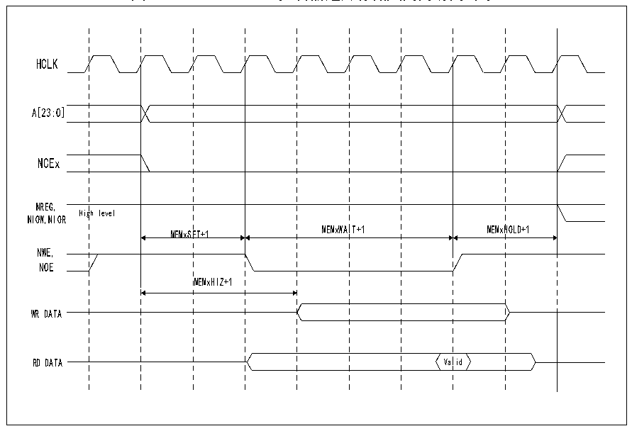

<!-- source-page: 316 -->

[← p.315](0315.md) · [index](../README.md) · [PDF p.316](https://ch32-riscv-ug.github.io/CH32V205/datasheet_zh/CH32V205RM.PDF#page=316) · [p.317 →](0317.md)

<!-- header: CH32V205应用手册 https://wch.cn -->

图24-15 NAND FLASH控制器通用存储空间的访问时序  
 <!-- rendered from the PDF; verify at https://ch32-riscv-ug.github.io/CH32V205/datasheet_zh/CH32V205RM.PDF#page=316 -->

🖼 Text parsed from the figure above

HCLK  
gh level  MEMxSE  ET+1  MEMxWAI  IT+1  MEMxH  HOLD+1  MEMxSE  ET+1  MEMxHIZ+1  
A[23:0]  
NCEx  
NREG,  
NIOW,NIOR  
MEMxSET+1 MEMxWAIT+1 MEMxHOLD+1  
NWE,  
NOE  
WR DATA  
Val  lid  
RD DATA Valid  

#### 24.2.4.4 NAND FLASH 操作流程

NAND FLASH 的命令锁存使能信号（CLE）和地址锁存使能信号（ALE）分别由 FSMC 地址线 A16  
和A17驱动，故在对NAND FLASH操作发送命令或地址时，需要对存储空间的特定地址执行写操作。  
对NAND FLASH的读操作过程如下：  
1） 根据即将操作的NAND FLASH特性，配置FSMC_PCR2、FSMC_PMEM2和FSMC_PATT2寄存器的PWID、  
PTYP、PWAITEN和PBKEN。  
2） 在通用存储空间写入命令字节，在NWE为低电平期间，CLE输出高电平，此时该命令字节被NAND  
FLASH识别为一个命令，并锁存该命令，随后的页读操作不需要重复发送该命令。  
3） 之后通过向存储器空间写入 4 个字节，作为读操作的起始地址。在 NWE 为低电平期间，ALE 输  
出高电平，此时4个字节被NAND FLASH识别为读操作的起始地址。在操作属性存储空间时，可  
以使FSMC产生不同的时序，实现某些NAND FLASH预等待功能。  
4） FSMC 控制器开始新的操作前需要等待 NAND FLASH 的 R/NB 信号变为高电平，在等待期间 FSMC  
控制器需要保持NCE信号为低电平。  
5） FSMC控制器可以通过操作通用存储空间，可以从NAND FLASH逐字节的读出存储页。  

#### 24.2.4.5 NAND FLASH 预等待功能

某些特殊的NAND FLASH需要在输入最后一个地址字节后，R/NB信号变为低电平，见图24-16。  
图中（1）为CPU写字节命令0x00到0x70010000；  
图中（2）为CPU写NAND FLASH的地址A7-A0至0x70020000；  
图中（3）为CPU写NAND FLASH的地址A15-A8至0x70020000；  
图中（4）为CPU写NAND FLASH的地址A23-A16至0x70020000；  
图中（5）为CPU写NAND FLASH的地址A31-A24至0x70020000；  
<!-- image: p316-draw-image-00001 bbox=[507.84, 786.36, 527.28, 796.68] -->
<!-- footer: V1.2 311 -->
