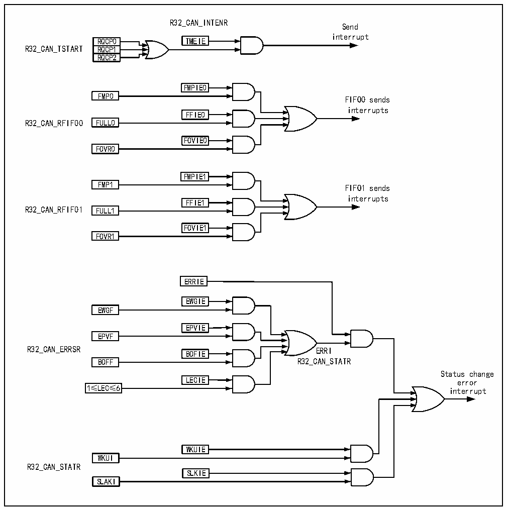

<!-- source-page: 334 -->

[← p.333](0333.md) · [index](../README.md) · [PDF p.334](https://ch32-riscv-ug.github.io/CH32V205/datasheet_zh/CH32V205RM.PDF#page=334) · [p.335 →](0335.md)

<!-- header: CH32V205应用手册 https://wch.cn -->

图25-9 CAN中断逻辑图  
 <!-- rendered from the PDF; verify at https://ch32-riscv-ug.github.io/CH32V205/datasheet_zh/CH32V205RM.PDF#page=334 -->

🖼 Text parsed from the figure above

R32_CAN_INTENR  
Send  
interrupt  
RQCP0 TMEIE  
RQCP0RQCP1  RQCP1RQCP2  
R32_CAN_TSTART RQCP1  
FMPIE0  
FMP0 FIFO0 sends  
interrupts  
FFIE0  
R32_CAN_RFIF00 FULL0  
FOVIE0  
FOVR0  
FMPIE1  
FMP1 FIFO1 sends  
interrupts  
FFIE1  
R32_CAN_RFIF01 FULL1  
FOVIE1  
FOVR1  
ERRIE  
EWGIE  
EWGF  
<!-- image: p334-draw-image-00003 inside the figure -->
EPVIE  
EPVF  
<!-- image: p334-draw-image-00002 inside the figure -->
R32_CAN_ERRSR ERRI  
<!-- image: p334-draw-image-00004 inside the figure -->
BOFIE  
<!-- image: p334-draw-image-00005 inside the figure -->
BOFF R32_CAN_STATR  
Status change  
LECIE error  
1≤LEC≤6 interrupt  
WKUIE  
WKUI  
R32_CAN_STATR  
SLKIE  
SLAKI  

## 25.8 寄存器描述

CAN 控制器相关的寄存器必须用 32 位字的方式来操作且操作时必须确保 CAN 的外设时钟已使  
能。为了避免当前节点对整个CAN总线的影响，所以应用软件只能在初始化模式下修改位时序寄存  
器CAN1_BTIMR。  

<!-- p334-table-002 (table-25-5@1) pages 334-335 -->
<table><caption>表25-5 CAN相关寄存器列表</caption><tr><th>名称</th><th>访问地址</th><th>描述</th><th>复位值</th></tr><tr><td>R32_CAN1_CTLR</td><td>0x40006400</td><td>CAN1主控制寄存器</td><td>0x00010002</td></tr><tr><td>R32_CAN1_STATR</td><td>0x40006404</td><td>CAN1主状态寄存器</td><td>0x00000x02</td></tr><tr><td>R32_CAN1_TSTATR</td><td>0x40006408</td><td>CAN1发送状态寄存器</td><td>0x1C000000</td></tr><tr><td>R32_CAN1_RFIFO0</td><td>0x4000640C</td><td>CAN1接收FIFO0控制和状态寄存器</td><td>0x00000000</td></tr><tr><td>R32_CAN1_RFIFO1</td><td>0x40006410</td><td>CAN1接收FIFO1控制和状态寄存器</td><td>0x00000000</td></tr><tr><td>R32_CAN1_INTENR</td><td>0x40006414</td><td>CAN1中断使能寄存器</td><td>0x00000000</td></tr><tr><td>R32_CAN1_ERRSR</td><td>0x40006418</td><td>CAN1错误状态寄存器</td><td>0x00000000</td></tr><tr><td>R32_CAN1_BTIMR</td><td>0x4000641C</td><td>CAN1位时序寄存器</td><td>0x01230000</td></tr><tr><td>R32_CAN1_TTCTLR</td><td>0x40006420</td><td>CAN1时间触发控制寄存器</td><td>0x0000FFFF</td></tr><tr><td>R32_CAN1_TTCNT</td><td>0x40006424</td><td>CAN1时间触发计数值寄存器</td><td>0x00000000</td></tr><tr><td>R32_CAN1_TERR_CNT</td><td>0x40006428</td><td>CAN1离线恢复错误计数器</td><td>0x00000000</td></tr></table>

<!-- image: p334-draw-image-00001 bbox=[507.84, 786.36, 527.28, 796.68] -->
<!-- footer: V1.2 329 -->
