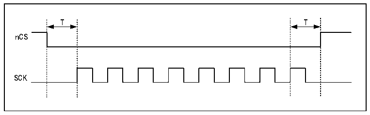
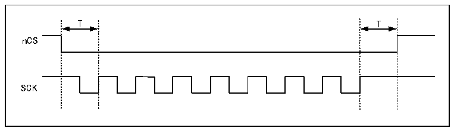
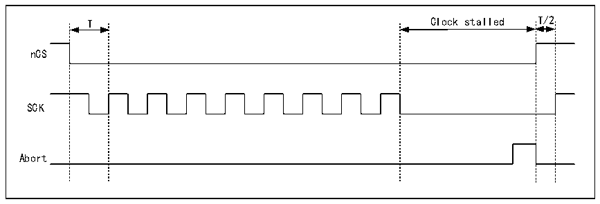

<!-- source-page: 359 -->

[← p.358](0358.md) · [index](../README.md) · [PDF p.359](https://ch32-riscv-ug.github.io/CH32V205/datasheet_zh/CH32V205RM.PDF#page=359) · [p.360 →](0360.md)

<!-- header: CH32V205应用手册 https://wch.cn -->

### 26.3.12 nCS 行为

默认情况下，nCS为高电平，取消选择外部FLASH。在操作开始前nCS会下降，并在操作完成后  
立即上升。  
当 CKMODE=0（“模式 0”，即在没有进行操作时 SCK 保持低电平），nCS 在操作首次升高 SCK  
边沿时的一个SCK周期前降至低电平，在操作最后一次升高SCK边沿时的一个SCK周期后升至高电  
平，如下图所示。  

图26-4 CKMODE=0时的nCS（T=SCK周期）  
 <!-- rendered from the PDF; verify at https://ch32-riscv-ug.github.io/CH32V205/datasheet_zh/CH32V205RM.PDF#page=359 -->

🖼 Text parsed from the figure above

T T  
nCS  
SCK  

当 CKMODE=1（“模式 3”，在未进行任何操作时 SCK 升至高电平）时，nCS仍在操作首次升高  
SCK边沿时的一个SCK周期前降至低电平，在操作最后一次升高SCK边沿时的一个SCK周期后升至  
高电平，如下图所示。  

图26-5 CKMODE=1时的nCS（T=SCK周期）  
 <!-- rendered from the PDF; verify at https://ch32-riscv-ug.github.io/CH32V205/datasheet_zh/CH32V205RM.PDF#page=359 -->

🖼 Text parsed from the figure above

T T  
nCS  
SCK  

若FIFO在读取操作中保持写满状态或在写入操作中保持为空，则在固件干预FIFO前，操作停  
止并且 SCK 保持低电平。若操作停止时发生中止，则 nCS 在请求中止后即升至高电平，SCK 则在半  
个周期后升至高电平，如下图所示。  

图26-6 CKMODE=1且发生中止时的nCS（T=SCK周期）  
 <!-- rendered from the PDF; verify at https://ch32-riscv-ug.github.io/CH32V205/datasheet_zh/CH32V205RM.PDF#page=359 -->

🖼 Text parsed from the figure above

T Clock stalled T/2  
nCS  
SCK  
Abort  

当不处于双闪存模式（DFM=0）且FSEL=0（默认值）时，仅访问FLASH1。因此，若FSEL=1，仅  
访问FLASH1，nCS保持高电平。在双闪存模式下，FLASH1和FLASH2的nCS行为完全相同。因此，  
如果存在FLASH2，并且应用程序始终处于双闪存模式，那么FLASH1的nCS信号也可以用于FLASH2，  
而FLASH2的nCS引脚输出可用于其他功能。  
<!-- image: p359-draw-image-00001 bbox=[507.84, 786.36, 527.28, 796.68] -->
<!-- footer: V1.2 354 -->
