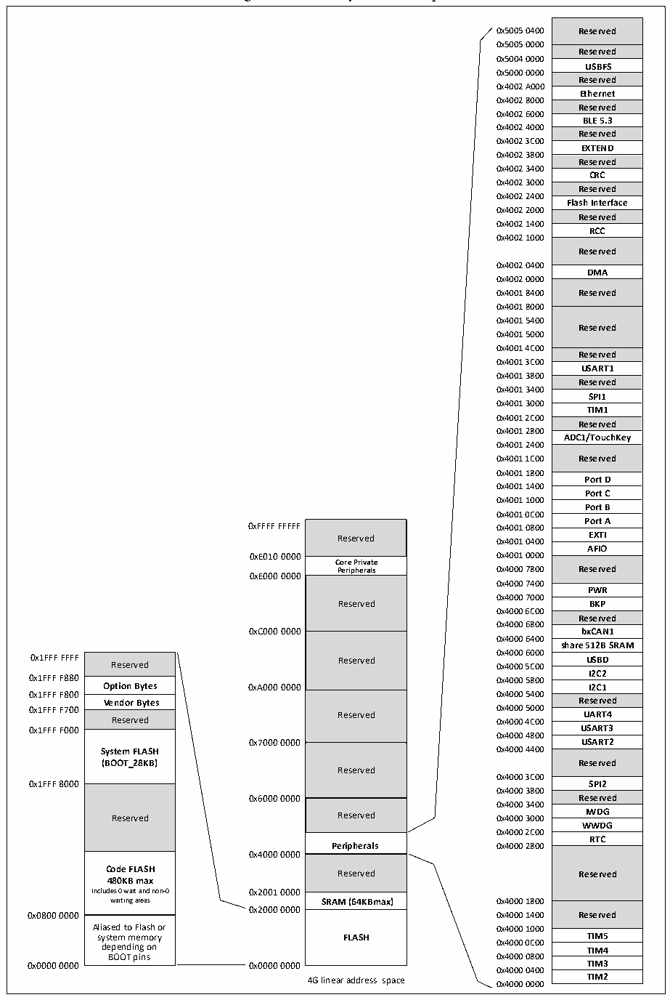

<!-- source-page: 8 -->

[← p.7](0007.md) · [index](../README.md) · [PDF p.8](https://ch32-riscv-ug.github.io/CH32V20x/datasheet_en/CH32V208DS0.PDF#page=8) · [p.9 →](0009.md)

<!-- header: CH32V208 Datasheet http://wch-ic.com -->

## 2.3 Memory map

Figure 2-2 Memory address map  
 <!-- rendered from the PDF; verify at https://ch32-riscv-ug.github.io/CH32V20x/datasheet_en/CH32V208DS0.PDF#page=8 -->

🖼 Text parsed from the figure above

Reserved  Reserved  USBFS  Reserved  Ethernet  Reserved  BLE 5.3  Reserved  EXTEND  Reserved  CRC  Reserved  Flash Interface  Reserved  RCC  Reserved  DMA  Reserved  Reserved  Reserved  USART1  Reserved  SPI1  TIM1  Reserved  ADC1/TouchKey  Reserved  Port D  Port C  Port B  Port A  EXTI  AFIO  Reserved  PWR  BKP  Reserved  bxCAN1  share 512B SRAM  USBD  I2C2  I2C2I2C1  I2C1Reserved  UART4  USART3  USART2  Reserved  SPI2  Reserved  IWDG  WWDG  RTC  Reserved  Reserved  TIM5  TIM4  TIM3  TIM3TIM2  
0x5005 0000  
0x5004 0000  
0x5000 0000  
0x4002 A000  
0x4002 8000  
0x4002 6000  
0x4002 4000  
0x4002 3C00  
0x4002 3800  
0x4002 3400  
0x4002 3000  
0x4002 2400  
0x4002 2000  
0x4002 1400  
0x4002 1000  
0x4002 0400  
0x4002 0000  
0x4001 8000  
0x4001 5400  
0x4001 5000  
0x4001 4C00  
0x4001 3C00  
0x4001 3800  
0x4001 3400  
0x4001 3000  
0x4001 2C00  
0x4001 2800  
0x4001 2400  
0x4001 1800  
0x4001 1400  
0x4001 1000  
0x4001 0C00  
Reserved  Core Private Peripherals  Reserved  Reserved  Reserved  Reserved  Reserved  Peripherals  Reserved  SRAM (64KBmax)  FLASH  
Reserved 0x4001 0400 EXTI  
<strong>Peripherals 0x4000 7800 Reserved</strong>  
0xE000 0000  
0x4000 7400  
0x4000 7000  
Reserved BKP  
0x4000 6C00  
0x4000 6800  
0xC000 0000 bxCAN1  
0x4000 6400  
0x4000 6000  
Reserved  Option Bytes  Option Bytes Vendor Bytes  Reserved  System FLASH (BOOT_28KB)  Reserved  Code FLASH 480KB max Includes 0 wait and non-0 waiting areas  Aliased to Flash or system memory depending on BOOT pins  
0x1FFF F880 0x4000 5800  
0x1FFF F800 0x4000 5400  
0x4000 4800  
0x7000 0000 USART2  
0x4000 3C00  
0x4000 3800  
0x6000 0000 Reserved  
0x4000 3400  
0x4000 2C00  
<strong>Peripherals 0x4000 2800</strong>  
0x4000 0000  
Includes 0 wait and non-0 0x2001 0000  
0x2000 0000  
0x4000 0400  
4G linear address space 0x4000 0000 TIM2  

<!-- image: p8-draw-image-00001 bbox=[504.72, 783.84, 524.28, 793.8] -->
<!-- footer: V2.7 6 -->
