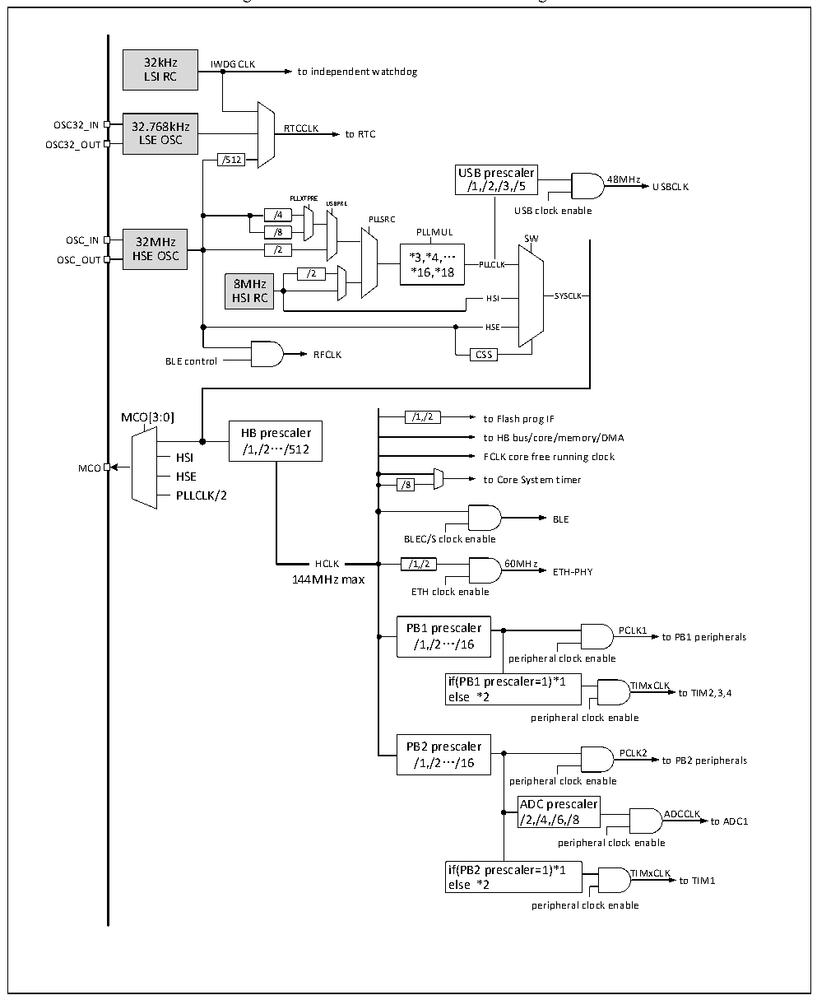

<!-- source-page: 10 -->

[← p.9](0009.md) · [index](../README.md) · [PDF p.10](https://ch32-riscv-ug.github.io/CH32V20x/datasheet_en/CH32V208DS0.PDF#page=10) · [p.11 →](0011.md)

<!-- header: CH32V208 Datasheet http://wch-ic.com -->

Figure 2-3 CH32V208 clock tree block diagram  
 <!-- rendered from the PDF; verify at https://ch32-riscv-ug.github.io/CH32V20x/datasheet_en/CH32V208DS0.PDF#page=10 -->

🖼 Text parsed from the figure above

32kHz IWDGCLK  
LSI RC to independent watchdog  
OSC32_IN 32.768kHz RTCCLK  
LSE OSC to RTC  
OSC32_OUT  
/512  
USB prescaler  
48MHz  
/1,/2,/3,/5 USBCLK  
PLLXTPRE  
USBPRE  
/4 PLLSRC USB clock enable  
/4 /8  
/8 PLLMUL  
32MHz HSE OSC  
HSE OSC /2 *3,*4,…  
OSC_OUT  
PLLCLK  
/2 *16,*18  
8MHz  
HSI RC HSI SYSCLK  
HSE  
RFCLK CSS  
BLE control  
MCO[3:0] /1,/2 to Flash prog IF  
HB prescaler  
to HB bus/core/memory/DMA  
/1,/2…/512  
HSI FCLK core free running clock  
MCO  
HSE to Core System timer  
/8  
PLLCLK/2  
BLE  
BLEC/S clock enable  
HCLK  HCLK  
HCLK /1,/2 60MHz  
ETH-PHY  
144MHz max  
ETH clock enable  
PB1 prescaler PCLK1  
/1,/2…/16 to PB1 peripherals  
peripheral clock enable  
if(PB1 prescaler=1)*1 TIMxCLK  
else *2 to TIM2,3,4  
peripheral clock enable  
PB2 prescaler  
PCLK2  
/1,/2…/16 to PB2 peripherals  
peripheral clock enable  
ADC prescaler  
/2,/4,/6,/8 ADCCLK to ADC1  
peripheral clock enable  
if(PB2 prescaler=1)*1 TIMxCLK  
else *2 to TIM1  
peripheral clock enable  

Note: 1. When using USB, the CPU clock speed must be 48MHz or 96MHz or 144MHz. When the system  
wakes up from Stop mode or Standby mode, the system will automatically select HSI as the system clock  
frequency. If USB and ETH both are enabled, select USBPRE=5DIV, configure PLLCKR=SYSCLK to be  
240M, HBPRE=2DIV, and the CPU clock speed is 120M.  
2. For the CH32V208, the external crystal or clock (HSE) is 32M. When the external crystal is enabled,  
no load capacitor is needed as it is built in.  
<!-- image: p10-draw-image-00001 bbox=[504.72, 783.84, 524.28, 793.8] -->
<!-- footer: V2.7 8 -->
