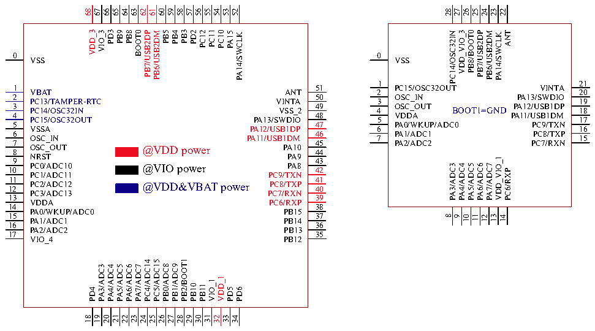
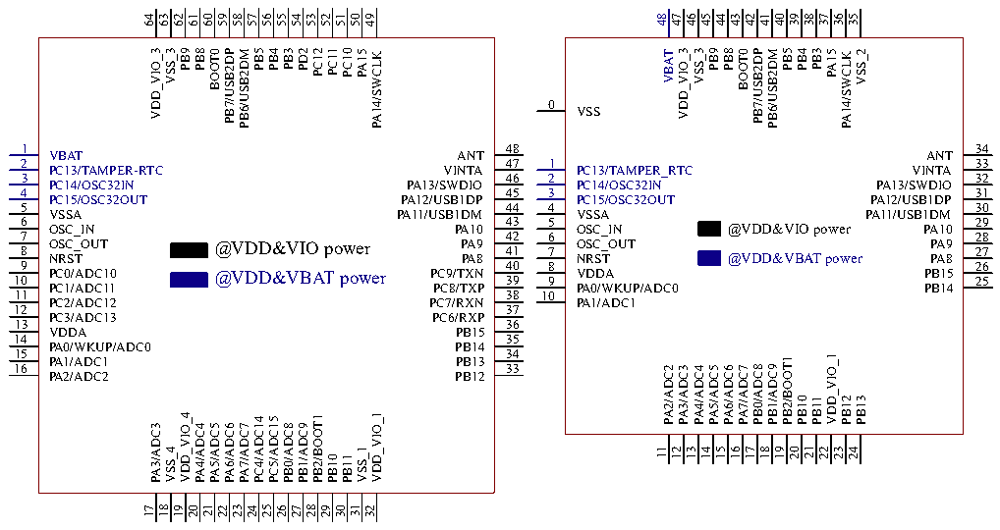

<!-- source-page: 18 -->

[← p.17](0017.md) · [index](../README.md) · [PDF p.18](https://ch32-riscv-ug.github.io/CH32V20x/datasheet_en/CH32V208DS0.PDF#page=18) · [p.19 →](0019.md)

<!-- header: CH32V208 Datasheet http://wch-ic.com -->

# Chapter 3 Pinouts and Pin Definition

## 3.1 Pinouts

# CH32V208WBU6 CH32V208GBU6

 <!-- p18-cluster-01 uncaptioned graphics, rendered from the PDF; verify at https://ch32-riscv-ug.github.io/CH32V20x/datasheet_en/CH32V208DS0.PDF#page=18 -->

🖼 Text parsed from the figure above

68  
67  
66  
65  
64  
63  
62  
61  
60  
59  
58  
57  
56  
55  
54  
53  
52  
28  
27  
26  
25  
24  
23  
22  
VDD_3  
PD3  
PB3  
PC11  
PB8  
PB5  
VDD_VIO_3  
PB9  
PB4  
PD2  
PC12  
BOOT0  
PC10  
PB8/BOOT0  
ANT  
PB7/USB2DP  
PB7/USB2DP  
PB6/USB2DM  
PB6/USB2DM  
PA15  
PC14/OSC32IN  
PA14/SWCLK  
PA14/SWCLK  
0  
0  
VSS  
VSS  
1  
21  
1  
51  
PC15/OSC32OUT  
VINTA  
VBAT  
ANT  
2  
20  
2  
50  
OSC_IN  
PA13/SWDIO  
PC13/TAMPER-RTC  
VINTA  
3  
19  
3  
49 VSS_2  
OSC_OUT 4  
PA12/USB1DP 18  
BOOT1=GND  
PC14/OSC32IN  
4  
48  
VDDA  
PA11/USB1DM  
PC15/OSC32OUT  
PA13/SWDIO  
5  
17  
5  
47  
PA0/WKUP/ADC0  
PC9/TXN  
VSSA  
PA12/USB1DP  
6  
16  
6  
46  
PA1/ADC1  
PC8/TXP  
OSC_IN  
PA11/USB1DM  
7  
15  
7  
45  
PA2/ADC2  
PC7/RXN  
OSC_OUT 8  
PA10 44  
@VDD power  
NRST 9  
PA9 43  
VDD_VIO_1  
PC0/ADC10 10 PC1/ADC11  
PA8 42 PC9/TXN  
PA3/ADC3  
PA4/ADC4  
PA5/ADC5  
PA6/ADC6  
PA7/ADC7  
@VIO power  
PC6/RXP  
11  
41  
PC2/ADC12 12  
PC8/TXP 40  
@VDD&amp;VBAT power  
PC3/ADC13  
PC7/RXN  
13  
39  
VDDA  
PC6/RXP  
14  
38  
PA0/WKUP/ADC0  
PB15  
15 PA1/ADC1  
37 PB14  
11  
13  
8  
9  
10  
12  
14  
16  
36  
PA2/ADC2  
PB13  
17  
35  
VIO_4  
PB12  
PB2/BOOT1  
PC4/ADC14  
PC5/ADC15  
PB0/ADC8  
PB1/ADC9  
PA3/ADC3  
PA4/ADC4  
PA5/ADC5  
PA6/ADC6  
PA7/ADC7  
VDD_1  
VIO_1  
PB10  
PB11  
PD4  
PD5  
PD6  
21  
31  
23  
33  
18  
25  
28  
19  
20  
22  
24  
26  
27  
29  
30  
32  
34  

# CH32V208RBT6 CH32V208CBU6

 <!-- p18-cluster-02 uncaptioned graphics, rendered from the PDF; verify at https://ch32-riscv-ug.github.io/CH32V20x/datasheet_en/CH32V208DS0.PDF#page=18 -->

🖼 Text parsed from the figure above

48  
47  
46  
45  
44  
43  
42  
41  
40  
39  
38  
37  
36  
35  
64  
63  
62  
61  
60  
59  
58  
57  
56  
55  
54  
53  
52  
51  
50  
49  
PB3  
PC11  
PB3  
VDD_VIO_3  
PB8  
PB5  
VDD_VIO_3  
PB8  
PB5  
VSS_3  
PB9  
PB4  
PD2  
PC12  
VSS_3  
PB9  
PB4  
BOOT0  
PC10  
BOOT0  
VSS_2  
PB7/USB2DP  
PB7/USB2DP  
PB6/USB2DM  
PB6/USB2DM  
PA15  
PA15  
VBAT  
PA14/SWCLK  
PA14/SWCLK  
0  
VSS  
1  
48  
34  
VBAT  
ANT  
ANT  
2  
47  
1  
33  
PC13/TAMPER-RTC  
VINTA  
PC13/TAMPER_RTC  
VINTA  
3  
46  
2  
32  
PC14/OSC32IN  
PA13/SWDIO  
PC14/OSC32IN  
PA13/SWDIO  
4  
45  
3  
31  
PC15/OSC32OUT  
PA12/USB1DP  
PC15/OSC32OUT  
PA12/USB1DP  
5  
44  
4  
30  
VSSA  
PA11/USB1DM  
VSSA  
PA11/USB1DM  
6 OSC_IN  
43 PA10  
5 OSC_IN  
29 PA10  
@VDD&amp;VIO power  
7  
42  
6  
28  
OSC_OUT 8 NRST  
PA9 41 PA8  
OSC_OUT 7 NRST  
PA9 27 PA8  
@VDD&amp;VIO power  
@VDD&amp;VBAT power  
9  
40  
8  
26  
PC0/ADC10 10  
PC9/TXN 39  
VDDA 9  
PB15 25  
@VDD&amp;VBAT power  
PC1/ADC11  
PC8/TXP  
PA0/WKUP/ADC0  
PB14  
11  
38  
10  
PC2/ADC12  
PC7/RXN  
PA1/ADC1  
12  
37  
PC3/ADC13  
PC6/RXP  
13  
36  
VDDA  
PB15  
14  
35  
PA0/WKUP/ADC0  
PB14  
15 PA1/ADC1  
34 PB13  
VDD_VIO_1  
PB2/BOOT1  
16 PA2/ADC2  
33 PB12  
PB0/ADC8  
PB1/ADC9  
PA2/ADC2  
PA3/ADC3  
PA4/ADC4  
PA5/ADC5  
PA6/ADC6  
PA7/ADC7  
PB10  
PB12  
PB13  
PB11  
VDD_VIO_4  
VDD_VIO_1  
PB2/BOOT1  
PC4/ADC14  
PC5/ADC15  
PB0/ADC8  
PB1/ADC9  
PA3/ADC3  
PA4/ADC4  
PA5/ADC5  
PA6/ADC6  
PA7/ADC7  
21  
11  
13  
23  
VSS_4  
VSS_1  
15  
18  
12  
14  
16  
17  
19  
20  
22  
24  
PB10  
PB11  
21  
31  
23  
18  
25  
28  
17  
19  
20  
22  
24  
26  
27  
29  
30  
32  

<!-- image: p18-draw-image-00001 bbox=[498.0, 779.64, 517.56, 789.6] -->
<!-- footer: V2.7 16 -->
