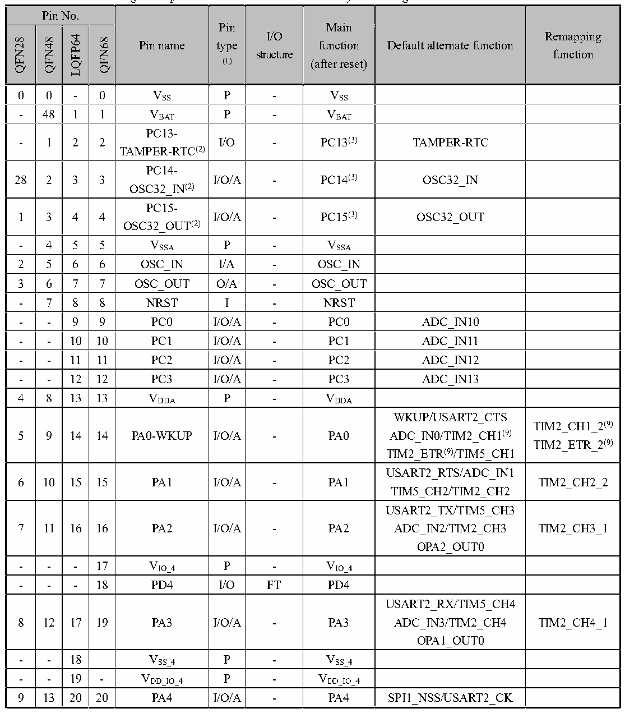

<!-- source-page: 19 -->

[← p.18](0018.md) · [index](../README.md) · [PDF p.19](https://ch32-riscv-ug.github.io/CH32V20x/datasheet_en/CH32V208DS0.PDF#page=19) · [p.20 →](0020.md)

<!-- header: CH32V208 Datasheet http://wch-ic.com -->

## 3.2 Pin description

<em>Note: The pin function in the table below refer to all functions and does not involve specific model(s). There</em>  
<em>are differences in peripheral resources between different models. Please confirm whether this function is</em>  
<em>available according to the particular model&#x27;s resource table before viewing this table.</em>  

 <!-- p19-cluster-01 uncaptioned graphics, rendered from the PDF; verify at https://ch32-riscv-ug.github.io/CH32V20x/datasheet_en/CH32V208DS0.PDF#page=19 -->

🖼 Text parsed from the figure above

<!-- p19-table-001 (table-3-1@1) pages 19-22 -->
<table><caption>Table 3-1 Pin definitions</caption><tr><th colspan="5">Pin No.</th><th rowspan="2">Pin name</th><th rowspan="2" style="text-align:left">Pin type (1)</th><th rowspan="2" style="text-align:left">I/O structure</th><th rowspan="2" style="text-align:left">Main function (after reset)</th><th rowspan="2">Default alternate function</th><th rowspan="2" style="text-align:left">Remapping function</th></tr><tr><td>QFN28</td><td>QFN48</td><td>LQFP64</td><td>M</td><td>QFN68</td></tr><tr><td>0</td><td>0</td><td colspan="2">-</td><td>0</td><td style="text-align:left">VSS</td><td>P</td><td>-</td><td style="text-align:left">VSS</td><td></td><td></td></tr><tr><td>-</td><td>48</td><td colspan="2">1</td><td>1</td><td style="text-align:left">VBAT</td><td>P</td><td>-</td><td style="text-align:left">VBAT</td><td></td><td></td></tr><tr><td>-</td><td>1</td><td colspan="2">2</td><td>2</td><td style="text-align:left">PC13- TAMPER-RTC(2)</td><td>I/O</td><td>-</td><td>PC13(3)</td><td>TAMPER-RTC</td><td></td></tr><tr><td>28</td><td>2</td><td colspan="2">3</td><td>3</td><td style="text-align:left">PC14- OSC32_IN(2)</td><td>I/O/A</td><td>-</td><td>PC14(3)</td><td>OSC32_IN</td><td></td></tr><tr><td>1</td><td>3</td><td colspan="2">4</td><td>4</td><td style="text-align:left">PC15- OSC32_OUT(2)</td><td>I/O/A</td><td>-</td><td>PC15(3)</td><td>OSC32_OUT</td><td></td></tr><tr><td>-</td><td>4</td><td colspan="2">5</td><td>5</td><td style="text-align:left">VSSA</td><td>P</td><td>-</td><td style="text-align:left">VSSA</td><td></td><td></td></tr><tr><td>2</td><td>5</td><td colspan="2">6</td><td>6</td><td>OSC_IN</td><td>I/A</td><td>-</td><td>OSC_IN</td><td></td><td></td></tr><tr><td>3</td><td>6</td><td colspan="2">7</td><td>7</td><td>OSC_OUT</td><td>O/A</td><td>-</td><td>OSC_OUT</td><td></td><td></td></tr><tr><td>-</td><td>7</td><td colspan="2">8</td><td>8</td><td>NRST</td><td>I</td><td>-</td><td>NRST</td><td></td><td></td></tr><tr><td>-</td><td>-</td><td colspan="2">9</td><td>9</td><td>PC0</td><td>I/O/A</td><td>-</td><td>PC0</td><td>ADC_IN10</td><td></td></tr><tr><td>-</td><td>-</td><td colspan="2">10</td><td>10</td><td>PC1</td><td>I/O/A</td><td>-</td><td>PC1</td><td>ADC_IN11</td><td></td></tr><tr><td>-</td><td>-</td><td colspan="2">11</td><td>11</td><td>PC2</td><td>I/O/A</td><td>-</td><td>PC2</td><td>ADC_IN12</td><td></td></tr><tr><td>-</td><td>-</td><td colspan="2">12</td><td>12</td><td>PC3</td><td>I/O/A</td><td>-</td><td>PC3</td><td>ADC_IN13</td><td></td></tr><tr><td>4</td><td>8</td><td colspan="2">13</td><td>13</td><td style="text-align:left">VDDA</td><td>P</td><td>-</td><td style="text-align:left">VDDA</td><td></td><td></td></tr><tr><td>5</td><td>9</td><td colspan="2">14</td><td>14</td><td>PA0-WKUP</td><td>I/O/A</td><td>-</td><td>PA0</td><td style="text-align:left">WKUP/USART2_CTSADC_IN0/TIM2_CH1(9) TIM2_ETR(9)/TIM5_CH1</td><td style="text-align:left">TIM2_CH1_2(9) TIM2_ETR_2(9)</td></tr><tr><td>6</td><td>10</td><td colspan="2">15</td><td>15</td><td>PA1</td><td>I/O/A</td><td>-</td><td>PA1</td><td style="text-align:left">USART2_RTS/ADC_IN1TIM5_CH2/TIM2_CH2</td><td>TIM2_CH2_2</td></tr><tr><td>7</td><td>11</td><td colspan="2">16</td><td>16</td><td>PA2</td><td>I/O/A</td><td>-</td><td>PA2</td><td style="text-align:left">USART2_TX/TIM5_CH3ADC_IN2/TIM2_CH3OPA2_OUT0</td><td>TIM2_CH3_1</td></tr><tr><td>-</td><td>-</td><td colspan="2">-</td><td>17</td><td style="text-align:left">VIO_4</td><td>P</td><td>-</td><td style="text-align:left">VIO_4</td><td></td><td></td></tr><tr><td>-</td><td>-</td><td colspan="2">-</td><td>18</td><td>PD4</td><td>I/O</td><td>FT</td><td>PD4</td><td></td><td></td></tr><tr><td>8</td><td>12</td><td colspan="2">17</td><td>19</td><td>PA3</td><td>I/O/A</td><td>-</td><td>PA3</td><td style="text-align:left">USART2_RX/TIM5_CH4ADC_IN3/TIM2_CH4OPA1_OUT0</td><td>TIM2_CH4_1</td></tr><tr><td>-</td><td>-</td><td colspan="2">18</td><td></td><td style="text-align:left">VSS_4</td><td>P</td><td>-</td><td style="text-align:left">VSS_4</td><td></td><td></td></tr><tr><td>-</td><td>-</td><td colspan="2">19</td><td>-</td><td style="text-align:left">VDD_IO_4</td><td>P</td><td>-</td><td style="text-align:left">VDD_IO_4</td><td></td><td></td></tr><tr><td>9</td><td>13</td><td colspan="2">20</td><td>20</td><td>PA4</td><td>I/O/A</td><td>-</td><td>PA4</td><td>SPI1_NSS/USART2_CK</td><td></td></tr><tr><td colspan="5">Pin No.</td><td rowspan="2">Pin name</td><td rowspan="2" style="text-align:left">Pin type (1)</td><td rowspan="2" style="text-align:left">I/O structure</td><td rowspan="2" style="text-align:left">Main function (after reset)</td><td rowspan="2">Default alternate function</td><td rowspan="2" style="text-align:left">Remapping function</td></tr><tr><td>QFN28</td><td>QFN48</td><td>LQFP64</td><td>M</td><td>QFN68</td></tr><tr><td></td><td></td><td colspan="2"></td><td></td><td></td><td></td><td></td><td></td><td>ADC_IN4/OPA2_OUT1</td><td></td></tr><tr><td>10</td><td>14</td><td colspan="2">21</td><td>21</td><td>PA5</td><td>I/O/A</td><td>-</td><td>PA5</td><td style="text-align:left">SPI1_SCK/ADC_IN5OPA2_CH1N</td><td></td></tr><tr><td>11</td><td>15</td><td colspan="2">22</td><td>22</td><td>PA6</td><td>I/O/A</td><td>-</td><td>PA6</td><td style="text-align:left">SPI1_MISO/ADC_IN6TIM3_CH1/OPA1_CH1N</td><td>TIM1_BKIN_1</td></tr><tr><td>12</td><td>16</td><td colspan="2">23</td><td>23</td><td>PA7</td><td>I/O/A</td><td>-</td><td>PA7</td><td style="text-align:left">SPI1_MOSI/ADC_IN7TIM3_CH2/OPA2_CH1P</td><td>TIM1_CH1N_1</td></tr><tr><td>-</td><td>-</td><td colspan="2">24</td><td>24</td><td>PC4</td><td>I/O/A</td><td>-</td><td>PC4</td><td>ADC_IN14</td><td></td></tr><tr><td>-</td><td>-</td><td colspan="2">25</td><td>25</td><td>PC5</td><td>I/O/A</td><td>-</td><td>PC5</td><td>ADC_IN15</td><td></td></tr><tr><td>-</td><td>17</td><td colspan="2">26</td><td>26</td><td>PB0</td><td>I/O/A</td><td>-</td><td>PB0</td><td style="text-align:left">ADC_IN8/TIM3_CH3OPA1_CH1P</td><td style="text-align:left">TIM1_CH2N_1TIM3_CH3_2UART4_TX_1</td></tr><tr><td>-</td><td>18</td><td colspan="2">27</td><td>27</td><td>PB1</td><td>I/O/A</td><td>-</td><td>PB1</td><td style="text-align:left">ADC_IN9TIM3_CH4OPA1_OUT1</td><td style="text-align:left">TIM1_CH3N_1TIM3_CH4_2UART4_RX_1</td></tr><tr><td>-</td><td>19</td><td colspan="2">28</td><td>28</td><td>PB2</td><td>I/O</td><td>FT</td><td>PB2/BOOT1</td><td></td><td></td></tr><tr><td>-</td><td>20</td><td colspan="2">29</td><td>29</td><td>PB10</td><td>I/O/A</td><td>FT</td><td>PB10</td><td style="text-align:left">I2C2_SCL/USART3_TXOPA2_CH0N</td><td style="text-align:left">TIM2_CH3_2TIM2_CH3_3</td></tr><tr><td>-</td><td>21</td><td colspan="2">30</td><td>30</td><td>PB11</td><td>I/O/A</td><td>FT</td><td>PB11</td><td style="text-align:left">I2C2_SDA/USART3_RXOPA1_CH0N</td><td style="text-align:left">TIM2_CH4_2TIM2_CH4_3</td></tr><tr><td>-</td><td>-</td><td colspan="2">31</td><td>-</td><td style="text-align:left">VSS_1</td><td>P</td><td></td><td style="text-align:left">VSS_1</td><td></td><td></td></tr><tr><td>13</td><td>22</td><td colspan="2">32</td><td>-</td><td style="text-align:left">VDD_IO_1</td><td>P</td><td></td><td style="text-align:left">VDD_IO_1</td><td></td><td></td></tr><tr><td>-</td><td>-</td><td colspan="2">-</td><td>31</td><td style="text-align:left">VIO_1</td><td>P</td><td></td><td style="text-align:left">VIO_1</td><td></td><td></td></tr><tr><td>-</td><td>-</td><td colspan="2">-</td><td>32</td><td style="text-align:left">VDD_1</td><td>P</td><td></td><td style="text-align:left">VDD_1</td><td></td><td></td></tr><tr><td>-</td><td>-</td><td colspan="2">-</td><td>33</td><td>PD5</td><td>I/O</td><td>FT</td><td>PD5</td><td></td><td></td></tr><tr><td>-</td><td>-</td><td colspan="2">-</td><td>34</td><td>PD6</td><td>I/O</td><td>FT</td><td>PD6</td><td></td><td></td></tr><tr><td>-</td><td>23</td><td colspan="2">33</td><td>35</td><td>PB12</td><td>I/O/A</td><td>FT</td><td>PB12</td><td style="text-align:left">SPI2_NSS/I2C2_SMBAUSART3_CK/TIM1_BKIN</td><td></td></tr><tr><td>-</td><td>24</td><td colspan="2">34</td><td>36</td><td>PB13</td><td>I/O/A</td><td>FT</td><td>PB13</td><td style="text-align:left">SPI2_SCK/TIM1_CH1NUSART3_CTS</td><td>USART3_CTS_1</td></tr><tr><td>-</td><td>25</td><td colspan="2">35</td><td>37</td><td>PB14</td><td>I/O/A</td><td>FT</td><td>PB14</td><td style="text-align:left">SPI2_MISO/TIM1_CH2NUSART3_RTS/OPA2_CH0P</td><td>USART3_RTS_1</td></tr><tr><td>-</td><td>26</td><td colspan="2">36</td><td>38</td><td>PB15</td><td>I/O/A</td><td>FT</td><td>PB15</td><td style="text-align:left">SPI2_MOSI/TIM1_CH3NOPA1_CH0P</td><td></td></tr><tr><td>14</td><td>-</td><td colspan="2">37</td><td>39</td><td>PC6</td><td>I/O</td><td>FT</td><td>PC6</td><td>ETH_RXP</td><td>TIM3_CH1_3</td></tr><tr><td>15</td><td>-</td><td colspan="2">38</td><td>40</td><td>PC7</td><td>I/O</td><td>FT</td><td>PC7</td><td>ETH_RXN</td><td>TIM3_CH2_3</td></tr><tr><td>16</td><td>-</td><td colspan="2">39</td><td>41</td><td>PC8</td><td>I/O</td><td>FT</td><td>PC8</td><td>ETH_TXP</td><td>TIM3_CH3_3</td></tr><tr><td>17</td><td>-</td><td colspan="2">40</td><td>42</td><td>PC9</td><td>I/O</td><td>FT</td><td>PC9</td><td>ETH_TXN</td><td>TIM3_CH4_3</td></tr><tr><td>-</td><td>27</td><td colspan="2">41</td><td>43</td><td>PA8</td><td>I/O</td><td>FT</td><td>PA8</td><td style="text-align:left">USART1_CKTIM1_CH1/MCO</td><td style="text-align:left">USART1_CK_1TIM1_CH1_1</td></tr><tr><td colspan="5">Pin No.</td><td rowspan="2">Pin name</td><td rowspan="2" style="text-align:left">Pin type (1)</td><td rowspan="2" style="text-align:left">I/O structure</td><td rowspan="2" style="text-align:left">Main function (after reset)</td><td rowspan="2">Default alternate function</td><td rowspan="2" style="text-align:left">Remapping function</td></tr><tr><td>QFN28</td><td>QFN48</td><td>LQFP64</td><td>M</td><td>QFN68</td></tr><tr><td>-</td><td>28</td><td colspan="2">42</td><td>44</td><td>PA9</td><td>I/O</td><td>FT</td><td>PA9</td><td style="text-align:left">USART1_TXTIM1_CH2</td><td>TIM1_CH2_1</td></tr><tr><td>-</td><td>29</td><td colspan="2">43</td><td>45</td><td>PA10</td><td>I/O</td><td>FT</td><td>PA10</td><td style="text-align:left">USART1_RXTIM1_CH3</td><td>TIM1_CH3_1</td></tr><tr><td>18</td><td>30</td><td colspan="2">44</td><td>46</td><td>PA11</td><td>I/O/A</td><td>FT</td><td>PA11</td><td style="text-align:left">USART1_CTS/USBDMCAN1_RX/TIM1_CH4</td><td style="text-align:left">USART1_CTS_1TIM1_CH4_1</td></tr><tr><td>19</td><td>31</td><td colspan="2">45</td><td>47</td><td>PA12</td><td>I/O/A</td><td>FT</td><td>PA12</td><td style="text-align:left">USART1_RTS/USBDPCAN1_TX/TIM1_ETR</td><td style="text-align:left">USART1_RTS_1TIM1_ETR_1</td></tr><tr><td>20</td><td>32</td><td colspan="2">46</td><td>48</td><td>PA13</td><td>I/O</td><td>FT</td><td>SWDIO</td><td></td><td>PA13</td></tr><tr><td>-</td><td>35</td><td colspan="2">-</td><td>49</td><td style="text-align:left">VSS_2</td><td>P</td><td>-</td><td style="text-align:left">VSS_2</td><td></td><td></td></tr><tr><td>21</td><td>33</td><td colspan="2">47</td><td>50</td><td style="text-align:left">VINTA</td><td>P</td><td>-</td><td style="text-align:left">VINTA</td><td></td><td></td></tr><tr><td>22</td><td>34</td><td colspan="2">48</td><td>51</td><td>ANT</td><td>A</td><td>-</td><td>ANT</td><td></td><td></td></tr><tr><td>23</td><td>36</td><td colspan="2">49</td><td>52</td><td>PA14</td><td>I/O</td><td>FT</td><td>SWCLK</td><td></td><td>PA14</td></tr><tr><td>-</td><td>37</td><td colspan="2">50</td><td>53</td><td>PA15</td><td>I/O</td><td>FT</td><td>PA15</td><td></td><td style="text-align:left">TIM2_CH1_1(9) TIM2_ETR_1(9) TIM2_CH1_3(9) TIM2_ETR_3(9) SPI1_NSS_1</td></tr><tr><td>-</td><td>-</td><td colspan="2">51</td><td>54</td><td>PC10</td><td>I/O</td><td>FT</td><td>PC10</td><td>UART4_TX</td><td>USART3_TX_1</td></tr><tr><td>-</td><td>-</td><td colspan="2">52</td><td>55</td><td>PC11</td><td>I/O</td><td>FT</td><td>PC11</td><td>UART4_RX</td><td>USART3_RX_1</td></tr><tr><td>-</td><td>-</td><td colspan="2">53</td><td>56</td><td>PC12</td><td>I/O</td><td>FT</td><td>PC12</td><td></td><td>USART3_CK_1</td></tr><tr><td>-</td><td>-</td><td colspan="2">54</td><td>57</td><td>PD2</td><td>I/O</td><td>FT</td><td>PD2</td><td>TIM3_ETR</td><td style="text-align:left">TIM3_ETR_2TIM3_ETR_3</td></tr><tr><td>-</td><td>38</td><td colspan="2">55</td><td>58</td><td>PB3</td><td>I/O</td><td>FT</td><td>PB3</td><td></td><td style="text-align:left">TIM2_CH2_1TIM2_CH2_3SPI1_SCK_1</td></tr><tr><td>-</td><td>39</td><td colspan="2">56</td><td>59</td><td>PB4</td><td>I/O</td><td>FT</td><td>PB4</td><td></td><td style="text-align:left">TIM3_CH1_2SPI1_MISO_1</td></tr><tr><td>-</td><td>40</td><td colspan="2">57</td><td>60</td><td>PB5</td><td>I/O</td><td>FT</td><td>PB5</td><td>I2C1_SMBA</td><td style="text-align:left">TIM3_CH2_2SPI1_MOSI_1</td></tr><tr><td>24</td><td>41</td><td colspan="2">58</td><td>61</td><td>PB6</td><td>I/O</td><td>FT</td><td>PB6</td><td style="text-align:left">I2C1_SCLTIM4_CH1/USBFS_DM</td><td>USART1_TX_1</td></tr><tr><td>25</td><td>42</td><td colspan="2">59</td><td>62</td><td>PB7</td><td>I/O</td><td>FT</td><td>PB7</td><td style="text-align:left">I2C1_SDATIM4_CH2/USBFS_DP</td><td>USART1_RX_1</td></tr><tr><td rowspan="2">26(6)</td><td>43</td><td colspan="2">60</td><td>63</td><td>BOOT0</td><td>I</td><td>-</td><td>BOOT0</td><td></td><td></td></tr><tr><td>44</td><td colspan="2">61</td><td>64</td><td>PB8</td><td>I/O/A</td><td>FT</td><td>PB8</td><td>TIM4_CH3</td><td style="text-align:left">I2C1_SCL_1 /CAN1_RX_2</td></tr><tr><td>-</td><td>45</td><td colspan="2">62</td><td>65</td><td>PB9</td><td>I/O/A</td><td>FT</td><td>PB9</td><td>TIM4_CH4</td><td style="text-align:left">I2C1_SDA_1 /CAN1_TX_2</td></tr><tr><td>-</td><td>-</td><td colspan="2">-</td><td>66</td><td>PD3</td><td>I/O</td><td>FT</td><td>PD3</td><td></td><td></td></tr><tr><td colspan="5">Pin No.</td><td rowspan="2">Pin name</td><td rowspan="2" style="text-align:left">Pin type (1)</td><td rowspan="2" style="text-align:left">I/O structure</td><td rowspan="2" style="text-align:left">Main function (after reset)</td><td rowspan="2">Default alternate function</td><td rowspan="2" style="text-align:left">Remapping function</td></tr><tr><td>QFN28</td><td>QFN48</td><td>LQFP64</td><td>M</td><td>QFN68</td></tr><tr><td>-</td><td>46</td><td colspan="2">63</td><td>-</td><td style="text-align:left">VSS_3</td><td>P</td><td>-</td><td style="text-align:left">VSS_3</td><td></td><td></td></tr><tr><td>27</td><td>47</td><td colspan="2">64</td><td>-</td><td style="text-align:left">VDD_IO_3</td><td>P</td><td>-</td><td style="text-align:left">VDD_IO_3</td><td></td><td></td></tr><tr><td>-</td><td>-</td><td colspan="2">-</td><td>67</td><td style="text-align:left">VIO_3</td><td>P</td><td>-</td><td style="text-align:left">VIO_3</td><td></td><td></td></tr><tr><td>-</td><td>-</td><td colspan="2">-</td><td>68</td><td style="text-align:left">VDD_3</td><td>P</td><td>-</td><td style="text-align:left">VDD_3</td><td></td><td></td></tr></table>

M86NFQ  
0 0 - 0 VSS P - VSS  
4 5 5 VSSA P - VSSA  

<!-- image: p19-draw-image-00001 bbox=[498.0, 779.64, 517.56, 789.6] -->
<!-- footer: V2.7 17 -->
