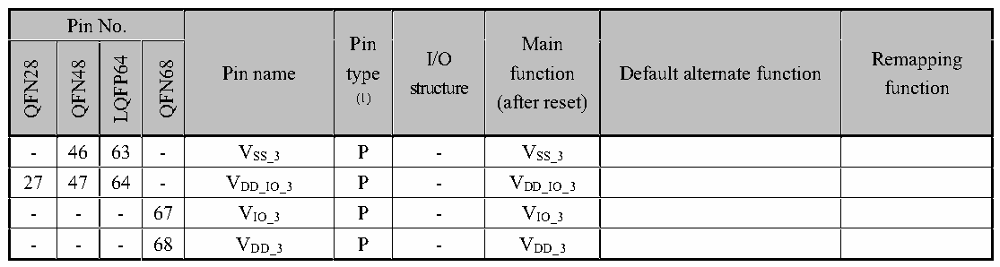

<!-- source-page: 22 -->

[← p.21](0021.md) · [index](../README.md) · [PDF p.22](https://ch32-riscv-ug.github.io/CH32V20x/datasheet_en/CH32V208DS0.PDF#page=22) · [p.23 →](0023.md)

<!-- header: CH32V208 Datasheet http://wch-ic.com -->

 <!-- p22-cluster-01 uncaptioned graphics, rendered from the PDF; verify at https://ch32-riscv-ug.github.io/CH32V20x/datasheet_en/CH32V208DS0.PDF#page=22 -->

🖼 Text parsed from the figure above

> ⬆ **Table continued** — rendered in full at [page 19](0019.md). <!-- p22-table-001 -->

M86NFQ  

<em>Note 1: Abbreviations in the table</em>  
<em>I = TTL/CMOS Schmitt input;</em>  
<em>O = CMOS tri-state output;</em>  
<em>A = analog signal input or output;</em>  
<em>P = power;</em>  
<em>FT = 5V tolerance;</em>  
<em>ANT = RF signal input and output (antenna);</em>  
<em>Note 2: The PC13, PC14 and PC15 pins are powered through a power switch which can only pass a limited</em>  
<em>current (3mA). PC13 can be used as TAMPER pin, RTC alarm clock or second output; PC14 and PC15 can</em>  
<em>only be used as LSE pins; when used as output pins, they can only work in 2MHz mode, the maximum driving</em>  
<em>load is 30pF, and cannot be used as a current source (such as driving LED).</em>  
<em>Note 3: These pins are in the main function state when the backup area is powered on for the first time. Even</em>  
<em>after reset, the state of these pins is controlled by the backup area registers (these registers will not be reset</em>  
<em>by the main reset system). For specific information on how to control these IO ports, please refer to the</em>  
<em>relevant chapters on the battery backup area and BKP register in the CH32FV2x_V3xRM datasheet.</em>  
<em>Note 4: For chips with neither BOOT0 nor BOOT1/PB2 pins lead out, the internal BOOT0 pin has been</em>  
<em>shorted to GND and the BOOT1/PB2 pins are floating. Under low power consumption, it is recommended to</em>  
<em>configure PB2 in pull-down input mode to prevent additional current.</em>  
<em>For chips where the BOOT1/PB2 pin is lead out but the BOOT0 pin is not, the BOOT0 pin is internally</em>  
<em>shorted to GND.</em>  
<em>For chips with the BOOT0 pin but not the BOOT1/PB2 pin, the internal BOOT1/PB2 pin has been shorted to</em>  
<em>GND. Under low power consumption, it is recommended to configure the PB2 pull-down input mode to</em>  
<em>prevent additional current.</em>  
<em>Note 5: The BOOT0 and PB8 pins are in a packaged chip. It is recommended to connect an external 4.7K</em>  
<em>pull-down resistor to ensure that BOOT0 is low level during power-on in order to enter the program flash</em>  
<em>memory boot mode. After normal operation, the PB8 pin can be used for output as needed.</em>  
<em>Note 6: The 28-pin package chip has many combined pins (at least 2 IO function pins are physically combined</em>  
<em>into one pin). At this time, the driver should not configure the output function at the same time, otherwise the</em>  
<em>pins may be damaged. Pay attention to the pin status if there are power consumption requirements.</em>  
<em>Note 7: The value after the underline in the remapping function indicates the configuration value of the</em>  
<em>corresponding bit in the AFIO register. For example: UART4_RX_3 means that the corresponding bit of the</em>  
<!-- image: p22-draw-image-00001 bbox=[498.0, 779.64, 517.56, 789.6] -->
<!-- footer: V2.7 20 -->
