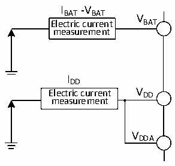

<!-- source-page: 29 -->

[← p.28](0028.md) · [index](../README.md) · [PDF p.29](https://ch32-riscv-ug.github.io/CH32V20x/datasheet_en/CH32V208DS0.PDF#page=29) · [p.30 →](0030.md)

<!-- header: CH32V208 Datasheet http://wch-ic.com -->

Figure 4-2 Current consumption measurement  
 <!-- rendered from the PDF; verify at https://ch32-riscv-ug.github.io/CH32V20x/datasheet_en/CH32V208DS0.PDF#page=29 -->

🖼 Text parsed from the figure above

IBAT-VBAT  
V  
Electric current BAT  
measurement  
IDD  
Electric current V DD  
measurement  
VDDA  

The microcontroller is in the following conditions:  
Under normal temperature conditions and when VDD= 3.3V, all I/O ports are configured with pull-down  
inputs, only one of HSE and HIS is enabled, HSE=32M, HIS=8M (calibrated), FPLCK1=FHCLK/2,  
FPLCK2=FHCLK, PLL is enabled when FHCLK&gt;8MHz. Enable or disable the power consumption of all peripheral  
clocks.  

<!-- p29-table-001 (table-4-6-1@1) -->
<table><caption>Table 4-6-1 Typical current consumption in Run mode, the data processing code runs from the internal Flash</caption><tr><th rowspan="2">Symbol</th><th rowspan="2">Parameter</th><th rowspan="2" colspan="2">Condition</th><th colspan="2">Typ.</th><th rowspan="2">Unit</th></tr><tr><td style="text-align:left">All peripherals enabled</td><td style="text-align:left">All peripherals disabled(2)</td></tr><tr><td rowspan="18" style="text-align:left">I (1) DD</td><td rowspan="18" style="text-align:left">Supply current in Run mode</td><td rowspan="9">External clock</td><td style="text-align:left">F = 144MHz HCLK</td><td>16.21</td><td>11.46</td><td rowspan="18">mA</td></tr><tr><td style="text-align:left">F = 72MHz HCLK</td><td>8.44</td><td>5.99</td></tr><tr><td style="text-align:left">F = 48MHz HCLK</td><td>5.84</td><td>4.20</td></tr><tr><td style="text-align:left">F = 36MHz HCLK</td><td>4.50</td><td>3.31</td></tr><tr><td style="text-align:left">F = 24MHz HCLK</td><td>3.24</td><td>2.44</td></tr><tr><td style="text-align:left">F = 16MHz HCLK</td><td>2.37</td><td>1.83</td></tr><tr><td style="text-align:left">F = 8MHz HCLK</td><td>1.38</td><td>1.12</td></tr><tr><td style="text-align:left">F = 4MHz HCLK</td><td>0.97</td><td>0.83</td></tr><tr><td style="text-align:left">F = 500KHz HCLK</td><td>0.60</td><td>0.58</td></tr><tr><td rowspan="9" style="text-align:left">Runs on the high-speed internal RC oscillator (HSI). Uses HB prescaler to reduce the frequency.</td><td style="text-align:left">F = 144MHz HCLK</td><td>15.61</td><td>10.65</td></tr><tr><td style="text-align:left">F = 72MHz HCLK</td><td>8.06</td><td>5.60</td></tr><tr><td style="text-align:left">F = 48MHz HCLK</td><td>5.56</td><td>3.92</td></tr><tr><td style="text-align:left">F = 36MHz HCLK</td><td>4.31</td><td>3.07</td></tr><tr><td style="text-align:left">F = 24MHz HCLK</td><td>3.07</td><td>2.24</td></tr><tr><td style="text-align:left">F = 16MHz HCLK</td><td>2.24</td><td>1.69</td></tr><tr><td style="text-align:left">F = 8MHz HCLK</td><td>1.28</td><td>1.02</td></tr><tr><td style="text-align:left">F = 4MHz HCLK</td><td>0.88</td><td>0.76</td></tr><tr><td style="text-align:left">F = 500KHz HCLK</td><td>0.53</td><td>0.51</td></tr></table>

<em>Note: 1. The above are measured parameters.</em>  
<em>2. During the test, the clocks of USART1 and GPIOA are not disabled when all peripheral clocks are</em>  
<em>disabled.</em>  
<!-- image: p29-draw-image-00001 bbox=[498.0, 780.84, 517.56, 791.4] -->
<!-- footer: V2.7 27 -->
