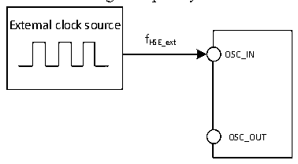
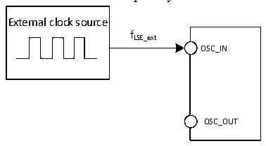

<!-- source-page: 32 -->

[← p.31](0031.md) · [index](../README.md) · [PDF p.32](https://ch32-riscv-ug.github.io/CH32V20x/datasheet_en/CH32V208DS0.PDF#page=32) · [p.33 →](0033.md)

<!-- header: CH32V208 Datasheet http://wch-ic.com -->

Figure 4-3 External high-frequency clock source circuit  
 <!-- rendered from the PDF; verify at https://ch32-riscv-ug.github.io/CH32V20x/datasheet_en/CH32V208DS0.PDF#page=32 -->

🖼 Text parsed from the figure above

External clock source  
fHSE_ext  
OSC_IN  
OSC_OUT  

<!-- p32-table-001 (table-4-10@1) -->
<table><caption>Table 4-10 From external low-speed clock</caption><tr><th>Symbol</th><th>Parameter</th><th>Condition</th><th>Min.</th><th>Typ.</th><th>Max.</th><th>Unit</th></tr><tr><td style="text-align:left">FLSE_ext</td><td>User external clock frequency</td><td></td><td></td><td>32.768</td><td>1000</td><td>KHz</td></tr><tr><td style="text-align:left">VLSEH</td><td style="text-align:left">OSC32_IN input pin high level voltage</td><td></td><td style="text-align:left">0.8VDD</td><td></td><td style="text-align:left">VDD</td><td>V</td></tr><tr><td style="text-align:left">VLSEL</td><td>OSC32_IN input pin low voltage</td><td></td><td>0</td><td></td><td style="text-align:left">0.2VDD</td><td>V</td></tr><tr><td style="text-align:left">C in(LSE)</td><td>OSC32_IN input capacitance</td><td></td><td></td><td>5</td><td></td><td>pF</td></tr><tr><td style="text-align:left">DuCy (LSE)</td><td>Duty cycle</td><td></td><td></td><td>50</td><td></td><td>%</td></tr><tr><td style="text-align:left">IL</td><td>OSC32_IN input leakage current</td><td></td><td></td><td></td><td>±1</td><td>uA</td></tr></table>

Figure 4-4 External low-frequency clock source circuit  
 <!-- rendered from the PDF; verify at https://ch32-riscv-ug.github.io/CH32V20x/datasheet_en/CH32V208DS0.PDF#page=32 -->

🖼 Text parsed from the figure above

External clock source  
fLSE_ext  
OSC_IN  
OSC_OUT  

<!-- p32-table-002 (table-4-11@1) -->
<table><caption>Table 4-11 High-speed external clock generated from a crystal/ceramic resonator</caption><tr><th>Symbol</th><th>Parameter</th><th>Condition</th><th>Min.</th><th>Typ.</th><th>Max.</th><th>Unit</th></tr><tr><td style="text-align:left">FOSC_IN</td><td>Resonator frequency</td><td></td><td></td><td>32(2)</td><td></td><td>MHz</td></tr><tr><td style="text-align:left">RF</td><td>Feedback resistance</td><td></td><td></td><td>250</td><td></td><td>kΩ</td></tr><tr><td>C</td><td style="text-align:left">Recommended load capacitance and corresponding crystal series impedance RS</td><td style="text-align:left">R =60Ω(1) S</td><td></td><td>20</td><td></td><td>pF</td></tr><tr><td style="text-align:left">I2</td><td>HSE drive current</td><td></td><td></td><td>0.53</td><td></td><td>mA</td></tr><tr><td style="text-align:left">g m</td><td>Oscillator transconductance</td><td>Startup</td><td></td><td>17</td><td></td><td>mA/V</td></tr><tr><td style="text-align:left">t SU(HSE)</td><td>Startup time</td><td style="text-align:left">V is stable, 8M crystal DD</td><td></td><td>2.5(2)</td><td></td><td>ms</td></tr></table>

<em>Note 1: It is recommended that the crystal ESR does not exceed 80Ω, and crystals with smaller ESR are</em>  
<em>preferred. For load capacitance, refer to the crystal manual requirements.</em>  
<em>2. Startup time refers to the time difference from when HSEON is turned on to when HSERDY is set.</em>  
<em>3. No external load capacitor is required.</em>  
Circuit reference design and requirements:  
The load capacitance of the crystal is subject to the recommendation of the crystal manufacturer, CL1=CL2.  
For the CH32V208xx series, they are connected with external 32M crystals, and they have built-in load  
<!-- image: p32-draw-image-00001 bbox=[498.0, 780.84, 517.56, 791.4] -->
<!-- footer: V2.7 30 -->
