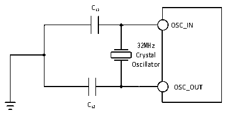
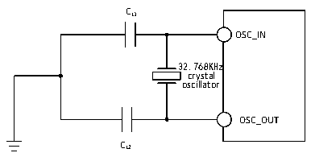

<!-- source-page: 33 -->

[← p.32](0032.md) · [index](../README.md) · [PDF p.33](https://ch32-riscv-ug.github.io/CH32V20x/datasheet_en/CH32V208DS0.PDF#page=33) · [p.34 →](0034.md)

<!-- header: CH32V208 Datasheet http://wch-ic.com -->
capacitor, so the external circuit is not necessary.  

Figure 4-5 Typical circuit of external 32M crystal  
 <!-- rendered from the PDF; verify at https://ch32-riscv-ug.github.io/CH32V20x/datasheet_en/CH32V208DS0.PDF#page=33 -->

🖼 Text parsed from the figure above

CL1  
OSC_IN  
32MHz  
Crystal  
Oscillator  
OSC_OUT  
CL2  

(fLSE=32.768KHz)  

<!-- p33-table-001 (table-4-12@1) -->
<table><caption>Table 4-12 Low-speed external clock generated by generated from a crystal/ceramic resonator</caption><tr><th>Symbol</th><th>Parameter</th><th>Condition</th><th>Min.</th><th>Typ.</th><th>Max.</th><th>Unit</th></tr><tr><td style="text-align:left">RF</td><td>Feedback resistance</td><td></td><td></td><td>5</td><td></td><td>MΩ</td></tr><tr><td>C</td><td style="text-align:left">Recommended load capacitance and corresponding crystal serial impedance RS</td><td style="text-align:left">R &lt;70kΩS</td><td></td><td></td><td>15</td><td>pF</td></tr><tr><td style="text-align:left">i 2</td><td>LSE drive current</td><td>VDD = 3.3V</td><td></td><td>0.35</td><td></td><td>uA</td></tr><tr><td style="text-align:left">g m</td><td>Oscillator transconductance</td><td>Startup</td><td></td><td>25.3</td><td></td><td>uA/V</td></tr><tr><td style="text-align:left">t SU(LSE)</td><td>Startup time</td><td>VDD is stable</td><td></td><td>800</td><td></td><td>mS</td></tr></table>

Circuit reference design and requirements:  
The load capacitance of the crystal is subject to the recommendation of the crystal manufacturer, CL1=CL2,  
generally 12pF is recommended.  

Figure 4-6 Typical circuit of external 32.768K crystal  
 <!-- rendered from the PDF; verify at https://ch32-riscv-ug.github.io/CH32V20x/datasheet_en/CH32V208DS0.PDF#page=33 -->

🖼 Text parsed from the figure above

CL1  
OSC_IN  
32.768KHz  
crystal  
oscillator  
OSC_OUT  
CL2  

<em>Note: The load capacitance CL is calculated by the following formula: CL= CL1 x CL2/ (CL1+ CL2) + Cstray.</em>  
<em>Cstray is the capacitance of the pin and the PCB board or PCB-related capacitance. Its typical value is</em>  
<em>between 2pF and 7pF.</em>  

### 4.3.6 Internal clock source characteristics

<!-- p33-table-002 (table-4-13@1) pages 33-34 -->
<table><caption>Table 4-13 Internal high-speed (HSI) RC oscillator characteristics</caption><tr><th>Symbol</th><th>Parameter</th><th>Condition</th><th>Min.</th><th>Typ.</th><th>Max.</th><th>Unit</th></tr><tr><td style="text-align:left">FHSI</td><td>Frequency (after calibration)</td><td></td><td></td><td>8</td><td></td><td>MHz</td></tr><tr><td style="text-align:left">DuCy HSI</td><td>Duty cycle</td><td></td><td>45</td><td>50</td><td>55</td><td>%</td></tr><tr><td rowspan="2" style="text-align:left">ACCHSI</td><td rowspan="2" style="text-align:left">Accuracy of HSI oscillator (after calibration)</td><td>TA = 0℃~70℃</td><td>-1.6</td><td></td><td>1.6</td><td>%</td></tr><tr><td>TA = -40℃~85℃</td><td>-2.2</td><td></td><td>2.2</td><td>%</td></tr><tr><td style="text-align:left">t SU(HSI)</td><td style="text-align:left">HSI oscillator startup stabilization time</td><td></td><td></td><td>10</td><td></td><td>us</td></tr><tr><td style="text-align:left">IDD(HSI)</td><td>HSI oscillator power consumption</td><td></td><td>120</td><td>180</td><td>270</td><td>uA</td></tr></table>

<!-- image: p33-draw-image-00001 bbox=[498.0, 780.84, 517.56, 791.4] -->
<!-- footer: V2.7 31 -->
